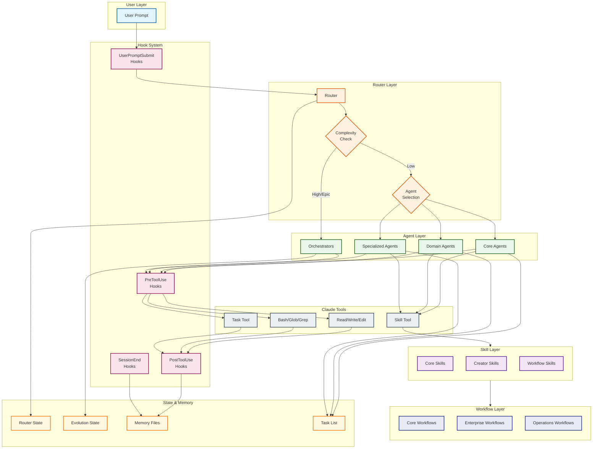

# System Architecture Diagram

> Generated: 2026-01-27
> Purpose: Visualizes the overall framework architecture and component relationships

## Overview

This diagram shows the high-level system architecture of the Claude Code Enterprise Framework, illustrating how the Router orchestrates Agents, Skills, Workflows, and Hooks.

## System Architecture

## Component Descriptions

| Component | Purpose | Location |
|-----------|---------|----------|
| **Router** | Classifies requests, selects agents | `.claude/agents/core/router.md` |
| **Core Agents** | Developer, Planner, Architect, QA, PM, Technical-Writer | `.claude/agents/core/` |
| **Domain Agents** | Language/framework specialists | `.claude/agents/domain/` |
| **Specialized Agents** | Task-specific experts | `.claude/agents/specialized/` |
| **Orchestrators** | Multi-agent coordinators | `.claude/agents/orchestrators/` |
| **Hooks** | Pre/Post tool validation | `.claude/hooks/` |
| **Skills** | Reusable capabilities | `.claude/skills/` |
| **Workflows** | Multi-phase processes | `.claude/workflows/` |
| **State Files** | Runtime state persistence | `.claude/context/` |

## Data Flow

1. **User Prompt** -> UserPromptSubmit hooks classify complexity
2. **Router** analyzes intent and selects appropriate agent(s)
3. **Agents** execute using Tools (with PreToolUse/PostToolUse hooks)
4. **Skills** are invoked via the Skill() tool for specialized capabilities
5. **Workflows** orchestrate multi-phase, multi-agent processes
6. **Memory** persists learnings, decisions, and issues across sessions

## Key Integrations

- **Task Tool**: Spawns subagents with isolated context
- **Router State**: Tracks mode (router/agent), complexity, spawn status
- **Evolution State**: Tracks self-evolution progress through EVOLVE phases
- **Memory Files**: `learnings.md`, `decisions.md`, `issues.md`
