# Agent Hierarchy Diagram

> Generated: 2026-01-27
> Purpose: Visualizes the agent organization structure and relationships

## Overview

This diagram shows how agents are organized into categories (Core, Domain, Specialized, Orchestrators) and their relationships within the framework.

## Agent Hierarchy

```mermaid
flowchart TB
    subgraph Meta["Meta Agent"]
        ROUTER[Router<br/>System Routing]
    end

    subgraph Core["Core Agents (8)"]
        direction TB
        DEV[Developer<br/>Bug fixes, coding]
        PLAN[Planner<br/>Feature planning]
        ARCH[Architect<br/>System design]
        QA[QA<br/>Testing]
        TW[Technical Writer<br/>Documentation]
        PM[PM<br/>Product management]
        REF[Reflection Agent<br/>Quality assessment]
        CC[Context Compressor<br/>Context summarization]
    end

    subgraph Domain["Domain Agents (20)"]
        direction TB
        subgraph Languages["Languages"]
            PY[Python Pro]
            TS[TypeScript Pro]
            RS[Rust Pro]
            GO[Golang Pro]
            JAVA[Java Pro]
            PHP[PHP Pro]
        end
        subgraph Frameworks["Frameworks"]
            FAST[FastAPI Pro]
            NEXT[NextJS Pro]
            NODE[NodeJS Pro]
            FRONT[Frontend Pro]
            SVELTE[SvelteKit Expert]
        end
        subgraph Mobile["Mobile"]
            IOS[iOS Pro]
            AND[Android Pro]
            EXPO[Expo Mobile Dev]
            MUX[Mobile UX Reviewer]
        end
        subgraph Emerging["Emerging Tech"]
            AI[AI/ML Specialist]
            WEB3[Web3 Expert]
            GAME[GameDev Pro]
            SCI[Scientific Research]
            DATA[Data Engineer]
            GQL[GraphQL Pro]
            TAURI[Tauri Desktop Dev]
        end
    end

    subgraph Specialized["Specialized Agents (11)"]
        direction TB
        subgraph Security["Security & Review"]
            SEC[Security Architect]
            CR[Code Reviewer]
        end
        subgraph Infrastructure["Infrastructure"]
            DEVOPS[DevOps]
            DTS[DevOps Troubleshooter]
            IR[Incident Responder]
        end
        subgraph Architecture["Architecture Docs"]
            C4CTX[C4 Context]
            C4CON[C4 Container]
            C4COM[C4 Component]
            C4COD[C4 Code]
        end
        subgraph Other["Other"]
            COND[Conductor Validator]
            RENG[Reverse Engineer]
            DBA[Database Architect]
        end
    end

    subgraph Orchestrators["Orchestrators (3)"]
        direction TB
        MASTER[Master Orchestrator<br/>Project coordination]
        SWARM[Swarm Coordinator<br/>Parallel execution]
        EVOL[Evolution Orchestrator<br/>Self-evolution]
    end

    %% Routing relationships
    ROUTER -->|"Bug fixes"| DEV
    ROUTER -->|"New features"| PLAN
    ROUTER -->|"System design"| ARCH
    ROUTER -->|"Testing"| QA
    ROUTER -->|"Documentation"| TW
    ROUTER -->|"Product"| PM
    ROUTER -->|"Quality check"| REF
    ROUTER -->|"Compression"| CC

    ROUTER -->|"Python code"| PY
    ROUTER -->|"TypeScript code"| TS
    ROUTER -->|"Security review"| SEC
    ROUTER -->|"Infrastructure"| DEVOPS
    ROUTER -->|"C4 diagrams"| C4CTX

    ROUTER -->|"Complex orchestration"| MASTER
    ROUTER -->|"Parallel tasks"| SWARM
    ROUTER -->|"No matching agent"| EVOL

    %% Orchestrator relationships
    MASTER -.->|"coordinates"| Core
    MASTER -.->|"coordinates"| Domain
    MASTER -.->|"coordinates"| Specialized
    SWARM -.->|"spawns parallel"| Core
    SWARM -.->|"spawns parallel"| Domain
    EVOL -.->|"creates"| Domain
    EVOL -.->|"creates"| Specialized

    %% Styling
    classDef meta fill:#fff3e0,stroke:#e65100,stroke-width:3px
    classDef core fill:#e8f5e9,stroke:#1b5e20,stroke-width:2px
    classDef domain fill:#e3f2fd,stroke:#0d47a1,stroke-width:2px
    classDef specialized fill:#fce4ec,stroke:#880e4f,stroke-width:2px
    classDef orchestrator fill:#f3e5f5,stroke:#4a148c,stroke-width:2px

    class ROUTER meta
    class DEV,PLAN,ARCH,QA,TW,PM,REF,CC core
    class PY,TS,RS,GO,JAVA,PHP,FAST,NEXT,NODE,FRONT,SVELTE,IOS,AND,EXPO,MUX,AI,WEB3,GAME,SCI,DATA,GQL,TAURI domain
    class SEC,CR,DEVOPS,DTS,IR,C4CTX,C4CON,C4COM,C4COD,COND,RENG,DBA specialized
    class MASTER,SWARM,EVOL orchestrator
```

## Agent Categories

### Core Agents (8 agents)
Fundamental agents that handle common development tasks.

| Agent | Primary Responsibility | File |
|-------|----------------------|------|
| Developer | Bug fixes, feature implementation | `core/developer.md` |
| Planner | Feature design, task breakdown | `core/planner.md` |
| Architect | System design, architecture decisions | `core/architect.md` |
| QA | Testing, quality assurance | `core/qa.md` |
| Technical Writer | Documentation | `core/technical-writer.md` |
| PM | Product management, requirements | `core/pm.md` |
| Reflection Agent | Quality assessment, learning extraction | `core/reflection-agent.md` |
| Context Compressor | Context summarization | `core/context-compressor.md` |

### Domain Agents (20 agents)
Language and framework specialists with deep expertise.

| Category | Agents | Expertise |
|----------|--------|-----------|
| Languages | python-pro, typescript-pro, rust-pro, golang-pro, java-pro, php-pro | Native language patterns |
| Frameworks | fastapi-pro, nextjs-pro, nodejs-pro, frontend-pro, sveltekit-expert | Framework best practices |
| Mobile | ios-pro, android-pro, expo-mobile-developer, mobile-ux-reviewer | Mobile development |
| Emerging | ai-ml-specialist, web3-blockchain-expert, gamedev-pro, scientific-research-expert, data-engineer, graphql-pro, tauri-desktop-developer | Specialized domains |

### Specialized Agents (11 agents)
Task-specific agents for focused responsibilities.

| Category | Agents | Purpose |
|----------|--------|---------|
| Security | security-architect, code-reviewer | Security analysis, code review |
| Infrastructure | devops, devops-troubleshooter, incident-responder | Operations, debugging |
| C4 Architecture | c4-context, c4-container, c4-component, c4-code | Architecture documentation |
| Other | conductor-validator, reverse-engineer, database-architect | Specialized tasks |

### Orchestrators (3 agents)
Multi-agent coordinators for complex workflows.

| Agent | Purpose | When Used |
|-------|---------|-----------|
| Master Orchestrator | Project-level coordination | Complex multi-phase projects |
| Swarm Coordinator | Parallel agent execution | Parallel reviews, bulk operations |
| Evolution Orchestrator | Self-evolution workflow | Creating new agents/skills |

## Routing Logic

The Router uses intent keywords to select the appropriate agent:

1. **Keyword Matching**: Analyzes prompt for domain keywords
2. **Disambiguation Rules**: Resolves conflicts (e.g., "mobile" + "kotlin" -> android-pro)
3. **Fallback Chain**: developer -> planner -> architect

See: `.claude/hooks/routing/router-enforcer.cjs` for complete routing logic.
