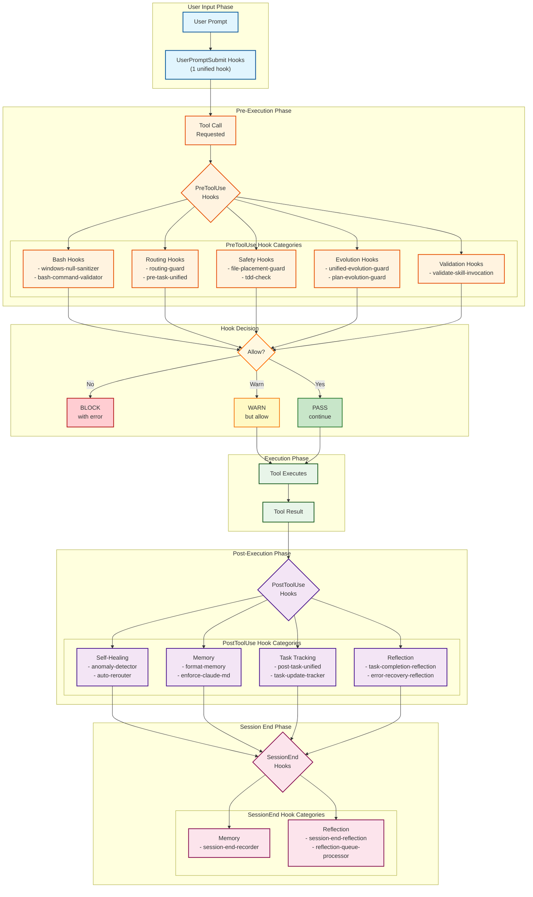

# Hook System Flow Diagram

> Generated: 2026-01-27
> Purpose: Visualizes the hook execution lifecycle and categories

## Overview

This diagram shows how hooks intercept tool calls at various lifecycle points (UserPromptSubmit, PreToolUse, PostToolUse, SessionEnd) to enforce safety, routing, and quality rules.

## Hook Execution Flow



## Hook Categories and Files

### UserPromptSubmit Hooks (1 hook)

Triggered when user submits a prompt, before any processing.

| Hook                      | Purpose                                         |
| ------------------------- | ----------------------------------------------- |
| `user-prompt-unified.cjs` | Classifies complexity, initializes router state |

### PreToolUse Hooks (By Matcher)

#### Bash Matcher

| Hook                         | Purpose                      | Enforcement |
| ---------------------------- | ---------------------------- | ----------- |
| `windows-null-sanitizer.cjs` | Sanitizes Windows null bytes | Block       |
| `bash-command-validator.cjs` | Validates shell commands     | Block       |

#### Glob/Grep/WebSearch Matcher

| Hook                | Purpose                  | Enforcement |
| ------------------- | ------------------------ | ----------- |
| `routing-guard.cjs` | Router tool restrictions | Block       |

#### Edit/Write/NotebookEdit Matcher

| Hook                          | Purpose                       | Enforcement    |
| ----------------------------- | ----------------------------- | -------------- |
| `file-placement-guard.cjs`    | Enforces file placement rules | Warn (default) |
| `routing-guard.cjs`           | Router tool restrictions      | Block          |
| `tdd-check.cjs`               | Enforces TDD workflow         | Warn           |
| `plan-evolution-guard.cjs`    | Validates plan modifications  | Warn           |
| `unified-evolution-guard.cjs` | Enforces EVOLVE workflow      | Block          |

#### Read Matcher

| Hook                            | Purpose                     | Enforcement |
| ------------------------------- | --------------------------- | ----------- |
| `validate-skill-invocation.cjs` | Validates skill invocations | Advisory    |

#### TaskCreate Matcher

| Hook                | Purpose                   | Enforcement |
| ------------------- | ------------------------- | ----------- |
| `routing-guard.cjs` | Planner-first enforcement | Block       |

#### Task Matcher

| Hook                   | Purpose                              | Enforcement |
| ---------------------- | ------------------------------------ | ----------- |
| `pre-task-unified.cjs` | Consolidated PreToolUse(Task) checks | Block       |

### PostToolUse Hooks (By Matcher)

#### All Tools (Empty Matcher)

| Hook                   | Purpose                    |
| ---------------------- | -------------------------- |
| `anomaly-detector.cjs` | Detects anomalous patterns |

#### Task Matcher

| Hook                    | Purpose                        |
| ----------------------- | ------------------------------ |
| `auto-rerouter.cjs`     | Reroutes failed tasks          |
| `post-task-unified.cjs` | Consolidated PostToolUse(Task) |

#### Edit/Write Matcher

| Hook                           | Purpose                         |
| ------------------------------ | ------------------------------- |
| `format-memory.cjs`            | Formats memory file writes      |
| `enforce-claude-md-update.cjs` | Ensures CLAUDE.md stays updated |

#### TaskUpdate Matcher

| Hook                             | Purpose                         |
| -------------------------------- | ------------------------------- |
| `task-update-tracker.cjs`        | Tracks task status changes      |
| `task-completion-reflection.cjs` | Queues reflection on completion |

#### Bash Matcher

| Hook                            | Purpose                     |
| ------------------------------- | --------------------------- |
| `error-recovery-reflection.cjs` | Queues reflection on errors |

### SessionEnd Hooks

| Hook                             | Purpose                           |
| -------------------------------- | --------------------------------- |
| `session-end-recorder.cjs`       | Records session summary to memory |
| `session-end-reflection.cjs`     | Queues session reflection         |
| `reflection-queue-processor.cjs` | Processes queued reflections      |

## Hook Directory Structure

```
hooks/
├── evolution/           # Evolution workflow enforcement (6 hooks)
│   ├── conflict-detector.cjs
│   ├── evolution-audit.cjs
│   ├── evolution-state-guard.cjs
│   ├── evolution-trigger-detector.cjs
│   ├── quality-gate-validator.cjs
│   ├── research-enforcement.cjs
│   └── unified-evolution-guard.cjs
├── memory/              # Memory management (5 hooks)
│   ├── extract-workflow-learnings.cjs
│   ├── format-memory.cjs
│   ├── memory-health-check.cjs
│   ├── session-end-recorder.cjs
│   └── session-memory-extractor.cjs
├── reflection/          # Reflection queue (4 hooks)
│   ├── error-recovery-reflection.cjs
│   ├── reflection-queue-processor.cjs
│   ├── session-end-reflection.cjs
│   └── task-completion-reflection.cjs
├── routing/             # Router enforcement (14 hooks)
│   ├── agent-context-pre-tracker.cjs
│   ├── agent-context-tracker.cjs
│   ├── documentation-routing-guard.cjs
│   ├── post-task-unified.cjs
│   ├── pre-task-unified.cjs
│   ├── router-enforcer.cjs
│   ├── router-mode-reset.cjs
│   ├── router-state.cjs
│   ├── routing-guard.cjs
│   ├── task-completion-guard.cjs
│   ├── task-update-tracker.cjs
│   ├── user-prompt-unified.cjs
│   └── _legacy/         # Consolidated hooks (reference only)
├── safety/              # Safety guardrails (14 hooks)
│   ├── bash-command-validator.cjs
│   ├── enforce-claude-md-update.cjs
│   ├── file-placement-guard.cjs
│   ├── router-write-guard.cjs
│   ├── security-trigger.cjs
│   ├── tdd-check.cjs
│   ├── validate-skill-invocation.cjs
│   ├── windows-null-sanitizer.cjs
│   └── validators/      # Command validators
├── self-healing/        # Self-healing (3 hooks)
│   ├── anomaly-detector.cjs
│   ├── auto-rerouter.cjs
│   └── loop-prevention.cjs
├── session/             # Session lifecycle (1 hook)
│   └── memory-reminder.cjs
└── validation/          # Input/output validation (1 hook)
    └── plan-evolution-guard.cjs
```

## Enforcement Modes

Most hooks support three enforcement modes via environment variables:

| Mode    | Behavior                       | When to Use                       |
| ------- | ------------------------------ | --------------------------------- |
| `block` | Prevents action, returns error | Production (default for security) |
| `warn`  | Logs warning, allows action    | Development, debugging            |
| `off`   | Disables hook entirely         | Emergency override only           |

Example: `PLANNER_FIRST_ENFORCEMENT=warn claude`
