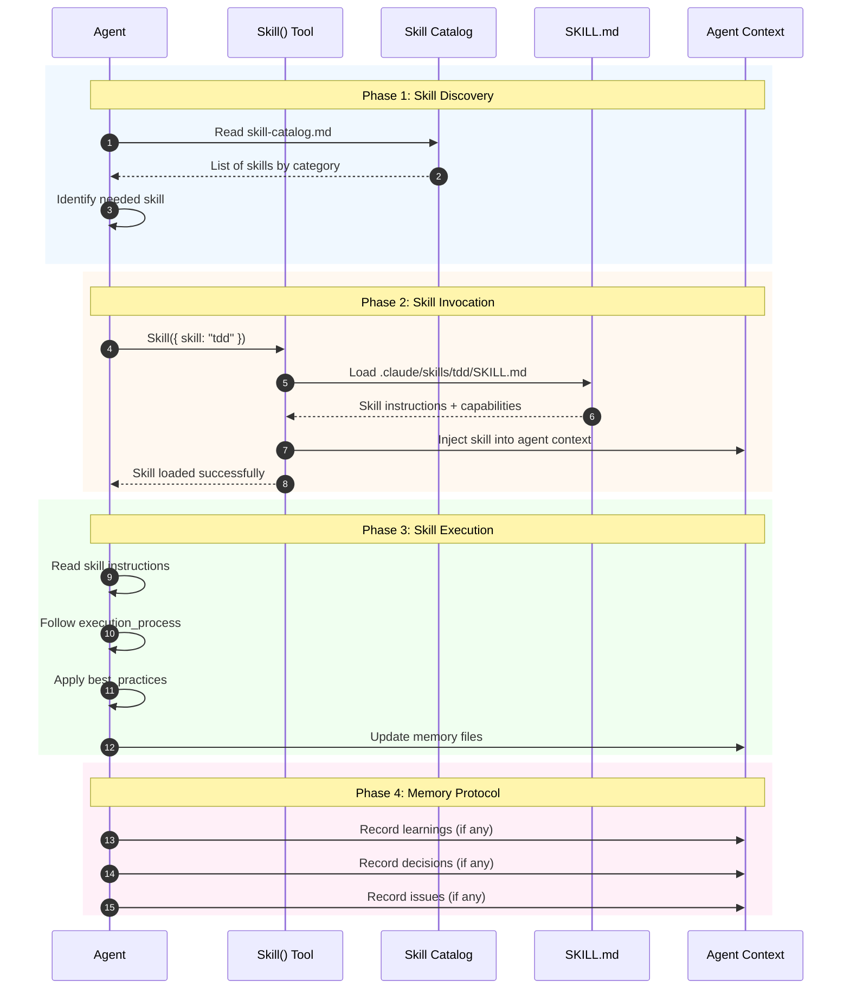
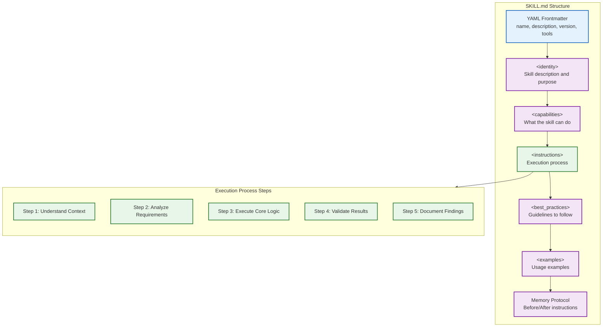
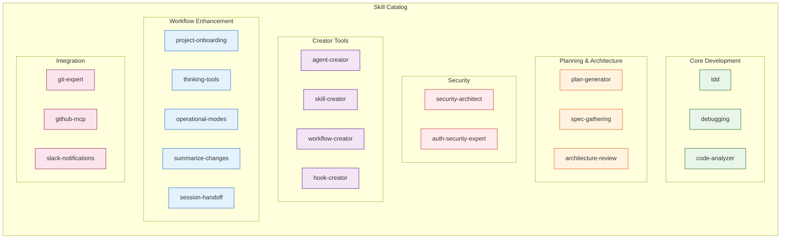

# Skill Invocation Flow Diagram

> Generated: 2026-01-27
> Purpose: Visualizes how agents discover and invoke skills

## Overview

This diagram shows the sequence of how an Agent discovers a skill from the catalog, invokes it using the Skill() tool, and applies the skill's instructions to their task.

## Skill Invocation Sequence



## Skill Structure



## Skill Categories



## Key Concepts

### Skill Discovery

1. **Catalog Location**: `.claude/context/artifacts/skill-catalog.md`
2. **Lookup by Category**: Skills organized into categories
3. **Keyword Search**: Find skills by searching for keywords

### Skill Invocation (CORRECT vs WRONG)

```javascript
// CORRECT: Use Skill() tool to invoke
Skill({ skill: "tdd" });
Skill({ skill: "debugging" });
Skill({ skill: "security-architect" });

// WRONG: Just reading doesn't apply the skill
Read(".claude/skills/tdd/SKILL.md");  // This only reads, doesn't invoke!
```

### Skill Composition

Agents can invoke multiple skills:

```javascript
// Sequential skill invocation
Skill({ skill: "project-onboarding" });  // First understand the codebase
Skill({ skill: "tdd" });                 // Then apply TDD workflow
Skill({ skill: "debugging" });           // Use debugging if tests fail
```

### Creator Skills (Self-Evolution)

When no existing skill meets the need:

```javascript
// Research first (MANDATORY)
Skill({ skill: "research-synthesis" });

// Then create new skill
Skill({ skill: "skill-creator" });
```

## Skill File Locations

| Skill Type | Location Pattern |
|------------|------------------|
| Standard | `.claude/skills/<skill-name>/SKILL.md` |
| Sub-skills | `.claude/skills/<parent>/sub-skills/<name>.md` |

## Integration Points

| Integration | How Skills Connect |
|-------------|-------------------|
| **Agents** | Define `skills` array in agent frontmatter |
| **Workflows** | Specify skills used in each phase |
| **Hooks** | `validate-skill-invocation.cjs` validates invocations |
| **Memory** | Skills follow Memory Protocol for persistence |

## Memory Protocol (All Skills)

Every skill includes Memory Protocol:

```markdown
## Memory Protocol (MANDATORY)

**Before starting:**
Read `.claude/context/memory/learnings.md`

**After completing:**
- New pattern -> `.claude/context/memory/learnings.md`
- Issue found -> `.claude/context/memory/issues.md`
- Decision made -> `.claude/context/memory/decisions.md`

> ASSUME INTERRUPTION: If it's not in memory, it didn't happen.
```
