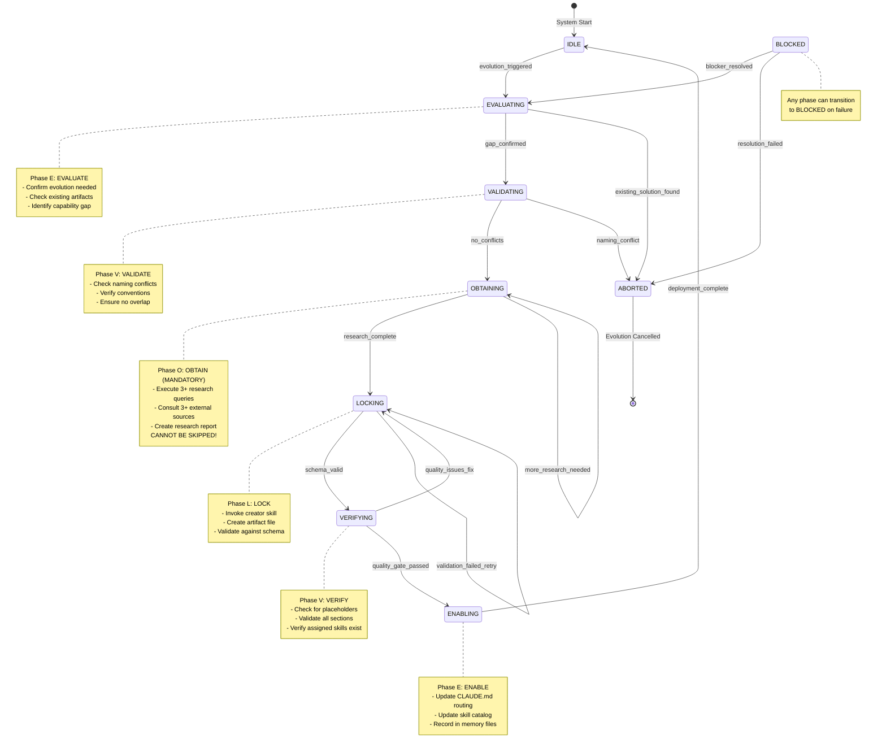
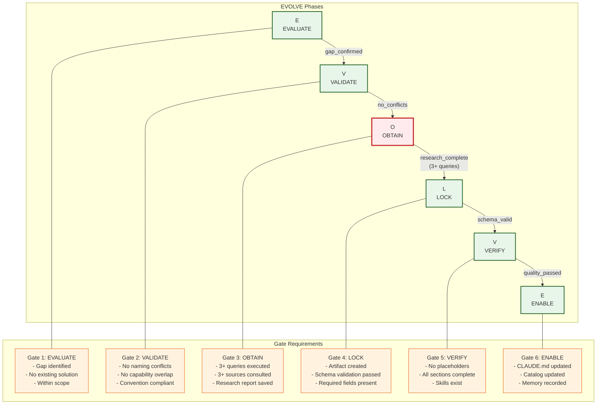
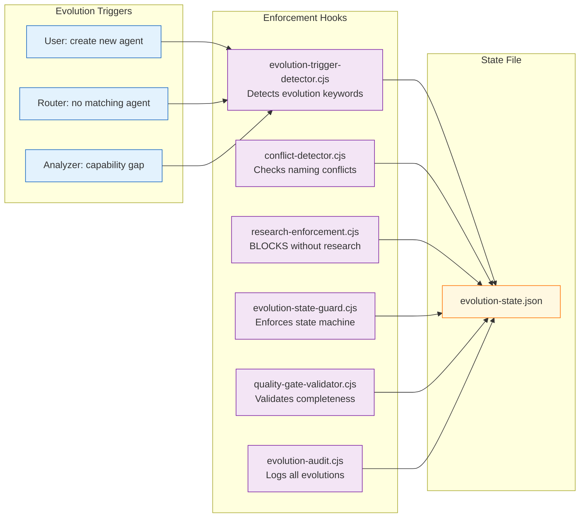
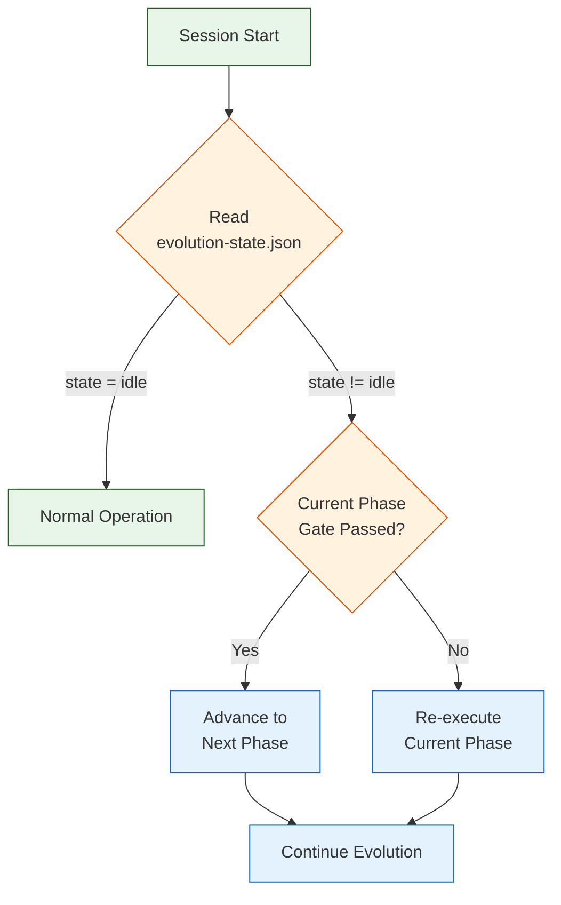

# EVOLVE State Machine Diagram

> Generated: 2026-01-27
> Purpose: Visualizes the EVOLVE workflow state machine for self-evolution

## Overview

The EVOLVE workflow is the mandatory process for creating new ecosystem artifacts (agents, skills, workflows, hooks, schemas, templates). This diagram shows the state machine that enforces proper phase transitions.

## EVOLVE State Machine



## Phase Transition Rules



## Enforcement Hooks



## Evolution State Schema

```json
{
  "state": "idle|evaluating|validating|obtaining|locking|verifying|enabling|blocked",
  "lastUpdated": "2026-01-27T10:00:00.000Z",
  "currentEvolution": {
    "type": "agent|skill|workflow|hook|schema|template",
    "name": "artifact-name",
    "phase": "evaluate|validate|obtain|lock|verify|enable",
    "startedAt": "ISO-timestamp",
    "gatePassed": false,
    "gateResults": {
      "gate1": { "passed": true, "checks": {} },
      "gate2": { "passed": true, "checks": {} },
      "gate3": { "passed": false, "checks": { "queriesExecuted": 2 } }
    },
    "researchReport": "path/to/report.md",
    "artifactPath": "path/to/artifact"
  },
  "evolutions": [
    {
      "type": "agent",
      "name": "graphql-pro",
      "path": ".claude/agents/domain/graphql-pro.md",
      "completedAt": "2026-01-26T15:30:00.000Z",
      "researchReport": ".claude/context/artifacts/research-reports/graphql-pro-research.md"
    }
  ]
}
```

## Iron Laws of Evolution

| #   | Law                                    | Enforcement                       |
| --- | -------------------------------------- | --------------------------------- |
| 1   | **NO ARTIFACT WITHOUT RESEARCH**       | `research-enforcement.cjs` blocks |
| 2   | **NO DEPLOYMENT WITHOUT VALIDATION**   | All 6 gates required              |
| 3   | **NO STATE TRANSITION WITHOUT UPDATE** | `evolution-state-guard.cjs`       |
| 4   | **NO DEVIATION FROM EVOLVE**           | Workflow is locked-in             |
| 5   | **NO BYPASSING SCHEMA VALIDATION**     | JSON schema required              |
| 6   | **NO ARTIFACT WITHOUT ROUTING**        | Must be discoverable              |

## Artifact Output Locations

| Artifact Type | Location Pattern                         |
| ------------- | ---------------------------------------- |
| Agent         | `.claude/agents/<category>/<name>.md`    |
| Skill         | `.claude/skills/<name>/SKILL.md`         |
| Workflow      | `.claude/workflows/<category>/<name>.md` |
| Hook          | `.claude/hooks/<category>/<name>.cjs`    |
| Schema        | `.claude/schemas/<name>.json`            |
| Template      | `.claude/templates/<name>.md`            |

## Recovery Protocol

If evolution is interrupted:

1. Read `evolution-state.json` to determine current phase
2. Check if `gatePassed: true` for current phase
3. If passed: Advance to next phase
4. If not passed: Re-execute current phase
5. Use `researchReport` path to verify research exists


