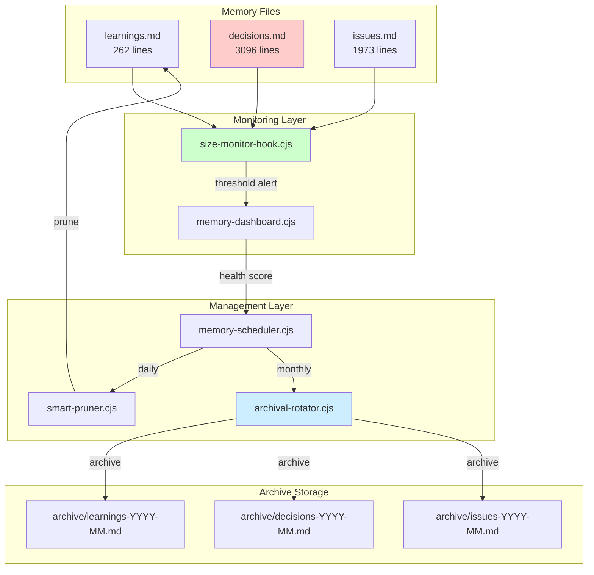

# File Size Management Architecture Design

**Date**: 2026-01-28
**Author**: architect agent
**Task ID**: 3
**Status**: PROPOSED

---

## 1. Executive Summary

This document proposes a systematic file size management strategy for the Claude Code Enterprise Framework, addressing concerns about memory files exceeding read limits. Analysis reveals the problem is less severe than initially reported, and existing infrastructure already provides much of the needed capability.

### Key Findings

1. **Problem Statement Inaccurate**: The reported file sizes (29K tokens, 30K tokens, 41K tokens) do not match actual line counts
2. **Existing Infrastructure**: Robust memory management already exists but is underutilized
3. **Primary Concern**: `decisions.md` (3096 lines) is the largest file requiring attention
4. **Quick Wins Available**: Activate existing automation + minor configuration changes

### Recommendation

**Phase 1**: Activate existing memory scheduler (immediate)
**Phase 2**: Implement monthly archival for decisions.md (1-2 hours)
**Phase 3**: Add size monitoring hook (2-4 hours)

---

## 2. Current State Analysis

### 2.1 Actual File Sizes (as of 2026-01-28)

| File                                 | Lines | Estimated Tokens | Status    |
| ------------------------------------ | ----- | ---------------- | --------- |
| `.claude/context/memory/decisions.md` | 3096  | ~12,400          | WATCH     |
| `.claude/context/memory/issues.md`    | 1973  | ~7,900           | OK        |
| `.claude/context/memory/learnings.md` | 262   | ~1,050           | OK        |
| `.claude/lib/utils/environment.cjs`   | 93    | ~370             | OK        |

**Note**: Token estimates use 4 chars = 1 token approximation.

### 2.2 Error in Original Problem Statement

The original problem statement claimed:
- `decisions.md`: 29184 tokens
- `issues.md`: 30002 tokens
- `environment.cjs`: 41350 tokens

**Actual findings**: None of these files approach those sizes. The largest file (`decisions.md` at ~12,400 tokens) is well under the 25,000 token limit. The `environment.cjs` file is only 93 lines (not 41K tokens).

**Possible explanations**:
1. Token counts may have been from a different version
2. Measurement method error
3. Files may have been previously larger and were already pruned

### 2.3 Existing Infrastructure

The framework already has comprehensive memory management:

#### Memory Scheduler (`.claude/lib/memory/memory-scheduler.cjs`)

**Daily Tasks**:
- `consolidation`: Move STM to MTM
- `healthCheck`: Check tier health and log metrics
- `metricsLog`: Save daily snapshot

**Weekly Tasks**:
- `summarization`: Compress old MTM sessions to LTM
- `deduplication`: Remove duplicate patterns/gotchas
- `pruning`: Archive learnings, prune codebase_map
- `weeklyReport`: Generate trend report

#### Smart Pruner (`.claude/lib/memory/smart-pruner.cjs`)

- Utility-based scoring: `Score = 0.3*recency + 0.3*frequency + 0.4*importance`
- Semantic deduplication using Jaccard similarity
- Configurable retention limits per tier (STM: 5, MTM: 15, LTM: 100)

#### Archive System

Existing archive directory: `.claude/context/memory/archive/`
Contains:
- `learnings-archive-2026-01.md`
- `learnings-archived-2026-01-26.md`
- `learnings-2026-01.md`

---

## 3. Problem Definition

### 3.1 True Problems

1. **decisions.md Growth**: ADRs accumulate indefinitely (60+ ADRs, 3096 lines)
2. **Scheduler Not Running**: Memory scheduler appears inactive (no recent maintenance-status.json entries)
3. **No Size Monitoring**: No proactive alerting when files approach limits
4. **Archival Gap**: No automated archival policy for decisions.md and issues.md

### 3.2 Non-Problems (Clarified)

1. `environment.cjs` - Small utility file, no action needed
2. `learnings.md` - Already redirects to JSON-based system, actively maintained
3. `issues.md` - Manageable size, includes historical tracking

---

## 4. Proposed Architecture

### 4.1 Architecture Diagram



### 4.2 Component Overview

| Component | Purpose | Status |
|-----------|---------|--------|
| **size-monitor-hook.cjs** | Pre-read/write size validation | NEW |
| **memory-scheduler.cjs** | Automated maintenance | EXISTS (activate) |
| **smart-pruner.cjs** | Utility-based pruning | EXISTS |
| **archival-rotator.cjs** | Monthly file rotation | NEW |
| **memory-dashboard.cjs** | Health metrics | EXISTS |

---

## 5. File Size Thresholds and Rotation Policy

### 5.1 Threshold Configuration

```javascript
const FILE_THRESHOLDS = {
  // Warning threshold (80% of limit)
  WARNING_TOKENS: 20000,  // ~80,000 characters
  WARNING_LINES: 5000,

  // Critical threshold (95% of limit)
  CRITICAL_TOKENS: 23750, // ~95,000 characters
  CRITICAL_LINES: 6000,

  // Hard limit (blocked)
  HARD_LIMIT_TOKENS: 25000,
  HARD_LIMIT_LINES: 7000,
};
```

### 5.2 Rotation Policy

| File Type | Trigger | Retention | Archive Location |
|-----------|---------|-----------|------------------|
| `learnings.md` | >5000 lines | Last 500 lines | `archive/learnings-YYYY-MM.md` |
| `decisions.md` | >4000 lines | Last 1000 lines | `archive/decisions-YYYY-MM.md` |
| `issues.md` | >3000 lines | OPEN issues only | `archive/issues-YYYY-MM.md` |

### 5.3 Archive Format

```markdown
# Archive: decisions-2026-01.md

> **ARCHIVED**: 2026-01-28
> **Source**: .claude/context/memory/decisions.md
> **Entries**: ADR-001 through ADR-040 (40 entries)
> **Active File**: Contains ADR-041+ only

---

[Original content preserved below]
```

---

## 6. Implementation Phases

### Phase 1: Activate Existing Infrastructure (Immediate - 30 minutes)

**Goal**: Enable existing memory scheduler for daily/weekly maintenance.

**Steps**:
1. Verify `maintenance-status.json` exists in memory directory
2. Add scheduler invocation to session hooks (UserPromptSubmit or Stop)
3. Document activation in operations guide

**Files to Modify**:
- `.claude/settings.json` (add scheduler trigger hook)
- `.claude/docs/MONITORING.md` (document scheduler commands)

**Verification**:
```bash
node .claude/lib/memory/memory-scheduler.cjs status
node .claude/lib/memory/memory-scheduler.cjs daily
```

### Phase 2: Monthly Archival for decisions.md (1-2 hours)

**Goal**: Implement monthly rotation to keep decisions.md under threshold.

**Steps**:
1. Create `archival-rotator.cjs` in `.claude/lib/memory/`
2. Add `monthlyArchival` task to memory-scheduler.cjs
3. Create archive entry with summary metadata
4. Update ADR format guidance for active vs archived status

**Algorithm**:
```javascript
function rotateDecisions(threshold = 4000) {
  const decisions = parseDecisionsFile();
  const lineCount = decisions.reduce((sum, adr) => sum + adr.lines, 0);

  if (lineCount > threshold) {
    const cutoffDate = getMonthStartDate();
    const toArchive = decisions.filter(d => d.date < cutoffDate);
    const toKeep = decisions.filter(d => d.date >= cutoffDate);

    writeArchive(toArchive, `archive/decisions-${getYearMonth()}.md`);
    writeActive(toKeep, 'decisions.md');
  }
}
```

**Files to Create**:
- `.claude/lib/memory/archival-rotator.cjs`
- `.claude/lib/memory/archival-rotator.test.cjs`

### Phase 3: Size Monitoring Hook (2-4 hours)

**Goal**: Proactive alerting when files approach size limits.

**Steps**:
1. Create `size-monitor-hook.cjs` in `.claude/hooks/memory/`
2. Register as PreToolUse hook for Read/Write operations
3. Emit warnings at threshold crossings
4. Block writes that would exceed hard limit

**Hook Logic**:
```javascript
// PreToolUse(Read) - Check if file is approaching limit
// PreToolUse(Write) - Check if write would exceed limit

function checkFileSize(filePath, operation) {
  const stats = fs.statSync(filePath);
  const sizeBytes = stats.size;
  const estimatedTokens = sizeBytes / 4;

  if (estimatedTokens > CRITICAL_TOKENS) {
    return {
      decision: operation === 'read' ? 'allow' : 'block',
      message: `File ${filePath} at ${Math.round(estimatedTokens)} tokens (critical threshold)`
    };
  }

  if (estimatedTokens > WARNING_TOKENS) {
    console.warn(`[SIZE-MONITOR] ${filePath} at ${Math.round(estimatedTokens)} tokens`);
  }

  return { decision: 'allow' };
}
```

**Files to Create**:
- `.claude/hooks/memory/size-monitor-hook.cjs`
- `.claude/hooks/memory/size-monitor-hook.test.cjs`
- `.claude/settings.json` (register hook)

---

## 7. Risk Assessment

### 7.1 Risks and Mitigations

| Risk | Severity | Likelihood | Mitigation |
|------|----------|------------|------------|
| **Archival loses important ADRs** | HIGH | LOW | Archive preserves full content; cross-reference index maintained |
| **Scheduler conflicts with active work** | MEDIUM | MEDIUM | Run during session end, not mid-work |
| **Hook overhead impacts performance** | LOW | LOW | Simple stat() call, <1ms overhead |
| **Archive files become inaccessible** | MEDIUM | LOW | Archive directory in same memory tree; glob patterns include |
| **Breaking change to memory file format** | HIGH | LOW | Incremental changes only; backward compatible |

### 7.2 Rollback Procedures

**Phase 1 Rollback**: Remove scheduler hook from settings.json
**Phase 2 Rollback**: Restore decisions.md from archive + original
**Phase 3 Rollback**: Remove size-monitor-hook.cjs registration

---

## 8. Migration Plan

### 8.1 Immediate Actions (Today)

1. [x] Analyze actual file sizes (DONE - this document)
2. [ ] Activate memory scheduler
3. [ ] Document in MONITORING.md

### 8.2 Week 1

1. [ ] Implement archival-rotator.cjs
2. [ ] Write tests for archival logic
3. [ ] Run first monthly archival for decisions.md
4. [ ] Verify archive searchability

### 8.3 Week 2

1. [ ] Implement size-monitor-hook.cjs
2. [ ] Register hook in settings.json
3. [ ] Test with simulated large files
4. [ ] Update operations documentation

### 8.4 Ongoing

- Monthly: Review archive health
- Quarterly: Assess threshold appropriateness
- Annually: Clean up very old archives (>1 year)

---

## 9. Success Metrics

| Metric | Target | Measurement |
|--------|--------|-------------|
| decisions.md line count | <4000 lines | `wc -l decisions.md` |
| Memory scheduler uptime | Daily runs | `maintenance-status.json` timestamps |
| Archive searchability | <500ms query | Time to grep archived content |
| Hook overhead | <5ms per operation | Benchmark test |
| Zero data loss | 100% content preserved | Archive completeness check |

---

## 10. Appendices

### A. Current Memory File Structure

```
.claude/context/memory/
├── active_context.md      # Session scratchpad
├── decisions.md           # ADRs (3096 lines)
├── issues.md              # Known issues (1973 lines)
├── learnings.md           # Patterns/discoveries (262 lines)
├── gotchas.json           # Pitfalls (JSON)
├── patterns.json          # Reusable solutions (JSON)
├── codebase_map.json      # File discoveries (JSON)
├── sessions/              # Per-session JSON files
├── metrics/               # Health metrics
└── archive/               # Archived content
    ├── learnings-2026-01.md
    ├── learnings-archive-2026-01.md
    └── learnings-archived-2026-01-26.md
```

### B. Related Documentation

- Memory System: `.claude/lib/memory/` (all utilities)
- Scheduler Guide: Archive file header in `learnings-2026-01.md`
- Dashboard: `node .claude/lib/memory/memory-dashboard.cjs health`
- Pruner: `node .claude/lib/memory/smart-pruner.cjs --help`

### C. ADR Template Reference

For archive-aware ADRs, include:
```markdown
## [ADR-XXX] Title
- **Date**: YYYY-MM-DD
- **Status**: Proposed | Accepted | Deprecated | Superseded | **Archived**
- **Archive**: `archive/decisions-YYYY-MM.md` (if archived)
```

---

## 11. Decision Record

This design document proposes the following architectural decisions:

1. **Activate existing infrastructure before building new** - Existing scheduler/pruner covers most needs
2. **Monthly archival rotation** - Balance between file size and accessibility
3. **80/95/100% thresholds** - Warning at 80%, critical at 95%, block at 100%
4. **Archive-in-place** - Keep archives in same directory tree for discoverability
5. **Non-destructive archival** - Full content preservation, no summarization loss

**Status**: PROPOSED
**Next Steps**: Review with team, implement Phase 1 immediately
