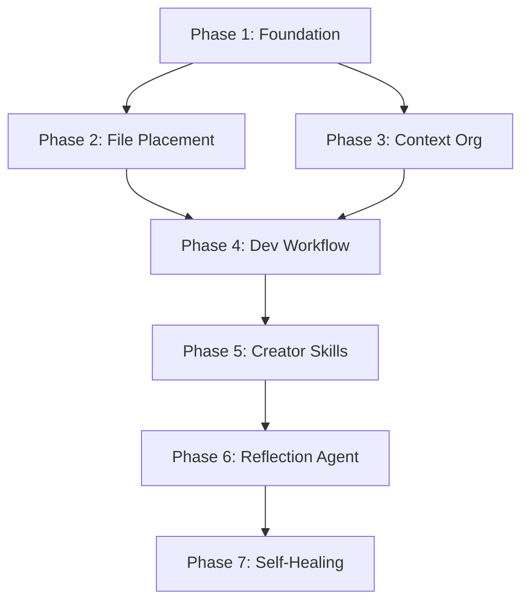

# Framework Refactoring & Reflection System Plan v3

**Date:** 2026-01-25
**Status:** PENDING_APPROVAL
**Author:** PLANNER Agent
**Version:** 3.0.0

---

## Executive Summary

This plan addresses comprehensive refactoring of the `.claude/` framework directory structure, establishing clear developer workflows for file placement, implementing a self-reflection system, and creating self-healing capabilities. The framework currently suffers from:

1. **Structural Debt**: `lib/` contains 31 files of workflow/engine code that should be in dedicated directories; `tools/` has 25 items acting as a "junk drawer"; empty directories (`commands/`, `temp/`) need deletion; misplaced test files in `.claude/tests/` instead of co-located with source.

2. **Missing Developer Guidance**: No standardized rules for where agents should place outputs (plans, reports, artifacts); no pre-write hooks to enforce placement; creator skills lack file placement rules.

3. **No Self-Reflection**: Framework cannot assess its own outputs; no systematic quality validation; no RECE loop (Reflect, Evaluate, Correct, Execute) implementation.

4. **Limited Self-Healing**: Evolution system exists but lacks anomaly detection, automatic rerouting, and loop prevention mechanisms identified in VIGIL/MARS research.

This plan follows a 7-phase approach, with each phase building on the previous. Phase 1 (Foundation) must complete before Phase 2, but later phases can overlap where dependencies allow. Total estimated effort: 40-60 agent sessions across all phases.

---

## Phase 1: Foundation - Folder Structure Cleanup

**Goal**: Clean up directory structure by removing empty/orphaned directories, moving misplaced files, and establishing correct organization.

**Duration**: 1-2 sessions
**Dependencies**: None (foundation work)

### 1.1 Delete Empty/Orphaned Directories

**Rationale**: Empty directories add noise and confusion. The git status shows `commands/` and `temp/` are empty.

| Task | Directory | Action | Verification |
|------|-----------|--------|--------------|
| 1.1.1 | `.claude/commands/` | Delete (confirmed empty) | `dir` returns empty |
| 1.1.2 | `.claude/temp/` | Delete (confirmed empty) | `dir` returns empty |

### 1.2 Reorganize Test Files

**Rationale**: Tests should be co-located with their source files for maintainability. Current `.claude/tests/hooks/` has 3 test files separated from their hooks.

| Task | Current Location | New Location | Pattern |
|------|-----------------|--------------|---------|
| 1.2.1 | `.claude/tests/hooks/*.test.cjs` | Co-locate with source in `.claude/hooks/**/*.test.cjs` | Move each test next to its source |
| 1.2.2 | Delete `.claude/tests/` | After moving all tests | Remove empty directory |

### 1.3 Reorganize lib/ Directory

**Rationale**: `lib/` contains 31 files totaling ~478KB. This is a mix of:
- Workflow engine code (should be in `.claude/lib/workflow/`)
- Memory management (should be in `.claude/lib/memory/`)
- Platform utilities (should stay in `.claude/lib/`)

| Task | Files | New Location | Purpose |
|------|-------|--------------|---------|
| 1.3.1 | `workflow-*.cjs`, `checkpoint-*.cjs`, `saga-*.cjs`, `step-*.cjs` | `.claude/lib/workflow/` | Workflow execution engine |
| 1.3.2 | `memory-*.cjs`, `smart-pruner.cjs` | `.claude/lib/memory/` | Memory management |
| 1.3.3 | `cross-workflow-*.cjs`, `system-registration-*.cjs`, `evolution-state-*.cjs` | `.claude/lib/integration/` | System integration |
| 1.3.4 | `platform.cjs`, `platform.mjs` | Keep in `.claude/lib/` | Platform utilities |
| 1.3.5 | Update all imports | All files referencing moved modules | Fix require/import paths |

### 1.4 Reorganize tools/ Directory

**Rationale**: `tools/` has 25 items mixing standalone tools with duplicates of skills. Items that duplicate skills should be deleted; standalone tools should be categorized.

| Task | Item | Action | Rationale |
|------|------|--------|-----------|
| 1.4.1 | `agent-creator/`, `hook-creator/`, `workflow-creator/` | Delete | Duplicates of skills |
| 1.4.2 | `diagram-generator/`, `project-analyzer/` | Delete | Duplicates of skills |
| 1.4.3 | `mcp-converter/`, `repo-rag/`, `sequential-thinking/` | Delete | Duplicates of skills |
| 1.4.4 | `test-generator/`, `skills-core/`, `swarm-coordination/` | Delete | Duplicates of skills |
| 1.4.5 | Standalone `.mjs` utilities | Keep in `.claude/tools/utils/` | context-path-resolver, detect-orphans, etc. |
| 1.4.6 | MCP/cloud tools | Keep in `.claude/tools/mcp/` | aws-cloud-ops, kubernetes-flux, etc. |
| 1.4.7 | Validation tools | Keep in `.claude/tools/validation/` | validate-agents, validate-commit, doctor |

### 1.5 Reorganize scripts/ Directory

**Rationale**: `scripts/` has 2 files that should be with their related code.

| Task | File | New Location | Purpose |
|------|------|--------------|---------|
| 1.5.1 | `run-workflow-tests.cjs` | `.claude/lib/workflow/run-tests.cjs` | With workflow engine |
| 1.5.2 | `verify-workflows.mjs` | `.claude/lib/workflow/verify.mjs` | With workflow engine |
| 1.5.3 | Delete `.claude/scripts/` | After moving files | Remove empty directory |

### 1.6 Phase 1 Validation

| Task | Check | Expected Result |
|------|-------|-----------------|
| 1.6.1 | Verify all hooks still work | Run 3 sample hooks |
| 1.6.2 | Verify workflow engine works | Run workflow-engine tests |
| 1.6.3 | Verify memory system works | Run memory-manager tests |
| 1.6.4 | Update CLAUDE.md if needed | Paths mentioned in docs are correct |

---

## Phase 2: File Placement Workflow

**Goal**: Establish clear rules for where agents place their outputs and enforce them with hooks.

**Duration**: 2-3 sessions
**Dependencies**: Phase 1 complete (directory structure settled)

### 2.1 Create File Placement Rules Document

**Deliverable**: `.claude/docs/FILE_PLACEMENT_RULES.md`

| Output Type | Location | Naming Convention | Example |
|-------------|----------|-------------------|---------|
| Plans | `.claude/context/plans/` | `<feature>-plan.md` | `auth-plan.md` |
| Research Reports | `.claude/context/artifacts/research-reports/` | `<topic>-research.md` | `oauth-research.md` |
| Implementation Reports | `.claude/context/reports/` | `<task>-report.md` | `refactor-report.md` |
| Audit Reports | `.claude/context/reports/` | `<target>-audit.md` | `skills-audit.md` |
| Session Artifacts | `.claude/context/artifacts/` | `<artifact-type>.md` | `skill-catalog.md` |
| Temporary Files | `.claude/context/tmp/` | Auto-cleaned | Ephemeral only |
| Checkpoints | `.claude/context/checkpoints/` | `<workflow>-<timestamp>.json` | Auto-generated |
| Agent Definitions | `.claude/agents/<category>/` | `<agent-name>.md` | `python-pro.md` |
| Skill Definitions | `.claude/skills/<skill-name>/` | `SKILL.md` | `tdd/SKILL.md` |
| Hook Code | `.claude/hooks/<category>/` | `<hook-name>.cjs` | `safety/router-write-guard.cjs` |
| Workflow Definitions | `.claude/workflows/<category>/` | `<workflow-name>.md` or `.yaml` | `core/evolution-workflow.md` |
| Schema Files | `.claude/schemas/` | `<entity>.schema.json` | `agent.schema.json` |
| Templates | `.claude/templates/` | `<template-name>.md` | `agent-template.md` |
| Memory Files | `.claude/context/memory/` | Predefined names | `learnings.md`, `decisions.md` |
| Config Files | `.claude/context/config/` | `<config-name>.json` | `agent-skill-matrix.json` |

### 2.2 Create File Placement Validation Hook

**Deliverable**: `.claude/hooks/safety/file-placement-guard.cjs`

**Trigger**: PreToolUse(Write, Edit)

**Logic**:
```javascript
// Validate file path against allowed patterns
const PLACEMENT_RULES = {
  'context/plans/': /\.(md|yaml)$/,
  'context/reports/': /\.(md|yaml)$/,
  'context/artifacts/': /\.(md|json)$/,
  'agents/': /\.md$/,
  'skills/': /SKILL\.md$/,
  'hooks/': /\.cjs$/,
  'workflows/': /\.(md|yaml)$/,
  'schemas/': /\.schema\.json$/,
  // etc.
};

// Block writes to incorrect locations
// Allow override with --force flag or PLACEMENT_GUARD=off
```

### 2.3 Create File Placement Test Suite

**Deliverable**: `.claude/hooks/safety/file-placement-guard.test.cjs`

| Test Case | Input | Expected |
|-----------|-------|----------|
| Valid plan file | Write to `context/plans/auth-plan.md` | Allow |
| Invalid plan location | Write to `context/auth-plan.md` | Block |
| Valid agent file | Write to `agents/domain/new-pro.md` | Allow |
| Invalid agent extension | Write to `agents/domain/new-pro.yaml` | Block |
| Valid skill structure | Write to `skills/new-skill/SKILL.md` | Allow |
| Invalid skill file | Write to `skills/new-skill/readme.md` | Block |
| Override with flag | Write anywhere with `--force` | Allow |

### 2.4 Update CLAUDE.md with File Placement Section

**Deliverable**: New section in CLAUDE.md

Add Section 10: FILE PLACEMENT RULES with:
- Quick reference table
- Link to full documentation
- Examples of correct and incorrect placement

### 2.5 Phase 2 Validation

| Task | Check | Expected Result |
|------|-------|-----------------|
| 2.5.1 | Hook blocks incorrect placement | Test 5 invalid paths |
| 2.5.2 | Hook allows correct placement | Test 5 valid paths |
| 2.5.3 | Override works | Test with PLACEMENT_GUARD=off |
| 2.5.4 | Documentation complete | FILE_PLACEMENT_RULES.md exists and comprehensive |

---

## Phase 3: Context Folder Organization

**Goal**: Standardize the structure of `.claude/context/` for consistent artifact storage.

**Duration**: 1-2 sessions
**Dependencies**: Phase 2 complete (placement rules defined)

### 3.1 Context Folder Structure

**Current State Analysis**:
```
context/
├── artifacts/           # Research reports, catalogs (keep)
├── backups/             # System backups (keep)
├── checkpoints/         # Workflow checkpoints (keep)
├── config/              # Configuration files (keep)
├── evolution-state.json # Evolution tracking (keep)
├── memory/              # Learnings, decisions, issues (keep)
├── plans/               # Planning documents (keep)
├── reports/             # Execution reports (keep, needs cleanup)
├── runtime/             # Runtime state (evaluate)
├── sessions/            # Session data (evaluate)
└── tmp/                 # Temporary files (keep, add auto-cleanup)
```

### 3.2 Create Standard Report Templates

**Deliverable**: `.claude/templates/reports/`

| Template | Purpose | Required Sections |
|----------|---------|-------------------|
| `plan-template.md` | Planning documents | Summary, Phases, Tasks, Dependencies, Risks |
| `research-report-template.md` | Research outputs | Query Summary, Sources, Key Findings, Recommendations |
| `audit-report-template.md` | Audit results | Scope, Methodology, Findings, Severity, Remediation |
| `implementation-report-template.md` | Task completion | Summary, Changes Made, Files Modified, Testing, Notes |
| `reflection-report-template.md` | Self-reflection | Assessment, Quality Score, Issues Found, Learnings |

### 3.3 Create Artifact Naming Convention Document

**Deliverable**: `.claude/docs/ARTIFACT_NAMING.md`

| Type | Pattern | Example |
|------|---------|---------|
| Plans | `<feature>-plan.md` | `auth-plan.md` |
| Research | `<topic>-research.md` | `oauth-research.md` |
| Audits | `<target>-audit.md` | `skills-audit.md` |
| Reports | `<task>-report.md` | `refactor-report.md` |
| Reflections | `reflection-<date>-<topic>.md` | `reflection-2026-01-25-cleanup.md` |

### 3.4 Clean Up context/reports/

**Rationale**: Currently has 26 report files, many outdated. Archive old reports.

| Task | Action | Target |
|------|--------|--------|
| 3.4.1 | Create archive directory | `.claude/context/reports/archive/` |
| 3.4.2 | Move reports older than 30 days | To archive directory |
| 3.4.3 | Keep recent and reference reports | In main reports directory |

### 3.5 Phase 3 Validation

| Task | Check | Expected Result |
|------|-------|-----------------|
| 3.5.1 | All templates exist | 5 template files created |
| 3.5.2 | Naming convention documented | ARTIFACT_NAMING.md complete |
| 3.5.3 | Reports organized | Old reports archived |
| 3.5.4 | Context structure clean | No orphaned files |

---

## Phase 4: Developer Code Workflow

**Goal**: Document and enforce best practices for agents implementing/editing code.

**Duration**: 2-3 sessions
**Dependencies**: Phases 1-3 complete

### 4.1 Create Developer Workflow Document

**Deliverable**: `.claude/docs/DEVELOPER_WORKFLOW.md`

**Sections**:
1. **Pre-Implementation Checklist**
   - Read assigned task fully
   - Check memory files for relevant learnings
   - Invoke required skills (tdd, debugging)
   - Review related code with Grep/Glob

2. **Implementation Standards**
   - One logical change per commit
   - Tests before implementation (TDD)
   - Absolute paths in all file operations
   - No proactive documentation creation

3. **Post-Implementation Checklist**
   - Run tests (must pass)
   - Update task status with summary
   - Record learnings if applicable
   - Check TaskList for next work

4. **Error Recovery**
   - Smart revert for failed changes
   - Checkpoint before risky operations
   - Memory recording for blockers

### 4.2 Create Pre-Implementation Hook

**Deliverable**: `.claude/hooks/safety/pre-implementation-check.cjs`

**Trigger**: UserPromptSubmit (when agent mode active)

**Logic**:
- Verify agent is in correct mode
- Remind about memory protocol
- Check for blocking tasks

### 4.3 Create Post-Implementation Hook

**Deliverable**: `.claude/hooks/safety/post-implementation-check.cjs`

**Trigger**: PostToolUse(Write, Edit)

**Logic**:
- Remind to run tests if code modified
- Remind to update task status
- Check file placement compliance

### 4.4 Update Agent Definitions with Workflow Reference

**Deliverable**: Update developer.md, and all domain agents

Add section:
```markdown
## Development Workflow (MANDATORY)

Follow: `.claude/docs/DEVELOPER_WORKFLOW.md`

Quick Reference:
1. Read task + memory
2. Invoke skills (tdd, debugging)
3. Implement with tests
4. Update task status
5. Record learnings
```

### 4.5 Phase 4 Validation

| Task | Check | Expected Result |
|------|-------|-----------------|
| 4.5.1 | DEVELOPER_WORKFLOW.md complete | All sections documented |
| 4.5.2 | Pre-implementation hook works | Reminders shown |
| 4.5.3 | Post-implementation hook works | Compliance checked |
| 4.5.4 | Agent definitions updated | 10+ agents have workflow reference |

---

## Phase 5: Update Creator Skills

**Goal**: Ensure all creator skills enforce file placement rules and follow best practices.

**Duration**: 2-3 sessions
**Dependencies**: Phases 1-4 complete

### 5.1 Skills to Update

| Skill | File | Updates Needed |
|-------|------|----------------|
| `agent-creator` | `.claude/skills/agent-creator/SKILL.md` | Add file placement rules, output validation |
| `skill-creator` | `.claude/skills/skill-creator/SKILL.md` | Add file placement rules, schema validation |
| `hook-creator` | `.claude/skills/hook-creator/SKILL.md` | Add file placement rules, test requirement |
| `workflow-creator` | `.claude/skills/workflow-creator/SKILL.md` | Add file placement rules, YAML validation |
| `template-creator` | `.claude/skills/template-creator/SKILL.md` | Add file placement rules |
| `schema-creator` | `.claude/skills/schema-creator/SKILL.md` | Add file placement rules |
| `research-synthesis` | `.claude/skills/research-synthesis/SKILL.md` | Add output location enforcement |

### 5.2 Add File Placement Section to Each Skill

**Template Section**:
```markdown
## File Placement Rules (MANDATORY)

### Output Location
- Primary Output: `<specific path for this skill>`
- Naming Convention: `<pattern>`

### Pre-Creation Validation
Before creating any file:
1. Verify target directory exists
2. Check for naming conflicts
3. Validate file extension

### Post-Creation Registration
After creating file:
1. Update CLAUDE.md routing table (for agents)
2. Update skill-catalog.md (for skills)
3. Update settings.json (for hooks)
```

### 5.3 Add Output Validation to Each Skill

**For each skill, add validation step**:
```markdown
## Output Validation

Before finalizing, verify:
- [ ] File created in correct location
- [ ] Naming convention followed
- [ ] Required sections present
- [ ] No placeholder content remaining
- [ ] Registration complete
```

### 5.4 Create Creator Skills Test Suite

**Deliverable**: `.claude/skills/creator-tests/`

| Test | Skill | Validates |
|------|-------|-----------|
| agent-creator-placement.test.md | agent-creator | Correct output location |
| skill-creator-placement.test.md | skill-creator | Correct output location |
| hook-creator-placement.test.md | hook-creator | Correct output location |

### 5.5 Phase 5 Validation

| Task | Check | Expected Result |
|------|-------|-----------------|
| 5.5.1 | All 7 skills updated | File placement sections added |
| 5.5.2 | Output validation added | Each skill has validation checklist |
| 5.5.3 | Tests created | 3+ placement tests exist |
| 5.5.4 | Skills still functional | Create test agent with agent-creator |

---

## Phase 6: Reflection Agent (EVOLVE Workflow)

**Goal**: Create a dedicated reflection agent following the EVOLVE workflow for metacognitive assessment.

**Duration**: 3-4 sessions
**Dependencies**: Phases 1-5 complete (infrastructure ready)

### 6.1 Research Phase (OBTAIN)

**Required Before Creation**:
- [ ] 3+ Exa/WebSearch queries on AI agent reflection
- [ ] Review VIGIL, MARS, RECE research (already in research report)
- [ ] Document design decisions with rationale

**Research Queries**:
1. "AI agent self-reflection metacognition patterns 2025"
2. "RECE loop implementation autonomous agents"
3. "Quality assessment rubrics for AI outputs"

### 6.2 Agent Definition

**Deliverable**: `.claude/agents/core/reflection-agent.md`

**Core Responsibilities**:
1. **Quality Assessment**: Score outputs against rubrics
2. **Pattern Extraction**: Identify reusable patterns from completed work
3. **Issue Detection**: Find problems, bugs, or gaps
4. **Learning Consolidation**: Update memory with insights
5. **Strategy Adjustment**: Suggest workflow improvements

**RECE Loop Implementation**:
```
REFLECT -> EVALUATE -> CORRECT -> EXECUTE
   │          │           │          │
   │          │           │          └─ Apply improvements
   │          │           └─ Generate corrections
   │          └─ Score against rubrics
   └─ Examine outputs and reasoning
```

### 6.3 Reflection Workflow

**Deliverable**: `.claude/workflows/core/reflection-workflow.md`

**Phases**:
1. **Trigger Detection**: When to run reflection
2. **Output Collection**: Gather outputs to assess
3. **Quality Scoring**: Apply rubrics
4. **Issue Identification**: Find problems
5. **Learning Extraction**: Capture patterns
6. **Memory Update**: Persist learnings
7. **Recommendation Generation**: Suggest improvements

### 6.4 Reflection Rubrics

**Deliverable**: `.claude/context/config/reflection-rubrics.json`

| Category | Criteria | Weight |
|----------|----------|--------|
| Completeness | All required sections present | 0.25 |
| Accuracy | No factual errors, correct paths | 0.25 |
| Clarity | Well-structured, readable | 0.15 |
| Consistency | Follows conventions | 0.15 |
| Actionability | Clear next steps defined | 0.20 |

### 6.5 Reflection Trigger Hooks

**Deliverable**: `.claude/hooks/reflection/`

| Hook | Trigger | Action |
|------|---------|--------|
| `task-completion-reflection.cjs` | PostToolUse(TaskUpdate status=completed) | Queue reflection |
| `error-recovery-reflection.cjs` | PostToolUse after error | Queue reflection |
| `session-end-reflection.cjs` | Session end | Run reflection summary |

### 6.6 Reflection Output Template

**Deliverable**: `.claude/templates/reports/reflection-report-template.md`

```markdown
# Reflection Report

**Date**: {{date}}
**Scope**: {{scope}}
**Agent**: {{agent}}

## Quality Assessment

| Criterion | Score (0-1) | Notes |
|-----------|-------------|-------|
| Completeness | {{score}} | {{notes}} |
| Accuracy | {{score}} | {{notes}} |
| Clarity | {{score}} | {{notes}} |
| Consistency | {{score}} | {{notes}} |
| Actionability | {{score}} | {{notes}} |
| **Overall** | {{overall}} | |

## Issues Found

{{#issues}}
- **{{severity}}**: {{description}}
{{/issues}}

## Patterns Identified

{{#patterns}}
- {{pattern}}
{{/patterns}}

## Learnings to Record

{{#learnings}}
- {{learning}}
{{/learnings}}

## Recommendations

{{#recommendations}}
- {{recommendation}}
{{/recommendations}}
```

### 6.7 Phase 6 Validation

| Task | Check | Expected Result |
|------|-------|-----------------|
| 6.7.1 | Research documented | 3+ queries, 3+ sources |
| 6.7.2 | Agent definition complete | reflection-agent.md exists |
| 6.7.3 | Workflow documented | reflection-workflow.md exists |
| 6.7.4 | Rubrics defined | reflection-rubrics.json exists |
| 6.7.5 | Hooks created | 3 reflection hooks work |
| 6.7.6 | CLAUDE.md updated | Reflection agent in routing table |
| 6.7.7 | Integration test | Run reflection on completed task |

---

## Phase 7: Self-Healing System

**Goal**: Implement VIGIL-inspired monitoring and automatic recovery mechanisms.

**Duration**: 4-5 sessions
**Dependencies**: Phase 6 complete (reflection agent provides quality signals)

### 7.1 Anomaly Detection

**Deliverable**: `.claude/hooks/self-healing/anomaly-detector.cjs`

**Anomalies to Detect**:
| Anomaly | Detection Logic | Threshold |
|---------|----------------|-----------|
| Token explosion | Token count > 2x average | configurable |
| Duration spike | Execution time > 3x average | configurable |
| Repeated failures | Same tool fails 3+ times | 3 failures |
| Infinite loop risk | Same prompt pattern repeating | 2 repetitions |
| Resource exhaustion | Memory/CPU metrics | system-defined |

**Output**: Log to `.claude/context/self-healing/anomaly-log.jsonl`

### 7.2 Validation Framework

**Deliverable**: `.claude/lib/self-healing/validator.cjs`

**Validations**:
1. **Output Validation**: Check outputs against schemas
2. **Path Validation**: Verify file paths are valid
3. **State Validation**: Check evolution-state.json integrity
4. **Memory Validation**: Check memory files for corruption

### 7.3 Automatic Rerouting

**Deliverable**: `.claude/hooks/self-healing/auto-rerouter.cjs`

**Rerouting Rules**:
| Condition | Action |
|-----------|--------|
| Agent fails 2+ times | Suggest alternative agent |
| Skill not found | Suggest creation via evolution |
| Resource constraint | Switch to lower-cost model |
| Task stuck | Suggest decomposition |

### 7.4 Loop Prevention

**Deliverable**: `.claude/hooks/self-healing/loop-prevention.cjs`

**Mechanisms**:
1. **Evolution Budget**: Max 3 evolutions per session
2. **Cooldown Period**: 5 minutes between same-type evolutions
3. **Depth Limit**: Max 5 nested agent spawns
4. **Pattern Detection**: Block if same action attempted 3x

**State Tracking**: `.claude/context/self-healing/loop-state.json`

### 7.5 Rollback System

**Deliverable**: `.claude/lib/self-healing/rollback-manager.cjs`

**Capabilities**:
1. **Checkpoint Creation**: Before risky operations
2. **Rollback Execution**: Restore to checkpoint
3. **Selective Rollback**: Undo specific changes only
4. **Audit Trail**: Log all rollbacks

**Integration**: Works with saga-coordinator.cjs from workflow engine

### 7.6 Self-Healing Dashboard

**Deliverable**: `.claude/lib/self-healing/dashboard.cjs`

**Metrics**:
- Anomaly count (last 24h, 7d)
- Recovery success rate
- Evolution count vs budget
- Loop interventions
- Rollback history

**CLI**: `node .claude/lib/self-healing/dashboard.cjs status`

### 7.7 Phase 7 Validation

| Task | Check | Expected Result |
|------|-------|-----------------|
| 7.7.1 | Anomaly detection works | Detects token explosion |
| 7.7.2 | Validation framework works | Catches invalid output |
| 7.7.3 | Rerouting works | Suggests alternative on failure |
| 7.7.4 | Loop prevention works | Blocks repeated evolution |
| 7.7.5 | Rollback works | Restores checkpoint successfully |
| 7.7.6 | Dashboard works | Shows metrics correctly |
| 7.7.7 | End-to-end test | Full self-healing cycle |

---

## Testing Strategy

### Unit Tests

Each new module must have co-located tests:
- `.claude/hooks/**/*.test.cjs` for hooks
- `.claude/lib/**/*.test.cjs` for library modules

### Integration Tests

| Test Suite | Covers | Location |
|------------|--------|----------|
| File Placement Integration | Phases 2-3 | `.claude/lib/integration/file-placement.test.cjs` |
| Developer Workflow Integration | Phase 4 | `.claude/lib/integration/developer-workflow.test.cjs` |
| Reflection Integration | Phase 6 | `.claude/lib/integration/reflection.test.cjs` |
| Self-Healing Integration | Phase 7 | `.claude/lib/integration/self-healing.test.cjs` |

### Manual Validation

After each phase, run:
1. Create a test agent using agent-creator
2. Create a test skill using skill-creator
3. Run reflection on completed task
4. Verify memory files updated

---

## Rollback Plan

### Phase-Level Rollback

Each phase can be rolled back independently:

| Phase | Rollback Steps |
|-------|---------------|
| Phase 1 | Restore directory structure from git |
| Phase 2 | Delete file-placement-guard.cjs, remove CLAUDE.md section |
| Phase 3 | Remove templates, restore reports from archive |
| Phase 4 | Delete workflow document and hooks |
| Phase 5 | Revert skill changes from git |
| Phase 6 | Delete reflection agent and related files |
| Phase 7 | Delete self-healing hooks and modules |

### Checkpoint Strategy

Before each phase:
1. Create git commit with clean state
2. Tag commit as `pre-phase-X`
3. Document current state in `.claude/context/checkpoints/`

### Emergency Rollback

If framework becomes unusable:
```bash
git checkout pre-phase-1 -- .claude/
```

---

## Success Criteria

### Phase 1: Foundation
- [ ] No empty directories remain
- [ ] All tests co-located with source
- [ ] lib/ organized into subdirectories
- [ ] tools/ cleaned up
- [ ] All existing tests pass

### Phase 2: File Placement
- [ ] FILE_PLACEMENT_RULES.md complete
- [ ] file-placement-guard.cjs blocks invalid paths
- [ ] CLAUDE.md updated with new section
- [ ] 10+ test cases pass

### Phase 3: Context Organization
- [ ] 5 report templates created
- [ ] ARTIFACT_NAMING.md complete
- [ ] Old reports archived
- [ ] No orphaned files in context/

### Phase 4: Developer Workflow
- [ ] DEVELOPER_WORKFLOW.md complete
- [ ] Pre/post implementation hooks work
- [ ] 10+ agents reference workflow

### Phase 5: Creator Skills
- [ ] All 7 creator skills updated
- [ ] File placement sections added
- [ ] Output validation added
- [ ] Skills still functional

### Phase 6: Reflection Agent
- [ ] Research documented (3+ queries, 3+ sources)
- [ ] reflection-agent.md created
- [ ] reflection-workflow.md created
- [ ] 3 reflection hooks work
- [ ] CLAUDE.md routing table updated

### Phase 7: Self-Healing
- [ ] Anomaly detection works
- [ ] Loop prevention works
- [ ] Rollback works
- [ ] Dashboard shows metrics
- [ ] End-to-end test passes

### Overall
- [ ] Framework directory is clean and organized
- [ ] Agents know where to put files
- [ ] Reflection agent can assess quality
- [ ] Self-healing prevents runaway processes
- [ ] All 200+ existing tests still pass

---

## Dependencies



| Phase | Depends On | Can Start When |
|-------|------------|----------------|
| 1 | None | Immediately |
| 2 | Phase 1 | Phase 1 complete |
| 3 | Phase 1 | Phase 1 complete (parallel with 2) |
| 4 | Phases 2, 3 | Both complete |
| 5 | Phase 4 | Phase 4 complete |
| 6 | Phase 5 | Phase 5 complete |
| 7 | Phase 6 | Phase 6 complete |

---

## Risk Mitigations

| Risk | Likelihood | Impact | Mitigation |
|------|------------|--------|------------|
| Breaking existing hooks | Medium | High | Test all hooks after Phase 1 |
| Import path errors | High | Medium | Run full test suite after moves |
| Skill breakage | Medium | High | Test each creator skill after Phase 5 |
| Reflection loop | Low | High | Implement loop prevention before Phase 6 |
| Self-healing false positives | Medium | Medium | Conservative thresholds, manual override |
| Memory file corruption | Low | High | Backup before each phase |
| Windows path issues | Medium | Medium | Use path.join(), avoid Unix-specific paths |

---

## Estimated Timeline

| Phase | Sessions | Duration | Start After |
|-------|----------|----------|-------------|
| Phase 1 | 1-2 | 1 day | Approval |
| Phase 2 | 2-3 | 1-2 days | Phase 1 |
| Phase 3 | 1-2 | 1 day | Phase 1 |
| Phase 4 | 2-3 | 1-2 days | Phases 2, 3 |
| Phase 5 | 2-3 | 1-2 days | Phase 4 |
| Phase 6 | 3-4 | 2-3 days | Phase 5 |
| Phase 7 | 4-5 | 2-3 days | Phase 6 |
| **Total** | **16-22** | **9-14 days** | |

---

## Appendix A: Files to Create

| File | Phase | Type |
|------|-------|------|
| `.claude/docs/FILE_PLACEMENT_RULES.md` | 2 | Documentation |
| `.claude/docs/ARTIFACT_NAMING.md` | 3 | Documentation |
| `.claude/docs/DEVELOPER_WORKFLOW.md` | 4 | Documentation |
| `.claude/hooks/safety/file-placement-guard.cjs` | 2 | Hook |
| `.claude/hooks/safety/file-placement-guard.test.cjs` | 2 | Test |
| `.claude/hooks/safety/pre-implementation-check.cjs` | 4 | Hook |
| `.claude/hooks/safety/post-implementation-check.cjs` | 4 | Hook |
| `.claude/hooks/reflection/task-completion-reflection.cjs` | 6 | Hook |
| `.claude/hooks/reflection/error-recovery-reflection.cjs` | 6 | Hook |
| `.claude/hooks/reflection/session-end-reflection.cjs` | 6 | Hook |
| `.claude/hooks/self-healing/anomaly-detector.cjs` | 7 | Hook |
| `.claude/hooks/self-healing/auto-rerouter.cjs` | 7 | Hook |
| `.claude/hooks/self-healing/loop-prevention.cjs` | 7 | Hook |
| `.claude/lib/self-healing/validator.cjs` | 7 | Library |
| `.claude/lib/self-healing/rollback-manager.cjs` | 7 | Library |
| `.claude/lib/self-healing/dashboard.cjs` | 7 | Library |
| `.claude/agents/core/reflection-agent.md` | 6 | Agent |
| `.claude/workflows/core/reflection-workflow.md` | 6 | Workflow |
| `.claude/context/config/reflection-rubrics.json` | 6 | Config |
| `.claude/templates/reports/plan-template.md` | 3 | Template |
| `.claude/templates/reports/research-report-template.md` | 3 | Template |
| `.claude/templates/reports/audit-report-template.md` | 3 | Template |
| `.claude/templates/reports/implementation-report-template.md` | 3 | Template |
| `.claude/templates/reports/reflection-report-template.md` | 6 | Template |

## Appendix B: Files to Delete

| File/Directory | Phase | Reason |
|----------------|-------|--------|
| `.claude/commands/` | 1 | Empty directory |
| `.claude/temp/` | 1 | Empty directory |
| `.claude/tests/` | 1 | Tests moved to co-locate with source |
| `.claude/scripts/` | 1 | Scripts moved to lib/workflow/ |
| `.claude/tools/agent-creator/` | 1 | Duplicate of skill |
| `.claude/tools/hook-creator/` | 1 | Duplicate of skill |
| `.claude/tools/workflow-creator/` | 1 | Duplicate of skill |
| `.claude/tools/diagram-generator/` | 1 | Duplicate of skill |
| `.claude/tools/project-analyzer/` | 1 | Duplicate of skill |
| `.claude/tools/mcp-converter/` | 1 | Duplicate of skill |
| `.claude/tools/repo-rag/` | 1 | Duplicate of skill |
| `.claude/tools/sequential-thinking/` | 1 | Duplicate of skill |
| `.claude/tools/test-generator/` | 1 | Duplicate of skill |
| `.claude/tools/skills-core/` | 1 | Duplicate of skill |
| `.claude/tools/swarm-coordination/` | 1 | Duplicate of skill |

## Appendix C: Files to Move

| Current Location | New Location | Phase |
|-----------------|--------------|-------|
| `.claude/lib/workflow-*.cjs` | `.claude/lib/workflow/` | 1 |
| `.claude/lib/checkpoint-*.cjs` | `.claude/lib/workflow/` | 1 |
| `.claude/lib/saga-*.cjs` | `.claude/lib/workflow/` | 1 |
| `.claude/lib/step-*.cjs` | `.claude/lib/workflow/` | 1 |
| `.claude/lib/memory-*.cjs` | `.claude/lib/memory/` | 1 |
| `.claude/lib/smart-pruner.cjs` | `.claude/lib/memory/` | 1 |
| `.claude/lib/cross-workflow-*.cjs` | `.claude/lib/integration/` | 1 |
| `.claude/lib/system-registration-*.cjs` | `.claude/lib/integration/` | 1 |
| `.claude/lib/evolution-state-*.cjs` | `.claude/lib/integration/` | 1 |
| `.claude/scripts/run-workflow-tests.cjs` | `.claude/lib/workflow/run-tests.cjs` | 1 |
| `.claude/scripts/verify-workflows.mjs` | `.claude/lib/workflow/verify.mjs` | 1 |
| `.claude/tests/hooks/*.test.cjs` | `.claude/hooks/**/*.test.cjs` (co-located) | 1 |

---

**End of Plan**

*Awaiting approval to begin Phase 1 task creation.*
