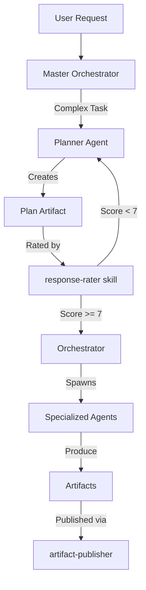

# Planner-Centric Architecture

## Overview

The LLM-RULES Production Pack uses a **planner-centric architecture** where all complex tasks begin with structured planning before execution. The Planner agent serves as the central planning authority, ensuring comprehensive scoping, risk assessment, and phase organization.

## Architecture Diagram



## Core Principles

### 1. Plan-First Approach

All complex tasks (workflow-based CUJs) MUST begin with a planning phase:
- **Step 0**: Planner creates comprehensive plan
- **Step 0.1**: Plan rated via response-rater (minimum 7/10)
- **Unrated plans NEVER execute**

**Rationale**: Planning ensures:
- All requirements understood before implementation
- Risks identified and mitigated early
- Correct agents assigned to tasks
- Clear success criteria defined
- Dependencies properly ordered

### 2. Hierarchical Planning

Large projects use hierarchical plan structure to manage complexity:

- **Master Plan**: High-level overview (<5KB)
  - Project goals and constraints
  - Phase boundaries and milestones
  - Agent assignments
  - Risk register

- **Phase Plans**: Detailed phase-specific plans (<20KB each)
  - Phase-specific requirements
  - Agent task breakdowns
  - Artifact dependencies
  - Validation gates

- **Task Breakdowns**: Granular task specifications
  - Specific agent assignments
  - Input/output artifacts
  - Acceptance criteria
  - Estimated effort

### 3. Multi-Phase Organization

Projects exceeding 3,000 lines are organized into phases:
- **Each phase**: 1,000-3,000 lines of code
- **Clear phase boundaries** with validation gates
- **Phase completion** triggers next phase planning
- **Context recycling** between phases (everlasting agents)

**Phase Structure**:
```
Phase 1: Foundation (0-1,000 lines)
├── Core models and schemas
├── Database architecture
└── Basic API structure

Phase 2: Features (1,000-2,000 lines)
├── Business logic implementation
├── API endpoints
└── Integration tests

Phase 3: Polish (2,000-3,000 lines)
├── UI/UX implementation
├── Performance optimization
└── End-to-end tests
```

## Planner Agent Responsibilities

### 1. Scope Analysis
- Parse user requirements and constraints
- Identify explicit and implicit requirements
- Clarify ambiguities via AskUserQuestion
- Document assumptions and dependencies

### 2. Risk Assessment
- Identify technical risks (complexity, dependencies, unknowns)
- Identify business risks (deadlines, resource constraints)
- Assess severity and likelihood
- Define mitigation strategies

### 3. Agent Selection
- Map tasks to appropriate specialized agents
- Ensure security agents included for sensitive tasks
- Include supporting agents for complex tasks
- Document agent responsibilities

### 4. Phase Organization
- Break large projects into 1,000-3,000 line phases
- Define phase boundaries and milestones
- Establish phase dependencies
- Plan context recycling points

### 5. Dependency Mapping
- Identify task dependencies and ordering
- Map artifact inputs and outputs
- Ensure no circular dependencies
- Plan parallel vs sequential execution

### 6. Success Criteria
- Define measurable completion criteria
- Specify validation gates for each step
- Establish quality metrics
- Plan testing strategy

## Plan Validation Process

### Step-by-Step Validation

1. **Planner produces plan artifact**
   - Saved to `.claude/context/runs/<run_id>/plans/<plan_id>.json`
   - Conforms to `.claude/schemas/plan.schema.json`

2. **Orchestrator invokes response-rater skill**
   ```bash
   Skill: response-rater
   Content: [Plan artifact]
   Rubric: completeness, feasibility, risk_mitigation, agent_coverage, integration
   Minimum Score: 7/10
   ```

3. **Rubric evaluation**:
   - **Completeness** (all requirements addressed)
     - All user requirements mapped to tasks
     - No gaps in functionality
     - Edge cases considered

   - **Feasibility** (realistic given constraints)
     - Timeline achievable
     - Resources available
     - Dependencies manageable

   - **Risk Mitigation** (risks identified and addressed)
     - All major risks documented
     - Mitigation strategies defined
     - Fallback plans available

   - **Agent Coverage** (correct agents assigned)
     - All required agents included
     - Security agents for sensitive tasks
     - Supporting agents for complex tasks

   - **Integration** (artifacts connect properly)
     - Artifact dependencies valid
     - No circular dependencies
     - Clear artifact flow

4. **Score >= 7**: Proceed to execution
   - Plan approved for execution
   - Rating saved to `<plan_id>-rating.json`
   - Workflow execution begins

5. **Score < 7**: Return to Planner with feedback
   - Specific feedback on rubric failures
   - Planner revises plan
   - Re-rating after improvements
   - Max 3 rating attempts

### Rating Storage

```json
{
  "plan_id": "plan-abc123",
  "rating_timestamp": "2026-01-05T12:00:00Z",
  "score": 8.5,
  "rubric_scores": {
    "completeness": 9,
    "feasibility": 8,
    "risk_mitigation": 8,
    "agent_coverage": 9,
    "integration": 9
  },
  "feedback": "Strong plan with clear phase structure. Minor improvements to risk mitigation.",
  "approved": true,
  "rater": "response-rater-v1",
  "attempt": 1
}
```

## Integration with Workflows

All 14 workflows begin with Planner:

| Workflow | Planning Complexity | Typical Score |
|----------|---------------------|---------------|
| quick-flow.yaml | Low | 7-8 |
| greenfield-fullstack.yaml | High | 8-9 |
| code-quality-flow.yaml | Medium | 7-8 |
| performance-optimization.yaml | Medium | 8-9 |
| ai-system.yaml | Very High | 9-10 |
| mobile.yaml | High | 8-9 |
| incident.yaml | Low | 7-8 |
| ui-perfection.yaml | Medium | 8-9 |
| browser-testing.yaml | Medium | 7-8 |
| legacy-modernization.yaml | Very High | 9-10 |
| brownfield.yaml | High | 8-9 |
| enterprise.yaml | Very High | 9-10 |
| automated-enterprise.yaml | Very High | 9-10 |
| bmad-greenfield.yaml | High | 8-9 |

### Workflow Step 0 Pattern

All workflows follow this pattern:

```yaml
- step: 0
  name: "Planning Phase"
  agent: planner
  description: "Create comprehensive plan for [workflow purpose]"
  inputs: []
  outputs:
    - plan.json (required)
  validation:
    schema: .claude/schemas/plan.schema.json
    rating_minimum: 7
```

## State Management

### Plan Storage Locations

Plans are stored in a hierarchical structure:

```
.claude/context/runs/<run_id>/
├── plans/
│   ├── <plan_id>.json              # Master plan
│   ├── <plan_id>-rating.json       # Plan rating
│   ├── phase-1-plan.json           # Phase 1 detailed plan
│   ├── phase-2-plan.json           # Phase 2 detailed plan
│   └── phase-3-plan.json           # Phase 3 detailed plan
├── artifacts/
│   └── artifact-registry.json      # Artifact tracking
└── gates/
    └── 00-planner.json             # Validation gate
```

### Plan Artifact Structure

```json
{
  "plan_id": "plan-abc123",
  "workflow": "greenfield-fullstack",
  "created": "2026-01-05T12:00:00Z",
  "planner": "planner",
  "summary": "Build full-stack web application with React and FastAPI",
  "phases": [
    {
      "phase": 1,
      "name": "Foundation",
      "lines_of_code": 1000,
      "agents": ["architect", "database-architect", "developer"],
      "artifacts": ["architecture.json", "schema.json", "core-models"]
    },
    {
      "phase": 2,
      "name": "Features",
      "lines_of_code": 1500,
      "agents": ["developer", "api-designer", "qa"],
      "artifacts": ["api-contracts", "business-logic", "integration-tests"]
    }
  ],
  "agents_required": ["architect", "developer", "qa", "security-architect"],
  "risks": [
    {
      "risk": "Third-party API rate limits",
      "severity": "medium",
      "mitigation": "Implement caching and backoff strategy"
    }
  ],
  "success_criteria": [
    "All features implemented and tested",
    "Security review passed",
    "Performance metrics met"
  ]
}
```

## Recovery Mechanisms

### Context Loss Recovery

When context is lost during execution:

1. **Recovery skill reads plan files**
   ```bash
   Skill: recovery
   Run ID: abc123
   ```
   - Loads plan from `.claude/context/runs/<run_id>/plans/`
   - Reads artifact registry
   - Reconstructs workflow state

2. **State reconstructed from artifacts**
   - Identifies completed steps
   - Determines current step
   - Loads input artifacts for next step

3. **Workflow resumes from last checkpoint**
   - No re-planning required if plan files intact
   - Continues from last completed step
   - Maintains phase context

### Plan Modification

Plans can be modified during execution if:
- User requirements change
- Unforeseen technical constraints discovered
- Risk mitigation requires scope adjustment

**Modification process**:
1. Pause workflow execution
2. Spawn Planner to revise plan
3. Re-rate revised plan (minimum 7/10)
4. Resume workflow with updated plan
5. Document modification in plan history

## Best Practices

### For Orchestrators

1. **Always rate plans before execution**
   - Use response-rater skill with standard rubric
   - Document rating in plan-rating.json
   - Never execute unrated plans

2. **Monitor plan execution**
   - Track progress via artifact registry
   - Detect deviations from plan
   - Escalate blockers to Planner

3. **Enforce phase boundaries**
   - Validate phase completion before next phase
   - Ensure context recycling at phase transitions
   - Maintain phase artifacts for recovery

### For Planners

1. **Be comprehensive**
   - Address all requirements explicitly
   - Identify risks proactively
   - Define clear success criteria

2. **Be realistic**
   - Estimate effort conservatively
   - Account for dependencies
   - Plan for contingencies

3. **Be specific**
   - Assign agents explicitly
   - Define artifact inputs/outputs
   - Specify validation gates

### For Executing Agents

1. **Follow the plan**
   - Adhere to assigned tasks
   - Produce specified artifacts
   - Meet acceptance criteria

2. **Escalate deviations**
   - Report blockers immediately
   - Request plan modifications when needed
   - Document assumptions

3. **Maintain state**
   - Update artifact registry
   - Save work incrementally
   - Support recovery

## Examples

### Example 1: Greenfield Full-Stack Application

**User Request**: "Build a task management web app with React frontend and FastAPI backend"

**Planning Process**:

1. **Planner creates master plan**:
   - 3 phases (Foundation, Features, Polish)
   - 8 agents (architect, database-architect, api-designer, developer, qa, security-architect, ux-expert, performance-engineer)
   - 12 major artifacts
   - 6 identified risks

2. **Response-rater evaluates**:
   - Completeness: 9/10 (all requirements mapped)
   - Feasibility: 8/10 (realistic timeline)
   - Risk Mitigation: 8/10 (strategies defined)
   - Agent Coverage: 9/10 (all needed agents)
   - Integration: 9/10 (clear artifact flow)
   - **Overall: 8.6/10 ✅ APPROVED**

3. **Orchestrator executes**:
   - Phase 1: Foundation (Steps 1-5)
   - Phase 2: Features (Steps 6-10)
   - Phase 3: Polish (Steps 11-15)

### Example 2: Legacy Modernization

**User Request**: "Modernize legacy PHP monolith to microservices"

**Planning Process**:

1. **Planner creates master plan**:
   - 4 phases (Analysis, Architecture, Migration, Validation)
   - 10 agents (legacy-modernizer, architect, database-architect, security-architect, developer, qa, performance-engineer, compliance-auditor, devops, code-reviewer)
   - 15 major artifacts
   - 12 identified risks (high complexity)

2. **Response-rater evaluates (Attempt 1)**:
   - Completeness: 8/10
   - Feasibility: 6/10 ❌ (timeline too aggressive)
   - Risk Mitigation: 7/10
   - Agent Coverage: 9/10
   - Integration: 8/10
   - **Overall: 7.6/10 ❌ REJECTED (feasibility too low)**

3. **Planner revises plan**:
   - Extended timeline by 2 phases
   - Added incremental migration strategy
   - Included parallel old/new system operation

4. **Response-rater evaluates (Attempt 2)**:
   - Completeness: 9/10
   - Feasibility: 8/10 ✅ (realistic timeline)
   - Risk Mitigation: 8/10
   - Agent Coverage: 9/10
   - Integration: 9/10
   - **Overall: 8.6/10 ✅ APPROVED**

5. **Orchestrator executes**:
   - Phase 1: Analysis (Steps 1-3)
   - Phase 2: Architecture (Steps 4-6)
   - Phase 3: Migration Wave 1 (Steps 7-10)
   - Phase 4: Migration Wave 2 (Steps 11-14)
   - Phase 5: Validation (Steps 15-18)

## Metrics and Monitoring

### Plan Quality Metrics

Track plan quality over time:

```json
{
  "metrics": {
    "total_plans": 156,
    "average_rating": 8.2,
    "approval_rate": 0.94,
    "average_attempts": 1.2,
    "plans_by_score": {
      "10": 12,
      "9": 45,
      "8": 68,
      "7": 22,
      "6": 7,
      "5": 2
    }
  }
}
```

### Execution Metrics

Track plan execution success:

```json
{
  "execution_metrics": {
    "total_executions": 142,
    "successful": 128,
    "failed": 8,
    "in_progress": 6,
    "success_rate": 0.90,
    "average_completion_time": "4.2 hours",
    "plan_deviation_rate": 0.15
  }
}
```

## Related Documentation

- [Workflow Guide](../workflows/WORKFLOW-GUIDE.md) - Detailed workflow execution
- [Agent-Skill Matrix](./AGENT_SKILL_MATRIX.md) - Agent-skill mappings
- [Enforcement Examples](./ENFORCEMENT_EXAMPLES.md) - Orchestration patterns
- [Phase-Based Projects](./PHASE_BASED_PROJECTS.md) - Multi-phase organization
- [Everlasting Agents](./EVERLASTING_AGENTS.md) - Context recycling

## Related CUJs

- **CUJ-026**: Multi-phase project planning - Demonstrates hierarchical planning
- **CUJ-027**: Workflow recovery after context loss - Shows recovery mechanisms
- **CUJ-037**: Multi-phase project execution - Full execution lifecycle

## Troubleshooting

### Common Issues

**Issue**: Plan repeatedly fails rating
- **Cause**: Missing requirements or unrealistic timeline
- **Solution**: Review rubric feedback, add missing elements, adjust timeline

**Issue**: Workflow deviates from plan
- **Cause**: Unforeseen technical constraints
- **Solution**: Pause execution, revise plan, re-rate, resume

**Issue**: Context lost mid-execution
- **Cause**: Token limit or session timeout
- **Solution**: Use recovery skill to reconstruct state from plan files

**Issue**: Agent assignments incorrect
- **Cause**: Task complexity underestimated
- **Solution**: Add supporting agents, revise plan, re-rate

## Future Enhancements

Planned improvements to planner-centric architecture:

1. **Automated Plan Refinement**: AI-driven plan improvement suggestions
2. **Predictive Risk Assessment**: ML-based risk severity prediction
3. **Dynamic Agent Allocation**: Real-time agent assignment optimization
4. **Plan Templates**: Pre-built templates for common workflows
5. **Execution Telemetry**: Real-time plan vs execution deviation tracking

## Conclusion

The planner-centric architecture ensures:
- **Quality**: All complex tasks properly scoped and validated
- **Reliability**: Risks identified and mitigated early
- **Efficiency**: Correct agents assigned from the start
- **Recoverability**: Clear state management enables recovery
- **Scalability**: Multi-phase organization supports large projects

**Remember**: All complex tasks MUST begin with planning. Unrated plans NEVER execute.
