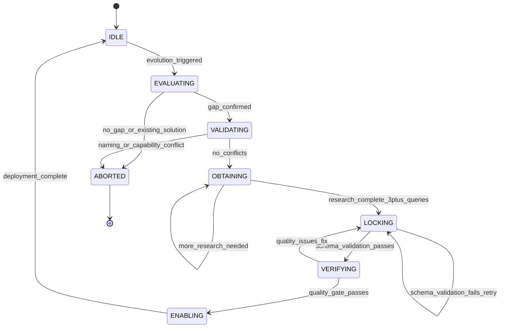

# Self-Evolution System

**Version:** 1.0.0
**Status:** Active
**Last Updated:** 2026-01-25

## 1. Overview

### What is Self-Evolution?

The self-evolution system enables the framework to create new ecosystem artifacts when capability gaps are detected. The framework can generate:

- **Agents**: New specialist agents for specific domains or tasks
- **Skills**: Reusable techniques, patterns, and tool integrations
- **Workflows**: Multi-agent orchestration patterns
- **Hooks**: Safety validators and enforcement guards
- **Schemas**: JSON Schema definitions for validation
- **Templates**: Artifact creation templates

### Why It Matters

Self-evolution ensures that every new artifact is:

- **Research-backed**: Informed by 3+ external sources and best practices
- **Validated**: Checked for conflicts and naming conventions
- **Quality-gated**: Verified for completeness before deployment
- **Discoverable**: Registered in routing tables and catalogs
- **Consistent**: Follows established patterns and conventions

Traditional approaches create artifacts without research, leading to inconsistent patterns, duplicates, and poorly integrated components. The EVOLVE workflow eliminates these issues through mandatory research and gate-based progression.

### The EVOLVE Acronym

```
E → V → O → L → V → E
│   │   │   │   │   │
│   │   │   │   │   └─ Enable & Monitor
│   │   │   │   └───── Verify Quality
│   │   │   └───────── Lock (Create Artifact)
│   │   └───────────── Obtain Research (MANDATORY - CANNOT SKIP)
│   └───────────────── Validate No Conflicts
└─────────────────────── Evaluate Need
```

## 2. The EVOLVE Workflow

The EVOLVE workflow is a locked-in, state machine-based process that MUST be followed exactly. Skipping phases or bypassing gates is a violation.

### Phase E: Evaluate (Gate 1)

**Purpose**: Confirm that evolution is actually needed before investing time.

**Entry Conditions**:
- User requests new capability
- Router detects no matching agent/skill
- Pattern analyzer suggests evolution
- Evolution state is `idle`

**Actions**:
1. Update evolution state to `evaluating`
2. Check if similar artifact exists (Glob/Grep)
3. Read skill catalog for existing solutions
4. Document the gap using structured thinking

**Exit Conditions** (ALL required):
- Gap clearly identified and documented
- No existing artifact meets the need (verified with Glob/Grep)
- Request is within ecosystem scope (not external integration)
- Evolution state updated to `EVALUATING`

**Failure Mode**:
- If existing solution found: ABORT with recommendation to use existing artifact

### Phase V: Validate (Gate 2)

**Purpose**: Ensure no conflicts with existing ecosystem artifacts.

**Entry Conditions**:
- Phase 1 gates passed
- Evolution state is `EVALUATING` with `gatePassed: true`

**Actions**:
1. Update evolution state to `validating`
2. Check naming conflicts (Grep across agents/, skills/, workflows/)
3. Check capability overlaps (read similar artifacts)
4. Verify naming conventions (`[a-z][a-z0-9-]*` pattern)

**Exit Conditions** (ALL required):
- No naming conflicts with existing artifacts
- No capability conflicts that would cause routing ambiguity
- Name follows ecosystem conventions
- Name is unique in ecosystem

**Naming Conventions**:

| Artifact | Convention | Example | Regex |
|----------|------------|---------|-------|
| Agent | `<domain>-<role>` | `mobile-ux-reviewer` | `^[a-z]+-[a-z]+(-[a-z]+)*$` |
| Skill | `<verb>-<object>` or `<domain>` | `code-analyzer`, `tdd` | `^[a-z]+(-[a-z]+)*$` |
| Workflow | `<process>-workflow` | `feature-development-workflow` | `^[a-z]+-workflow$` |
| Hook | `<trigger>-<action>` | `pre-commit-validator` | `^[a-z]+-[a-z]+(-[a-z]+)*$` |
| Schema | `<artifact>-schema` | `agent-schema` | `^[a-z]+-schema$` |

**Failure Mode**:
- If naming conflict: ABORT or propose alternative name
- If capability conflict: ABORT and recommend enhancing existing artifact

### Phase O: Obtain Research (Gate 3) - MANDATORY

> **CRITICAL**: This phase CANNOT be skipped. NO artifact creation without research.
> **Enforcement**: `research-enforcement.cjs` BLOCKS artifact creation without research evidence.

**Purpose**: Research best practices before creating anything.

**Entry Conditions**:
- Phase 2 gates passed
- Evolution state is `VALIDATING` with `gatePassed: true`

**Actions**:
1. Update evolution state to `obtaining`
2. Invoke `research-synthesis` skill (MANDATORY)
3. Execute minimum 3 research queries (Exa/WebSearch)
4. Analyze existing codebase patterns (2+ similar artifacts)
5. Generate structured research report

**Research Protocol**:

| Query # | Purpose | Example |
|---------|---------|---------|
| 1 | Best practices for artifact type in domain | "GraphQL schema validation best practices 2025" |
| 2 | Implementation patterns and real-world examples | "GraphQL schema validator implementation patterns" |
| 3 | Claude/AI agent specific patterns | "AI agent GraphQL review automation" |
| 4+ | Additional domain-specific research | Custom queries as needed |

**Research Report Location**: `.claude/context/artifacts/research-reports/<artifact-name>-research.md`

**Exit Conditions** (ALL required):
- Minimum 3 research queries executed (with evidence in report)
- Minimum 3 external sources consulted (URLs documented)
- Existing codebase patterns documented (2+ similar artifacts analyzed)
- Research report saved to correct location
- Design decisions documented with rationale AND source
- Risk assessment completed with mitigations

**Failure Mode**:
- CANNOT PROCEED without completing research
- Hook `research-enforcement.cjs` blocks Phase 4 entry

### Phase L: Lock (Gate 4)

**Purpose**: Create the artifact using appropriate creator skill.

**Entry Conditions**:
- Phase 3 gates passed
- Research report exists at correct location
- Evolution state is `OBTAINING` with `gatePassed: true`

**Actions**:
1. Update evolution state to `locking`
2. Invoke appropriate creator skill:
   - Agent: `Skill({ skill: "agent-creator" })`
   - Skill: `Skill({ skill: "skill-creator" })`
   - Workflow: `Skill({ skill: "workflow-creator" })`
   - Hook: `Skill({ skill: "hook-creator" })`
   - Schema: `Skill({ skill: "schema-creator" })`
   - Template: `Skill({ skill: "template-creator" })`
3. Creator skill applies research findings to template
4. Validate artifact against JSON schema

**Artifact Locations**:

| Artifact | Location Pattern |
|----------|------------------|
| Agent | `.claude/agents/<category>/<name>.md` |
| Skill | `.claude/skills/<name>/SKILL.md` |
| Workflow | `.claude/workflows/<category>/<name>.md` |
| Hook | `.claude/hooks/<category>/<name>.cjs` |
| Schema | `.claude/schemas/<name>.json` |
| Template | `.claude/templates/<name>.md` |

**Exit Conditions** (ALL required):
- Artifact file created at correct location
- YAML frontmatter passes schema validation
- All required fields present
- Task tools included: `TaskUpdate`, `TaskList`, `TaskCreate`, `TaskGet`
- Memory Protocol section present in body
- Task Progress Protocol section present in body (for agents)

**Failure Mode**:
- If schema validation fails: RETRY with fixes (max 3 retries)
- If required fields missing: RETRY with additions
- Maximum 3 retries before ABORT

### Phase V: Verify (Gate 5)

**Purpose**: Quality assurance before deployment.

**Entry Conditions**:
- Phase 4 gates passed
- Artifact exists and is schema-valid
- Evolution state is `LOCKING` with `gatePassed: true`

**Actions**:
1. Update evolution state to `verifying`
2. Read the created artifact
3. Check for placeholder content (TODO, TBD, FIXME, etc.)
4. Verify examples are functional (not pseudo-code)
5. For agents, verify assigned skills exist
6. Run validation tools

**Verification Checklist**:

| Check | Criteria | Failure Action |
|-------|----------|----------------|
| Placeholders | No TODO, TBD, FIXME, etc. | Return to LOCK |
| Task Progress Protocol | Complete with Iron Laws | Return to LOCK |
| Memory Protocol | All sections present | Return to LOCK |
| Assigned Skills | All exist in `.claude/skills/` | Return to LOCK or remove skill |
| Referenced Tools | All are valid Claude tools | Return to LOCK |
| Examples | Complete and executable | Return to LOCK |
| Documentation | Explains when/why to use | Return to LOCK |

**Exit Conditions** (ALL required):
- All sections complete (no placeholders)
- Task Progress Protocol complete with Iron Laws
- Memory Protocol complete with file paths
- All assigned skills exist
- All referenced tools are valid
- Examples are complete and correct
- Documentation is comprehensive

**Failure Mode**:
- If quality issues found: RETURN to LOCK for fixes
- Maximum 5 fix iterations before ABORT

### Phase E: Enable (Gate 6)

**Purpose**: Deploy artifact to ecosystem and register for discovery.

**Entry Conditions**:
- Phase 5 gates passed
- Artifact verified and quality-approved
- Evolution state is `VERIFYING` with `gatePassed: true`

**Actions**:
1. Update evolution state to `enabling`
2. Update CLAUDE.md routing table (for agents)
3. Update skill catalog (for skills)
4. Update workflow table (for workflows)
5. Record in evolution state history
6. Record in memory files (learnings.md, decisions.md)

**Post-Enable Verification**:

```bash
# For agents - MUST succeed
grep "<agent-name>" .claude/CLAUDE.md || echo "FAILED: Not in routing table"

# For skills - MUST succeed
grep "<skill-name>" .claude/context/artifacts/skill-catalog.md || echo "FAILED: Not in catalog"

# For workflows - MUST succeed
grep "<workflow-name>" .claude/CLAUDE.md || echo "FAILED: Not in workflow table"
```

**Exit Conditions** (ALL required):
- CLAUDE.md routing table updated (if agent)
- Skill catalog updated (if skill)
- Workflow table updated (if workflow)
- Evolution state updated with completed evolution
- Memory files updated with learnings and decisions
- Artifact is discoverable by Router (grep verification passes)

**Failure Mode**:
- If CLAUDE.md update fails: ROLLBACK and retry
- If verification fails: Fix registration and re-verify
- Never leave artifact unregistered (invisible to Router)

## 3. Research Requirements (Phase O)

Phase O (Obtain Research) is MANDATORY and cannot be skipped. This phase ensures that all artifacts are informed by best practices and real-world patterns.

### Minimum Requirements

- **3+ Research Queries**: Execute at least 3 Exa/WebSearch queries
- **3+ External Sources**: Consult at least 3 external sources (documentation, articles, repositories)
- **Codebase Analysis**: Document patterns from 2+ similar artifacts in the ecosystem
- **Research Report**: Save structured report to `.claude/context/artifacts/research-reports/<artifact-name>-research.md`

### Research Report Structure

```markdown
# Research Report: <Artifact Name>

**Date**: YYYY-MM-DD
**Type**: agent|skill|workflow|hook|schema|template
**Researcher**: evolution-orchestrator

## Research Queries

### Query 1: <Query Description>
- **Query**: "Best practices for X in domain Y"
- **Source**: <URL or documentation source>
- **Key Findings**:
  - Finding 1
  - Finding 2
  - Finding 3

### Query 2: <Query Description>
...

### Query 3: <Query Description>
...

## Codebase Pattern Analysis

### Similar Artifact 1: <Name>
- **Location**: `.claude/agents/domain/similar-agent.md`
- **Patterns Observed**:
  - Pattern 1
  - Pattern 2

### Similar Artifact 2: <Name>
...

## Design Decisions

### Decision 1: <Decision Title>
- **Rationale**: Why this decision was made
- **Source**: Research query/source that informed this decision
- **Alternatives Considered**: Alternative approaches and why they were rejected

### Decision 2: <Decision Title>
...

## Risk Assessment

### Risk 1: <Risk Description>
- **Severity**: Critical|High|Medium|Low
- **Mitigation**: How this risk will be mitigated
- **Source**: Where this risk pattern was identified

### Risk 2: <Risk Description>
...

## Recommendations

- Recommendation 1
- Recommendation 2
- Recommendation 3
```

### Why This Phase Cannot Be Skipped

1. **Quality**: Research-backed artifacts follow best practices
2. **Consistency**: Ensures patterns align with ecosystem conventions
3. **Risk Mitigation**: Identifies risks before creation
4. **Learning**: Captures knowledge for future reference
5. **Auditability**: Provides evidence for design decisions

## 4. The 6 Iron Laws

These rules are INVIOLABLE. Violations break the workflow.

### Law 1: NO EVOLUTION WITHOUT EVALUATION

**Rule**: Never create artifacts without confirming the need exists.

**Why**: Prevents duplicate capabilities and unnecessary complexity.

**Enforcement**: Phase E (Evaluate) gates MUST pass before proceeding.

### Law 2: NO ARTIFACT WITHOUT RESEARCH

**Rule**: Phase O (Obtain Research) is MANDATORY and cannot be bypassed.

**Why**: Research-backed artifacts follow best practices and avoid known pitfalls.

**Enforcement**: `research-enforcement.cjs` hook blocks artifact creation without research report.

**Rationale**:
- "I already know" is NOT valid - execute the queries
- Minimum 3 queries, 3 sources, research report required
- Design decisions must have documented rationale AND source

### Law 3: NO ARTIFACT WITHOUT ROUTING

**Rule**: All artifacts MUST be registered in discovery systems.

**Why**: Unregistered artifacts are INVISIBLE to the Router and unusable.

**Enforcement**: Phase E (Enable) gates verify grep results.

**Registration Requirements**:
- Agents: CLAUDE.md routing table (Section 3)
- Skills: skill-catalog.md
- Workflows: CLAUDE.md workflow table (Section 8.6)

### Law 4: RESEARCH MUST USE EXTERNAL SOURCES

**Rule**: Research phase must use mcp__Exa__ or WebSearch tools for external sources.

**Why**: Codebase-only research creates echo chambers and misses industry best practices.

**Enforcement**: Gate 3 validation requires 3+ external sources with documented URLs.

### Law 5: ALL ARTIFACTS MUST PASS SCHEMA VALIDATION

**Rule**: YAML frontmatter must validate against JSON Schema before proceeding.

**Why**: Ensures artifacts have required fields and follow conventions.

**Enforcement**: Phase L (Lock) gates verify schema validation passes.

**Schemas**:
- Agents: `.claude/schemas/agent-schema.json`
- Skills: `.claude/schemas/skill-schema.json`
- Workflows: `.claude/schemas/workflow-schema.json`

### Law 6: ALL EVOLUTIONS MUST UPDATE THE CATALOG

**Rule**: After creating artifact, update CLAUDE.md or skill catalog.

**Why**: Artifacts not in catalogs are invisible to the Router.

**Enforcement**: Phase E (Enable) gates verify grep results for registration.

## 5. Enforcement Hooks

Hooks enforce the EVOLVE workflow by blocking violations at different phases.

| Hook | Phase | Trigger | Purpose |
|------|-------|---------|---------|
| `evolution-trigger-detector.cjs` | IDLE→EVALUATE | PostToolUse | Detects evolution keywords, initiates workflow |
| `conflict-detector.cjs` | VALIDATE | PreToolUse | Blocks if naming/capability conflict |
| `research-enforcement.cjs` | OBTAIN→LOCK | PreToolUse(Write/Edit) | Blocks creation without research report |
| `evolution-state-guard.cjs` | ALL | PreToolUse | Enforces state machine, prevents skipping |
| `quality-gate-validator.cjs` | VERIFY | PreToolUse | Blocks incomplete/placeholder artifacts |
| `evolution-audit.cjs` | ENABLE | PostToolUse | Logs all evolutions, verifies registration |

### Hook: research-enforcement.cjs

**Purpose**: Blocks artifact creation without research evidence.

**Trigger**: PreToolUse (Write/Edit) for artifact files

**Logic**:
1. Check if creating artifact file (paths: `.claude/agents/`, `.claude/skills/`, `.claude/workflows/`)
2. Read evolution state from `evolution-state.json`
3. Verify state is `locking` and research report exists
4. Block if research not completed

**Error Message**: `"BLOCKED: Cannot create artifact without completing OBTAIN phase. Research report required."`

### Hook: evolution-state-guard.cjs

**Purpose**: Enforces state machine transitions.

**Trigger**: PreToolUse (Write/Edit) for `evolution-state.json`

**Logic**:
1. Parse new state from Write/Edit input
2. Verify transition is valid (e.g., `validating` can only go to `obtaining` or `aborted`)
3. Block invalid transitions

**Error Message**: `"BLOCKED: Invalid state transition from {currentState} to {newState}"`

### Hook: evolution-audit.cjs

**Purpose**: Logs completed evolutions and verifies registration.

**Trigger**: PostToolUse (after evolution completes)

**Logic**:
1. Detect when evolution state transitions to `idle` with completed evolution in history
2. Verify artifact is registered (grep CLAUDE.md or skill catalog)
3. Log evolution details to audit trail

## 6. State Tracking

Evolution progress is tracked in `.claude/context/evolution-state.json`.

### State Machine



### States

| State | Description | Valid Actions |
|-------|-------------|---------------|
| `idle` | No evolution in progress | Start new evolution |
| `evaluating` | Checking if evolution is needed | Analyze gap, check existing artifacts |
| `validating` | Checking for conflicts | Verify naming, check capability overlap |
| `obtaining` | Researching best practices (MANDATORY) | Execute queries, analyze codebase |
| `locking` | Creating the artifact | Invoke creator skill, validate schema |
| `verifying` | Quality assurance | Check completeness, verify protocols |
| `enabling` | Deploying to ecosystem | Update routing, catalogs, memory |
| `aborted` | Evolution cancelled | Document reason, recommend alternative |
| `blocked` | Gate failed, awaiting resolution | Fix blocker, retry phase |

### State File Structure

**File**: `.claude/context/evolution-state.json`

```json
{
  "version": "1.0.0",
  "state": "idle",
  "lastUpdated": "2026-01-25T10:30:00.000Z",
  "currentEvolution": null,
  "evolutions": [
    {
      "id": "evo-abc12345",
      "type": "agent",
      "name": "graphql-schema-reviewer",
      "description": "Agent for reviewing GraphQL schemas",
      "trigger": "User requested GraphQL review capability",
      "createdAt": "2026-01-25T10:00:00.000Z",
      "filesCreated": [
        ".claude/agents/domain/graphql-schema-reviewer.md"
      ],
      "filesModified": [
        ".claude/CLAUDE.md",
        ".claude/context/memory/learnings.md"
      ],
      "researchSources": 5,
      "duration": 1800000,
      "success": true
    }
  ],
  "patterns": [],
  "suggestions": []
}
```

### Recovery Protocol

If evolution is interrupted (context reset, error):

1. Check evolution state: `Read(".claude/context/evolution-state.json")`
2. If state is not `idle` and `currentEvolution` exists, resume from current phase
3. Check if gate was passed (`currentEvolution.gatePassed`)
4. If gate passed, advance to next phase
5. If gate not passed, re-execute current phase

## 7. Spawning Evolution

When Router detects no matching agent for a request, it spawns the evolution-orchestrator.

### Example: Creating New Agent

**User Request**: "I need an agent to review GraphQL schemas"

**Router Analysis**:
```
[ROUTER] Analyzing: "I need an agent to review GraphQL schemas"
- Intent: Capability gap
- Complexity: High (new agent creation)
- Domain: GraphQL
- Risk: Medium

[ROUTER] No matching agent found in routing table
[ROUTER] Triggering EVOLVE workflow via evolution-orchestrator
```

**Router Spawn**:
```javascript
Task({
  subagent_type: 'evolution-orchestrator',
  model: 'opus', // Use opus for evolution (complex reasoning)
  description: 'Creating new graphql-schema-reviewer agent',
  allowed_tools: ['Read', 'Write', 'Edit', 'Bash', 'Task', 'Skill', 'mcp__Exa__*', 'WebSearch', 'TaskUpdate', 'TaskList'],
  prompt: `You are the EVOLUTION-ORCHESTRATOR agent.

## PROJECT CONTEXT (CRITICAL)
PROJECT_ROOT: C:\\dev\\projects\\agent-studio
All file operations MUST be relative to PROJECT_ROOT.

## Your Assigned Task
Create agent for: "GraphQL schema review"

## Instructions
1. Read your agent definition: .claude/agents/orchestrators/evolution-orchestrator.md
2. Follow EVOLVE workflow: .claude/workflows/core/evolution-workflow.md
3. Execute all 6 phases with gate validation
4. MANDATORY: Complete OBTAIN phase with 3+ research queries

## Memory Protocol
1. Read .claude/context/memory/learnings.md first
2. Update evolution-state.json at every phase transition
3. Record decisions to .claude/context/memory/decisions.md
`
});
```

### Full EVOLVE Execution

```
[EVOLUTION-ORCHESTRATOR] Starting EVOLVE workflow...

=== Phase E: EVALUATE ===
- Reading evolution state: idle, no current evolution
- Searching for existing agents: Glob(".claude/agents/**/*graphql*.md")
- Result: No GraphQL-specific agent found
- Gap confirmed: Need GraphQL schema reviewer
- State updated: evaluating
- Gate 1 PASSED

=== Phase V: VALIDATE ===
- Checking naming conflicts: "graphql-schema-reviewer"
- Grep results: No matches in agents/, skills/, workflows/
- Convention check: kebab-case ✓, domain-role pattern ✓
- State updated: validating
- Gate 2 PASSED

=== Phase O: OBTAIN ===
- Invoking research-synthesis skill
- Query 1: "GraphQL schema design best practices 2025"
  → Found: Apollo GraphQL docs, GraphQL spec, community patterns
- Query 2: "GraphQL schema validation tools patterns"
  → Found: graphql-inspector, eslint-plugin-graphql, custom validators
- Query 3: "AI agent GraphQL review automation"
  → Found: GitHub Copilot patterns, automated review tools
- Codebase analysis: Reading api-integrator.md, architect.md patterns
- Research report saved: .claude/context/artifacts/research-reports/graphql-schema-reviewer-research.md
- State updated: obtaining
- Gate 3 PASSED (3 queries, 5 sources, 2 patterns)

=== Phase L: LOCK ===
- Invoking agent-creator skill
- Applying research findings to template
- Creating: .claude/agents/domain/graphql-schema-reviewer.md
- Schema validation: PASSED
- Required fields: COMPLETE (tools, skills, protocols)
- State updated: locking
- Gate 4 PASSED

=== Phase V: VERIFY ===
- Reading created artifact
- Placeholder check: NONE found
- Task Progress Protocol: COMPLETE with Iron Laws
- Memory Protocol: COMPLETE with all sections
- Skills validation: All assigned skills exist
- State updated: verifying
- Gate 5 PASSED

=== Phase E: ENABLE ===
- Updating CLAUDE.md routing table
- grep "graphql-schema-reviewer" .claude/CLAUDE.md → FOUND
- Updating evolution state history
- Recording to learnings.md and decisions.md
- State updated: idle
- Gate 6 PASSED

[EVOLUTION-ORCHESTRATOR] Evolution complete!
Created: graphql-schema-reviewer agent
Location: .claude/agents/domain/graphql-schema-reviewer.md
Research: .claude/context/artifacts/research-reports/graphql-schema-reviewer-research.md
```

## 8. Troubleshooting

### Evolution Blocked: Conflict Detected

**Symptom**: Evolution state shows `blocked` with `blockedReason: "Naming conflict: agent 'data-scientist' already exists"`

**Solution**:
1. Read evolution state: `Read(".claude/context/evolution-state.json")`
2. Check `blockedReason` and `recommendedAction`
3. Options:
   - Use existing artifact (if it meets the need)
   - Choose different name (e.g., `data-analytics-expert`)
   - Abort evolution
4. Update state to continue or abort

### Research Not Met: Need 3+ Queries

**Symptom**: Hook `research-enforcement.cjs` blocks artifact creation with error: `"BLOCKED: Research report incomplete - only 2 queries executed"`

**Solution**:
1. Return to Phase O (Obtain)
2. Execute additional research queries until minimum 3 met
3. Update research report with new findings
4. Proceed to Phase L (Lock)

### Schema Validation Failure

**Symptom**: Phase L (Lock) fails with: `"Schema validation failed: Missing required field 'tools'"`

**Solution**:
1. Read artifact file
2. Add missing required field
3. Re-run schema validation
4. If validation passes, proceed to Phase V (Verify)
5. Maximum 3 retries before ABORT

### Artifact Not Discoverable

**Symptom**: Phase E (Enable) verification fails: `"grep '<agent-name>' .claude/CLAUDE.md" returns no results`

**Solution**:
1. Manually update CLAUDE.md routing table
2. Add entry: `| <request-type> | \`<agent-name>\` | \`.claude/agents/<category>/<agent-name>.md\` |`
3. Verify with grep: `grep "<agent-name>" .claude/CLAUDE.md`
4. If found, proceed with evolution completion

### Evolution State Lost

**Symptom**: Context reset during evolution, state file not updated

**Solution**:
1. Read evolution state: `Read(".claude/context/evolution-state.json")`
2. Check last phase completed (`currentEvolution.phase`)
3. Resume from last phase:
   - If gate passed, advance to next phase
   - If gate not passed, re-execute current phase
4. Update state file at each transition to prevent future loss

## 9. EVOLVE Auto-Start (Opt-Out Mode)

**Default Behavior**: EVOLVE auto-start is DISABLED by default.

When enabled, the framework automatically triggers the EVOLVE workflow when artifact creation is blocked due to EVOLVE enforcement.

### How It Works

1. **Blocking Hook**: `file-placement-guard.cjs` intercepts artifact creation attempts
2. **Enforcement Check**: Verifies EVOLVE workflow compliance
3. **Auto-Start Trigger**: If `EVOLVE_AUTO_START=true`, outputs structured spawn instructions
4. **Router Action**: Router reads trigger data and spawns evolution-orchestrator automatically

### Enabling Auto-Start

```bash
export EVOLVE_AUTO_START=true  # Enable automatic evolution spawning
export EVOLVE_RATE_LIMIT=3     # Max 3 evolutions per hour (default)
```

### Circuit Breaker Rate Limiting

To prevent runaway evolution, a circuit breaker limits evolution frequency:

- **Default**: 3 evolutions per hour
- **Configurable**: Set `EVOLVE_RATE_LIMIT=N` environment variable
- **Tracking**: Counts evolutions with `completedAt` in last hour
- **Behavior**: When limit exceeded, auto-start is disabled until window passes

### Security Protections

Auto-start includes security safeguards:

1. **Sensitive Path Blocking**: Blocks auto-evolution for:
   - `.env` files
   - Credential files (keyword: credential, secret, password)
   - Security hooks (`.claude/hooks/safety/`)
   - Core config (`.claude/CLAUDE.md`)
   - Internal libs (`.claude/lib/`)

2. **Spawn Depth Tracking**: Prevents recursive spawn loops
   - Tracks spawn depth in evolution state
   - Blocks auto-spawn if already in automated flow (depth > 0)

3. **Path Sanitization**: File paths sanitized before inclusion in prompts
   - Removes shell metacharacters
   - Removes newlines (prompt injection vector)
   - Length limited to 500 chars

4. **Fail-Closed**: On any error, does NOT spawn (fail closed)
   - Audit logs the error event
   - Provides `HOOK_FAIL_OPEN` override for debugging only

### When to Use Auto-Start

**Use when:**
- Rapidly prototyping new capabilities
- Iterating on ecosystem design
- Exploring new domains with many unknown agents needed

**Don't use when:**
- In production environments
- When manual review of evolutions is required
- Working with security-critical artifacts

### Disabling Auto-Start

```bash
export EVOLVE_AUTO_START=false  # Disable (default)
```

Or remove the environment variable.

### Manual Trigger Alternative

If auto-start is disabled, the blocking hook outputs trigger data that you can use manually:

```json
{
  "blocked": true,
  "artifact": { "type": "agent", "name": "new-agent" },
  "spawnInstructions": "Task({ subagent_type: 'evolution-orchestrator', ... })"
}
```

Copy the `spawnInstructions` value and execute it manually to trigger EVOLVE.

## Related Documentation

- **Evolution Workflow**: `.claude/workflows/core/evolution-workflow.md` - Full EVOLVE workflow specification
- **Evolution-Orchestrator Agent**: `.claude/agents/orchestrators/evolution-orchestrator.md` - Agent that executes EVOLVE
- **Evolution State Schema**: `.claude/schemas/evolution-state.schema.json` - JSON Schema for state validation
- **ADR-011**: `.claude/context/memory/decisions.md` - Architecture Decision Record for EVOLVE workflow
- **Creator Skills**: `.claude/skills/agent-creator/`, `.claude/skills/skill-creator/`, etc. - Creator skill implementations
- **Research-Synthesis Skill**: `.claude/skills/research-synthesis/SKILL.md` - Research protocol for Phase O
- **Configuration Guide**: `.claude/docs/CONFIGURATION.md` - All environment variables including EVOLVE_AUTO_START

---

**Last Updated**: 2026-01-26
**Version**: 1.1.0
**Status**: Active
