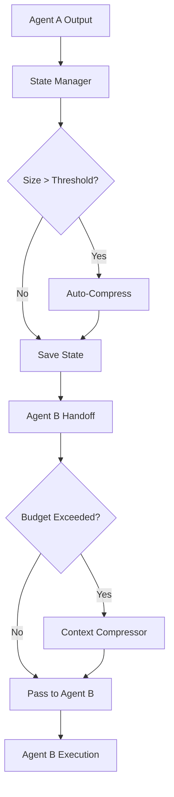
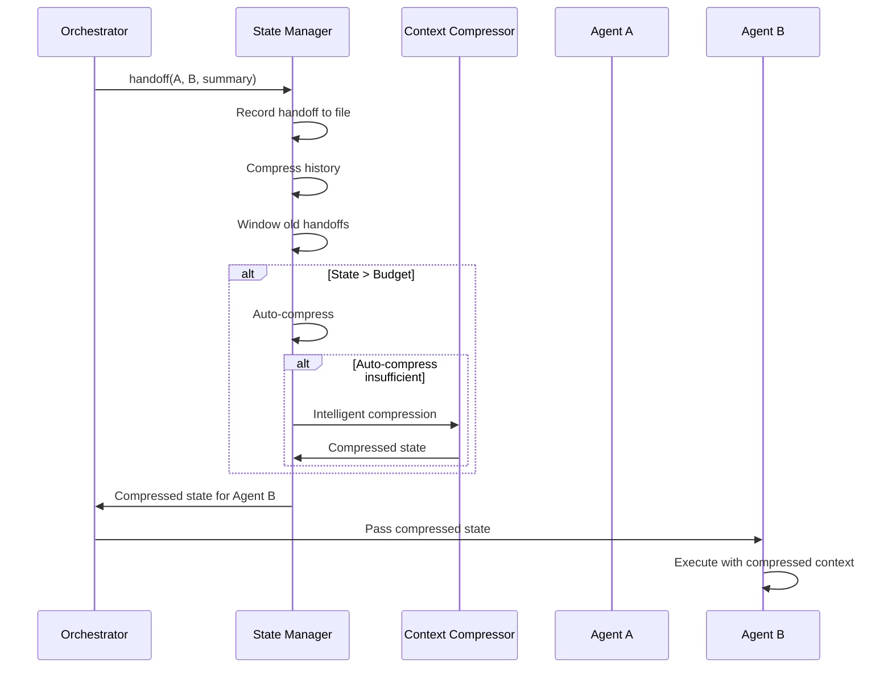

# State Management - Context Poisoning Prevention

## Problem Statement

With 34 agents passing metadata between each other in multi-agent orchestration, we risk:
- **Context poisoning** from accumulated metadata
- **Token limit exhaustion** in long agent chains
- **State drift** from redundant/stale information
- **Performance degradation** from bloated context

## Solution Architecture

The State Management system provides:
1. **State Manager Tool**: Compressed state management with automatic pruning
2. **Context Compressor Agent**: Intelligent compression when automatic rules insufficient
3. **Context Budgets**: Per-agent-type budgets (opus: 16KB, sonnet: 12KB, haiku: 6KB)
4. **Windowed History**: Keep only last 5 handoffs, discard older history
5. **File-Based State**: Canonical state in file system, not conversation history



## Components

### 1. State Manager Tool (`.claude/tools/state-manager.mjs`)

**Core Features**:
- Initialize run state with workflow and goal
- Update state with decisions, artifacts, agent assignments
- Automatic compression when state exceeds 10KB
- Agent handoff preparation with budget-aware compression
- Statistics and metrics tracking

**Context Budgets by Agent Type**:
| Agent Type | Budget | Example Agents |
|------------|--------|----------------|
| opus | 16KB | orchestrator, architect, qa, security-architect |
| sonnet | 12KB | developer, analyst, pm, devops |
| haiku | 6KB | technical-writer |

**Compression Thresholds**:
- `maxStateSize`: 10KB triggers auto-compression
- `maxHandoffs`: Keep last 5 handoffs only
- `maxAgentOutput`: 2KB max per agent output
- `maxHistoryChars`: 2000 chars for compressed history

**Usage**:

```bash
# Initialize run state
node state-manager.mjs init --run-id run-001 --workflow quick-flow --goal "Fix bug"

# Get current state (auto-compressed for agent type)
node state-manager.mjs get --run-id run-001 --agent developer

# Update state with decision
node state-manager.mjs update --run-id run-001 --decision "Use Redis caching" --step 3

# Handoff between agents
node state-manager.mjs handoff --run-id run-001 --from architect --to developer --summary "Design complete"

# View statistics
node state-manager.mjs stats --run-id run-001 --json
```

### 2. Context Compressor Agent (`.claude/agents/context-compressor.md`)

**When Invoked**:
- State exceeds 10KB and auto-compression insufficient
- Handoff to haiku agent requires aggressive compression (70% target)
- Manual compression requested with `--intelligent` flag

**Compression Strategy**:

**MUST Preserve**:
- Current goal and active task
- Blocking issues and errors
- Key decisions with rationale
- Artifact references (paths, not content)
- Security-relevant information
- Active agent assignments

**CAN Compress**:
- Detailed reasoning → 1-2 sentence summary
- Step-by-step logs → outcome summary
- Verbose tool outputs → key results only
- Historical context → rolling summary

**MUST Remove**:
- Duplicate information
- Superseded decisions
- Completed task details (keep outcome only)
- Verbose formatting/whitespace
- Internal tool metadata

**Example Compression**:

Before (847 tokens):
```
The architect agent completed the system design phase. After analyzing the requirements document which contained 15 user stories across 3 epics, I identified the following architectural components that will be needed: 1) A React frontend using Next.js 14 with App Router for server-side rendering capabilities, 2) A Node.js backend API using Express.js with TypeScript for type safety, 3) A PostgreSQL database for persistent storage with Prisma ORM, 4) Redis for caching frequently accessed data. The decision to use Next.js was based on the requirement for SEO optimization mentioned in user story US-003. The decision to use PostgreSQL over MongoDB was based on the relational nature of the data model identified in the ERD. I created the following artifacts: architecture-diagram.md, database-schema.sql, api-contracts.yaml. There was one blocker identified: the authentication strategy needs clarification from the product owner - specifically whether to use OAuth2 with social providers or a custom JWT implementation. I recommend we proceed with the database schema design while waiting for authentication clarification.
```

After (127 tokens):
```
Architect completed system design. Stack: Next.js 14 + Express/TS + PostgreSQL/Prisma + Redis. Artifacts: architecture-diagram.md, database-schema.sql, api-contracts.yaml. BLOCKER: Auth strategy unclear (OAuth2 vs custom JWT) - needs PO input. Recommendation: Proceed with DB schema while awaiting auth decision.
```

Compression ratio: 85% (847 → 127 tokens)

### 3. Run State Schema (`.claude/schemas/run-state.schema.json`)

**Schema Structure**:
```json
{
  "run_id": "run-001",
  "workflow": "quick-flow",
  "current_step": 3,
  "goal": "Fix authentication bug in login flow",
  "decisions": [
    "Use Redis caching",
    "Implement OAuth2",
    "Deploy to staging first"
  ],
  "artifacts": [
    {
      "name": "plan-run-001.json",
      "path": ".claude/context/artifacts/plan-run-001.json",
      "added_at": "2025-01-07T10:00:00Z"
    }
  ],
  "active_agents": ["architect", "developer", "qa"],
  "compressed_history": "[architect→developer]: Design complete\n[developer→qa]: Implementation done",
  "handoff_count": 2,
  "metrics": {
    "total_handoffs": 2,
    "compression_count": 1,
    "bytes_saved": 5432,
    "created_at": "2025-01-07T09:00:00Z"
  },
  "updated_at": "2025-01-07T10:30:00Z"
}
```

## Integration with Orchestrator

### Orchestrator Workflow

```javascript
import { StateManager } from '.claude/tools/state-manager.mjs';

// 1. Initialize run state
const manager = new StateManager('run-001');
manager.init('quick-flow', 'Fix authentication bug');

// 2. Update state after each step
manager.update({
  step: 1,
  agent: 'architect',
  decision: 'Use OAuth2 authentication',
  artifact: {
    name: 'architecture.md',
    path: '.claude/context/artifacts/architecture.md'
  }
});

// 3. Handoff between agents
const compressedState = manager.handoff(
  'architect',
  'developer',
  'System design complete. Ready for implementation.'
);

// 4. Pass compressed state to next agent
await delegateToAgent('developer', {
  task: 'Implement OAuth2 authentication',
  state: compressedState
});

// 5. Monitor state size
const stats = manager.stats();
if (stats.state_size_bytes > 10240) {
  // Trigger manual compression if needed
  manager.prune();
}
```

### Handoff Protocol



## Compression Strategies

### 1. Decision Compression

**Goal**: Extract decision + rationale only, remove verbose explanation

**Example**:
- **Before**: "After careful analysis of performance requirements and scalability needs, we decided to use Redis for caching because it provides sub-millisecond latency and supports 100k+ ops/sec which meets our SLA of 99.9% uptime."
- **After**: "Decision: Redis caching (meets latency SLA)"

### 2. Artifact List Compression

**Goal**: Keep artifact names and paths, remove sizes and metadata

**Example**:
- **Before**: "Created architecture-diagram.md (15KB), database-schema.sql (8KB), api-contracts.yaml (12KB)"
- **After**: "Artifacts: architecture-diagram.md, database-schema.sql, api-contracts.yaml"

### 3. Blocker Compression

**Goal**: Keep blocker description, severity, and impact; remove verbose context

**Example**:
- **Before**: "There is a critical blocker preventing us from moving forward with the authentication implementation. The product owner needs to decide whether we should implement OAuth2 with social providers (Google, GitHub, Facebook) or build a custom JWT-based authentication system. This decision impacts the database schema, frontend components, and security architecture."
- **After**: "BLOCKER (critical): Auth strategy unclear (OAuth2 vs custom JWT) - blocks DB schema, frontend, security"

### 4. History Compression

**Goal**: Keep only last 3-5 steps, summarize earlier steps

**Example**:
- **Before**: "Step 1: Analyst created requirements. Step 2: Architect designed system. Step 3: Developer implemented backend. Step 4: QA tested features. Step 5: DevOps deployed."
- **After**: "[5 steps completed] Current: DevOps deployment"

## Metrics and Monitoring

### State Size Tracking

```bash
node state-manager.mjs stats --run-id run-001 --json
```

**Output**:
```json
{
  "run_id": "run-001",
  "state_size_bytes": 8234,
  "state_size_kb": "8.04",
  "handoff_files": 3,
  "decisions_count": 5,
  "artifacts_count": 7,
  "active_agents": ["developer", "qa", "devops"],
  "metrics": {
    "total_handoffs": 3,
    "compression_count": 2,
    "bytes_saved": 12456,
    "created_at": "2025-01-07T09:00:00Z"
  },
  "thresholds": {
    "maxStateSize": 10240,
    "maxHandoffs": 5,
    "maxAgentOutput": 2048,
    "maxHistoryChars": 2000
  },
  "budgets": {
    "opus": 16000,
    "sonnet": 12000,
    "haiku": 6000,
    "default": 10000
  }
}
```

### Compression Effectiveness

Track compression metrics:
- **Compression Count**: Number of times state was compressed
- **Bytes Saved**: Total bytes removed through compression
- **Compression Ratio**: Average compression ratio (1 - new_size / original_size)

### Handoff Statistics

Monitor handoff patterns:
- **Total Handoffs**: Number of agent transitions
- **Handoff Files**: Number of handoff records (windowed to last 5)
- **Active Agents**: Currently active agents (last 3)

## Troubleshooting

### Issue: State Size Exceeds Budget After Compression

**Symptoms**: Even after auto-compression and intelligent compression, state size still exceeds agent budget

**Solutions**:
1. Reduce `maxHistoryChars` threshold (default: 2000)
2. Reduce `maxHandoffs` window (default: 5)
3. Reduce `maxAgentOutput` limit (default: 2048)
4. Invoke Context Compressor agent manually with stricter targets

### Issue: Critical Information Lost in Compression

**Symptoms**: Downstream agents missing critical context after compression

**Solutions**:
1. Add keywords to `preserve` list in compression request
2. Review Context Compressor's `MUST Preserve` rules
3. Increase context budget for critical agent types
4. Use explicit artifact references instead of embedding content

### Issue: Handoff Files Accumulating Too Quickly

**Symptoms**: Many handoff files in `.claude/context/runs/{run_id}/handoffs/`

**Solutions**:
1. Reduce `maxHandoffs` window (default: 5)
2. Manually trigger `prune()` to clean up old handoffs
3. Review handoff frequency (may indicate over-coordination)

## Best Practices

1. **Initialize State Early**: Call `state-manager.mjs init` at workflow start
2. **Update State Incrementally**: Update state after each step, not in batches
3. **Use Handoff for Transitions**: Always use `handoff()` when passing context between agents
4. **Monitor State Size**: Check `stats()` regularly to avoid budget overruns
5. **Preserve Critical Context**: Explicitly mark critical information in updates
6. **Clean Up Handoffs**: Old handoffs are auto-deleted after window limit
7. **Use Artifact References**: Reference artifacts by path, don't embed content
8. **Budget-Aware Compression**: Different agent types have different budgets

## Future Enhancements

1. **Semantic Compression**: Use LLM to compress while preserving semantic meaning
2. **Delta Compression**: Only store changes between states
3. **State Snapshots**: Periodic snapshots for rollback and recovery
4. **Multi-Run State**: Track state across multiple related runs
5. **State Analytics**: Analyze compression patterns and optimize thresholds
6. **Predictive Compression**: Predict state growth and compress preemptively
