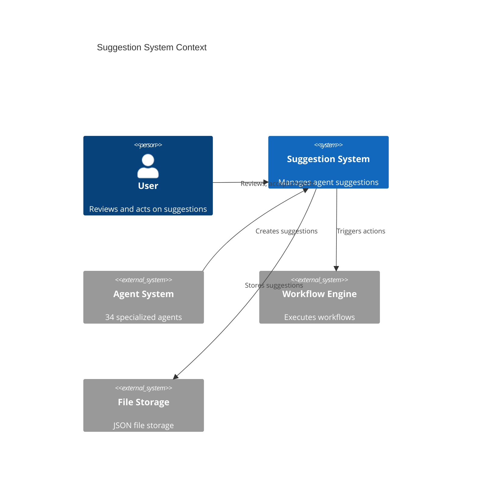
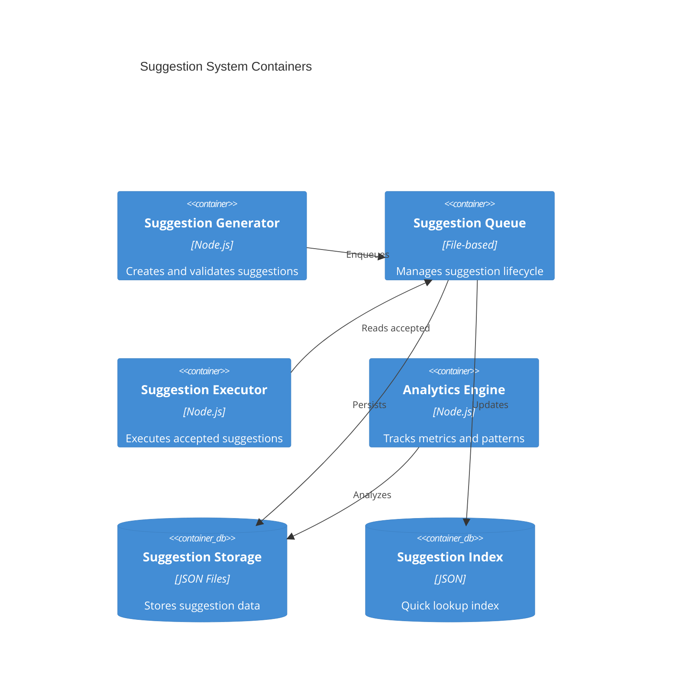
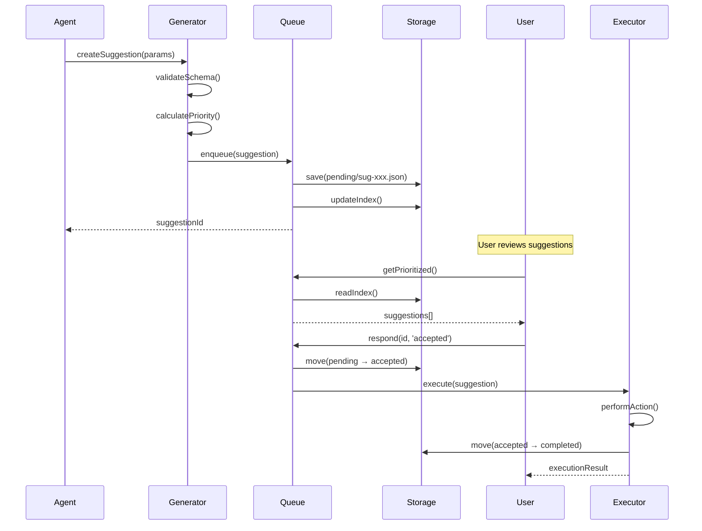

# Suggestion System Architecture

## Metadata

- **Version**: 1.0.0
- **Created**: 2026-01-15
- **Last Modified**: 2026-01-15
- **Author**: Winston (Architect Agent)
- **Status**: draft
- **Related Documents**: `.claude/schemas/suggestion.schema.json`, `.claude/conductor/context/suggestions/`

---

## Overview

The Suggestion System enables agents to proactively propose alternatives, clarifications, and optimizations during workflow execution without blocking the primary task flow. This architecture achieves a targeted 50% reduction in clarification round-trips by allowing agents to surface relevant suggestions asynchronously.

### Problem Statement

Current agent interactions follow a strict request-response pattern where agents cannot proactively suggest alternatives or flag potential issues. This leads to:

- Wasted iterations when user intent is ambiguous
- Missed optimization opportunities discovered during task execution
- No mechanism for agents to propose better approaches mid-task
- Lack of institutional learning from rejected suggestions

### Solution

An asynchronous suggestion queue system that:

1. Allows any agent to generate suggestions during task execution
2. Queues suggestions for user review without blocking workflows
3. Tracks acceptance/rejection for continuous improvement
4. Provides priority scoring based on confidence and impact

---

## Architecture Principles

| Principle        | Description                                                 |
| ---------------- | ----------------------------------------------------------- |
| **Non-blocking** | Suggestions never block workflow execution                  |
| **Asynchronous** | Agents generate suggestions independently of main task flow |
| **Prioritized**  | Suggestions ranked by calculated priority score             |
| **Traceable**    | Full audit trail of suggestion lifecycle                    |
| **Learnable**    | System improves routing based on acceptance patterns        |

---

## Architecture Decision Records (ADRs)

### ADR-001: Asynchronous Queue Architecture

- **Status**: accepted
- **Context**: Need to allow agents to suggest without blocking workflows
- **Decision**: Implement file-based queue with JSON storage at `.claude/conductor/context/suggestions/`
- **Consequences**: Simple implementation, no database required, easy debugging; limited to single-session concurrency

### ADR-002: Priority Scoring Algorithm

- **Status**: accepted
- **Context**: Need to rank suggestions for user attention
- **Decision**: Use formula `priority_score = confidence * impact_weight * urgency_factor`
- **Consequences**: Transparent scoring, tunable weights; may need calibration per project

### ADR-003: Suggestion Types

- **Status**: accepted
- **Context**: Need to categorize suggestions for appropriate handling
- **Decision**: Define 4 primary action types: `file_edit`, `command`, `clarification`, `agent_switch`
- **Consequences**: Clear action mapping; extensible for future types

---

## System Design

### High-Level Architecture

```
┌─────────────────────────────────────────────────────────────────────────┐
│                         Suggestion System                                │
├─────────────────────────────────────────────────────────────────────────┤
│                                                                         │
│  ┌──────────────┐    ┌──────────────┐    ┌──────────────┐              │
│  │   Agent      │    │  Suggestion  │    │    User      │              │
│  │  (Generator) │───▶│    Queue     │───▶│   Review     │              │
│  └──────────────┘    └──────────────┘    └──────────────┘              │
│         │                   │                   │                       │
│         │                   ▼                   ▼                       │
│         │            ┌──────────────┐    ┌──────────────┐              │
│         │            │   Priority   │    │   Action     │              │
│         │            │   Scorer     │    │   Executor   │              │
│         │            └──────────────┘    └──────────────┘              │
│         │                   │                   │                       │
│         ▼                   ▼                   ▼                       │
│  ┌──────────────────────────────────────────────────────┐              │
│  │              Suggestion Storage                       │              │
│  │     .claude/conductor/context/suggestions/            │              │
│  └──────────────────────────────────────────────────────┘              │
│                                                                         │
└─────────────────────────────────────────────────────────────────────────┘
```

### Suggestion Flow

```
┌─────────────────────────────────────────────────────────────────────────┐
│                      Suggestion Lifecycle Flow                           │
├─────────────────────────────────────────────────────────────────────────┤
│                                                                         │
│  ┌─────────┐     ┌─────────┐     ┌─────────┐     ┌─────────┐          │
│  │ PENDING │────▶│ QUEUED  │────▶│ REVIEW  │────▶│ACCEPTED │          │
│  └─────────┘     └─────────┘     └─────────┘     └────┬────┘          │
│       │               │               │               │                │
│       │               │               │               ▼                │
│       │               │               │         ┌─────────┐           │
│       │               │               │         │EXECUTING│           │
│       │               │               │         └────┬────┘           │
│       │               │               │               │                │
│       │               │               │               ▼                │
│       │               │               │         ┌─────────┐           │
│       │               │               └────────▶│COMPLETED│           │
│       │               │                         └─────────┘           │
│       │               │                               │                │
│       │               │         ┌─────────┐          │                │
│       │               └────────▶│REJECTED │◀─────────┘                │
│       │                         └─────────┘                           │
│       │                               │                                │
│       │                         ┌─────────┐                           │
│       └────────────────────────▶│DEFERRED │                           │
│                                 └─────────┘                           │
│                                       │                                │
│                                 ┌─────────┐                           │
│                                 │ EXPIRED │                           │
│                                 └─────────┘                           │
│                                                                         │
└─────────────────────────────────────────────────────────────────────────┘
```

---

## Suggestion Types

### Primary Suggestion Types (4 Core Types)

| Type            | Description                        | Action                           | Auto-executable                  |
| --------------- | ---------------------------------- | -------------------------------- | -------------------------------- |
| `file_edit`     | Propose changes to existing files  | Edit file with specified changes | No (requires review)             |
| `command`       | Suggest CLI command execution      | Run specified command            | Conditional (safe commands only) |
| `clarification` | Request information from user      | Display question, await response | No                               |
| `agent_switch`  | Recommend different agent for task | Spawn suggested agent            | No (user confirmation)           |

### Extended Suggestion Categories (15 Total)

The schema supports 15 suggestion categories that map to the 4 action types:

| Category            | Maps to Action Type               | Priority Weight |
| ------------------- | --------------------------------- | --------------- |
| `next-step`         | `command` or `agent_switch`       | 1.0             |
| `quick-win`         | `file_edit` or `command`          | 1.2             |
| `critical-fix`      | `file_edit`                       | 1.5             |
| `optimization`      | `file_edit`                       | 0.8             |
| `refactor`          | `file_edit`                       | 0.7             |
| `documentation`     | `file_edit`                       | 0.6             |
| `testing`           | `file_edit` or `command`          | 0.9             |
| `security`          | `file_edit`                       | 1.4             |
| `performance`       | `file_edit`                       | 0.9             |
| `accessibility`     | `file_edit`                       | 0.8             |
| `dependency-update` | `command`                         | 0.7             |
| `architecture`      | `clarification` or `agent_switch` | 1.1             |
| `cleanup`           | `file_edit` or `command`          | 0.5             |
| `feature`           | `file_edit`                       | 1.0             |
| `learning`          | `clarification`                   | 0.4             |

---

## Priority Scoring Algorithm

### Formula

```
priority_score = (confidence * impact_weight * urgency_factor) / effort_penalty

Where:
- confidence: 0.0 - 1.0 (agent's certainty)
- impact_weight: category-specific weight (see table above)
- urgency_factor: time-decay multiplier (1.0 - 1.5 based on age)
- effort_penalty: complexity-based divisor (1.0 - 3.0)
```

### Priority Calculation Implementation

```typescript
interface PriorityInput {
  confidence: number; // 0.0 - 1.0
  category: SuggestionType; // Category from schema
  createdAt: Date; // For urgency calculation
  complexity: Complexity; // trivial, simple, moderate, complex, very-complex
  riskLevel: RiskLevel; // low, medium, high, critical
}

function calculatePriority(input: PriorityInput): string {
  const impactWeights: Record<string, number> = {
    'critical-fix': 1.5,
    security: 1.4,
    'quick-win': 1.2,
    architecture: 1.1,
    'next-step': 1.0,
    feature: 1.0,
    testing: 0.9,
    performance: 0.9,
    optimization: 0.8,
    accessibility: 0.8,
    refactor: 0.7,
    'dependency-update': 0.7,
    documentation: 0.6,
    cleanup: 0.5,
    learning: 0.4,
  };

  const effortPenalties: Record<string, number> = {
    trivial: 1.0,
    simple: 1.2,
    moderate: 1.5,
    complex: 2.0,
    'very-complex': 3.0,
  };

  const riskMultipliers: Record<string, number> = {
    low: 1.0,
    medium: 1.1,
    high: 1.3,
    critical: 1.5,
  };

  const impactWeight = impactWeights[input.category] || 1.0;
  const effortPenalty = effortPenalties[input.complexity] || 1.0;
  const riskMultiplier = riskMultipliers[input.riskLevel] || 1.0;

  // Calculate urgency based on age (newer suggestions get slight boost)
  const ageHours = (Date.now() - input.createdAt.getTime()) / (1000 * 60 * 60);
  const urgencyFactor = Math.max(1.0, 1.5 - ageHours * 0.02); // Decays over 25 hours

  const rawScore =
    (input.confidence * impactWeight * urgencyFactor * riskMultiplier) / effortPenalty;

  // Map to priority levels
  if (rawScore >= 1.2) return 'P0';
  if (rawScore >= 0.8) return 'P1';
  if (rawScore >= 0.5) return 'P2';
  return 'P3';
}
```

### Priority Level Definitions

| Priority | Score Range | Response Time     | Description                                        |
| -------- | ----------- | ----------------- | -------------------------------------------------- |
| P0       | >= 1.2      | Immediate         | Critical suggestions requiring immediate attention |
| P1       | 0.8 - 1.2   | Within session    | High-value suggestions for current workflow        |
| P2       | 0.5 - 0.8   | Before completion | Moderate suggestions to review before finishing    |
| P3       | < 0.5       | Optional          | Low-priority suggestions for future consideration  |

---

## Component Architecture

### Suggestion Generator Component

```typescript
// Location: .claude/tools/suggestion-generator.mjs

interface SuggestionGenerator {
  /**
   * Create a new suggestion from an agent
   */
  createSuggestion(params: CreateSuggestionParams): Promise<Suggestion>;

  /**
   * Batch create multiple suggestions
   */
  createBatch(suggestions: CreateSuggestionParams[]): Promise<Suggestion[]>;

  /**
   * Validate suggestion against schema
   */
  validateSuggestion(suggestion: Suggestion): ValidationResult;
}

interface CreateSuggestionParams {
  type: SuggestionType;
  title: string;
  description: string;
  action: SuggestionAction;
  context: SuggestionContext;
  impact?: ImpactAssessment;
  effort?: EffortEstimate;
  rationale?: Rationale;
}
```

### Suggestion Queue Manager Component

```typescript
// Location: .claude/tools/suggestion-queue.mjs

interface SuggestionQueueManager {
  /**
   * Add suggestion to queue
   */
  enqueue(suggestion: Suggestion): Promise<void>;

  /**
   * Get suggestions by status
   */
  getByStatus(status: SuggestionStatus): Promise<Suggestion[]>;

  /**
   * Get prioritized suggestions for review
   */
  getPrioritized(limit?: number): Promise<Suggestion[]>;

  /**
   * Update suggestion status
   */
  updateStatus(suggestionId: string, status: SuggestionStatus, notes?: string): Promise<void>;

  /**
   * Get suggestions for specific agent
   */
  getByAgent(agentId: string): Promise<Suggestion[]>;

  /**
   * Expire old suggestions
   */
  expireStale(maxAgeHours: number): Promise<number>;
}
```

### Suggestion Executor Component

```typescript
// Location: .claude/tools/suggestion-executor.mjs

interface SuggestionExecutor {
  /**
   * Execute an accepted suggestion
   */
  execute(suggestion: Suggestion): Promise<ExecutionResult>;

  /**
   * Validate suggestion is executable
   */
  canExecute(suggestion: Suggestion): Promise<ValidationResult>;

  /**
   * Rollback executed suggestion (if reversible)
   */
  rollback(suggestionId: string): Promise<RollbackResult>;
}

interface ExecutionResult {
  success: boolean;
  output?: string;
  artifactsCreated?: string[];
  error?: string;
  duration_ms: number;
}
```

### Suggestion Analytics Component

```typescript
// Location: .claude/tools/suggestion-analytics.mjs

interface SuggestionAnalytics {
  /**
   * Calculate acceptance rate by agent
   */
  getAcceptanceRateByAgent(): Promise<Record<string, number>>;

  /**
   * Calculate acceptance rate by type
   */
  getAcceptanceRateByType(): Promise<Record<string, number>>;

  /**
   * Get average time to decision
   */
  getAverageDecisionTime(): Promise<number>;

  /**
   * Generate analytics report
   */
  generateReport(timeRange?: TimeRange): Promise<AnalyticsReport>;
}
```

---

## Agent Integration Points

### Integration Architecture

```
┌─────────────────────────────────────────────────────────────────────────┐
│                    Agent Integration Points                              │
├─────────────────────────────────────────────────────────────────────────┤
│                                                                         │
│  ┌────────────────────────────────────────────────────────────────┐    │
│  │                    Agent Layer (34 Agents)                      │    │
│  ├────────────────────────────────────────────────────────────────┤    │
│  │                                                                 │    │
│  │  Orchestrator Agents          Worker Agents                     │    │
│  │  ┌──────────────────┐        ┌──────────────────┐              │    │
│  │  │ master-orchestrator       │ developer        │              │    │
│  │  │ orchestrator      │       │ architect        │              │    │
│  │  │ planner           │       │ code-reviewer    │              │    │
│  │  └────────┬─────────┘        │ qa               │              │    │
│  │           │                  │ security-architect              │    │
│  │           │                  │ analyst          │              │    │
│  │           │                  │ ... (28 more)    │              │    │
│  │           │                  └────────┬─────────┘              │    │
│  │           │                           │                         │    │
│  │           ▼                           ▼                         │    │
│  │  ┌─────────────────────────────────────────────────────────┐   │    │
│  │  │              Suggestion Skill Interface                  │   │    │
│  │  │                                                          │   │    │
│  │  │  generateSuggestion(params)  // Create suggestion        │   │    │
│  │  │  getSuggestions()            // View pending             │   │    │
│  │  │  respondToSuggestion(id, action) // Accept/reject        │   │    │
│  │  │                                                          │   │    │
│  │  └─────────────────────────────────────────────────────────┘   │    │
│  │                                                                 │    │
│  └────────────────────────────────────────────────────────────────┘    │
│                                                                         │
└─────────────────────────────────────────────────────────────────────────┘
```

### Agent-Specific Integration Patterns

| Agent Category    | Suggestion Patterns                          | Typical Types                           |
| ----------------- | -------------------------------------------- | --------------------------------------- |
| **Orchestrators** | Route suggestions to appropriate agents      | `agent_switch`, `clarification`         |
| **Developers**    | Code improvements, refactoring opportunities | `file_edit`, `optimization`, `refactor` |
| **Architects**    | Design improvements, pattern suggestions     | `architecture`, `file_edit`             |
| **Reviewers**     | Quality improvements, best practices         | `file_edit`, `security`, `testing`      |
| **QA Agents**     | Test coverage, quality gates                 | `testing`, `command`                    |
| **Security**      | Vulnerability fixes, compliance              | `security`, `critical-fix`              |
| **DevOps**        | Infrastructure, deployment suggestions       | `command`, `dependency-update`          |
| **Specialists**   | Domain-specific improvements                 | Varies by specialty                     |

### Integration for All 34 Agents

```typescript
// Suggestion generation capability added to all worker agents
// Location: .claude/skills/suggestion-generator/SKILL.md

// Each agent can invoke:
// Skill: suggestion-generator
// Action: create
// Params: { type, title, description, action, context }

// Example integration in developer agent:
// During code review, developer discovers optimization opportunity
const suggestion = await generateSuggestion({
  type: 'optimization',
  title: 'Replace nested loops with Map for O(n) lookup',
  description:
    'Current implementation uses O(n^2) nested loops. Using a Map would reduce complexity to O(n).',
  action: {
    type: 'edit-file',
    file_path: 'src/utils/search.ts',
    auto_executable: false,
    reversible: true,
    estimated_duration_minutes: 15,
  },
  context: {
    trigger: 'pattern-match',
    related_files: ['src/utils/search.ts'],
  },
  impact: {
    areas_affected: ['performance'],
    files_affected: 1,
    risk_level: 'low',
    confidence: 0.85,
  },
  effort: {
    complexity: 'simple',
    time_estimate: 'minutes',
    agents_recommended: ['developer'],
  },
});
```

---

## Data Flow

### Suggestion Generation Flow

```
┌─────────────────────────────────────────────────────────────────────────┐
│                     Suggestion Generation Flow                           │
├─────────────────────────────────────────────────────────────────────────┤
│                                                                         │
│  1. Agent Discovery                                                     │
│     ┌────────────┐                                                      │
│     │   Agent    │ ─── During task execution, agent identifies          │
│     │            │     opportunity for suggestion                       │
│     └─────┬──────┘                                                      │
│           │                                                             │
│           ▼                                                             │
│  2. Suggestion Creation                                                 │
│     ┌────────────────────────────────────────────────────┐             │
│     │  Skill: suggestion-generator                        │             │
│     │  - Validate suggestion params against schema        │             │
│     │  - Calculate priority score                         │             │
│     │  - Generate unique suggestion_id                    │             │
│     │  - Add metadata (timestamps, agent info)            │             │
│     └─────┬──────────────────────────────────────────────┘             │
│           │                                                             │
│           ▼                                                             │
│  3. Queue Storage                                                       │
│     ┌────────────────────────────────────────────────────┐             │
│     │  .claude/conductor/context/suggestions/             │             │
│     │  - pending/sug-{id}.json                           │             │
│     │  - Index updated with new suggestion               │             │
│     └─────┬──────────────────────────────────────────────┘             │
│           │                                                             │
│           ▼                                                             │
│  4. Notification (Optional)                                             │
│     ┌────────────────────────────────────────────────────┐             │
│     │  If P0/P1 priority:                                 │             │
│     │  - Surface to user immediately                      │             │
│     │  - Include in workflow status updates               │             │
│     └────────────────────────────────────────────────────┘             │
│                                                                         │
└─────────────────────────────────────────────────────────────────────────┘
```

### User Review Flow

```
┌─────────────────────────────────────────────────────────────────────────┐
│                        User Review Flow                                  │
├─────────────────────────────────────────────────────────────────────────┤
│                                                                         │
│  1. Suggestion Retrieval                                                │
│     ┌────────────────────────────────────────────────────┐             │
│     │  User requests pending suggestions                  │             │
│     │  Command: /suggestions or /review-suggestions       │             │
│     │  Returns: Prioritized list of pending suggestions   │             │
│     └─────┬──────────────────────────────────────────────┘             │
│           │                                                             │
│           ▼                                                             │
│  2. Presentation                                                        │
│     ┌────────────────────────────────────────────────────┐             │
│     │  Display Format:                                    │             │
│     │  ┌──────────────────────────────────────────────┐  │             │
│     │  │ [P0] sug-abc123 - Critical security fix       │  │             │
│     │  │ Type: security | Agent: security-architect    │  │             │
│     │  │ Fix SQL injection vulnerability in user API   │  │             │
│     │  │ Confidence: 0.95 | Effort: simple             │  │             │
│     │  │ [Accept] [Reject] [Defer] [Details]           │  │             │
│     │  └──────────────────────────────────────────────┘  │             │
│     └─────┬──────────────────────────────────────────────┘             │
│           │                                                             │
│           ▼                                                             │
│  3. User Decision                                                       │
│     ┌────────────────────────────────────────────────────┐             │
│     │  Actions:                                           │             │
│     │  - Accept → Execute suggestion                      │             │
│     │  - Reject → Log rejection with optional reason      │             │
│     │  - Defer → Schedule for later review                │             │
│     │  - Modify → Edit suggestion before accepting        │             │
│     └─────┬──────────────────────────────────────────────┘             │
│           │                                                             │
│           ▼                                                             │
│  4. Action Execution (if accepted)                                      │
│     ┌────────────────────────────────────────────────────┐             │
│     │  - Validate action is still applicable              │             │
│     │  - Execute action (file edit, command, etc.)        │             │
│     │  - Record execution result                          │             │
│     │  - Update suggestion status to completed/failed     │             │
│     └────────────────────────────────────────────────────┘             │
│                                                                         │
└─────────────────────────────────────────────────────────────────────────┘
```

---

## Storage Architecture

### Directory Structure

```
.claude/conductor/context/suggestions/
├── pending/                    # Suggestions awaiting review
│   ├── sug-abc123.json
│   └── sug-def456.json
├── accepted/                   # Accepted suggestions (pre-execution)
│   └── sug-ghi789.json
├── completed/                  # Successfully executed suggestions
│   └── sug-jkl012.json
├── rejected/                   # Rejected suggestions (for analytics)
│   └── sug-mno345.json
├── deferred/                   # Suggestions scheduled for later
│   └── sug-pqr678.json
├── expired/                    # Expired suggestions (for cleanup)
│   └── sug-stu901.json
├── index.json                  # Quick lookup index
└── analytics.json              # Aggregated analytics data
```

### Index File Structure

```json
{
  "version": "1.0.0",
  "updated_at": "2026-01-15T10:30:00Z",
  "suggestions": {
    "sug-abc123": {
      "status": "pending",
      "priority": "P0",
      "type": "security",
      "agent": "security-architect",
      "created_at": "2026-01-15T10:00:00Z"
    }
  },
  "counts": {
    "pending": 3,
    "accepted": 1,
    "completed": 12,
    "rejected": 5,
    "deferred": 2,
    "expired": 8
  },
  "by_priority": {
    "P0": ["sug-abc123"],
    "P1": ["sug-def456"],
    "P2": ["sug-ghi789"],
    "P3": []
  }
}
```

---

## API Design

### Skill Interface

```typescript
// Skill: suggestion-generator
// Location: .claude/skills/suggestion-generator/SKILL.md

interface SuggestionSkill {
  // Create a new suggestion
  create(params: CreateParams): Suggestion;

  // List suggestions with filters
  list(filters?: ListFilters): Suggestion[];

  // Get specific suggestion
  get(suggestionId: string): Suggestion | null;

  // Respond to suggestion
  respond(suggestionId: string, response: UserResponse): UpdateResult;

  // Execute accepted suggestion
  execute(suggestionId: string): ExecutionResult;

  // Get analytics
  analytics(timeRange?: TimeRange): AnalyticsReport;
}

interface CreateParams {
  type: SuggestionType;
  title: string;
  description: string;
  action: ActionDefinition;
  context?: ContextInfo;
  impact?: ImpactAssessment;
  effort?: EffortEstimate;
  rationale?: Rationale;
  display?: DisplayHints;
}

interface ListFilters {
  status?: SuggestionStatus[];
  priority?: Priority[];
  type?: SuggestionType[];
  agent?: string;
  limit?: number;
  offset?: number;
}

interface UserResponse {
  action: 'accepted' | 'rejected' | 'deferred' | 'modified';
  notes?: string;
  defer_until?: string; // ISO date if deferred
  modified_action?: ActionDefinition; // If modified
}
```

### CLI Commands

```bash
# List pending suggestions (prioritized)
claude suggestions list

# List suggestions by status
claude suggestions list --status=pending,deferred

# View specific suggestion
claude suggestions show sug-abc123

# Accept a suggestion
claude suggestions accept sug-abc123

# Reject with reason
claude suggestions reject sug-abc123 --reason="Not applicable to current scope"

# Defer until later
claude suggestions defer sug-abc123 --until="2026-01-20"

# View analytics
claude suggestions analytics --days=30

# Expire stale suggestions
claude suggestions cleanup --max-age-hours=72
```

---

## UI Presentation Patterns

### Dashboard Integration

```
┌─────────────────────────────────────────────────────────────────────────┐
│                    Suggestion Dashboard Widget                           │
├─────────────────────────────────────────────────────────────────────────┤
│                                                                         │
│  Pending Suggestions (5)                              [View All]        │
│  ─────────────────────────────────────────────────────────────         │
│                                                                         │
│  ⚠️  [P0] Critical security fix needed                                  │
│      security-architect • 2 min ago • security                          │
│      [Accept] [Reject] [Details]                                        │
│                                                                         │
│  ⚡  [P1] Performance optimization available                            │
│      developer • 15 min ago • optimization                              │
│      [Accept] [Reject] [Details]                                        │
│                                                                         │
│  📝  [P2] Documentation update suggested                                │
│      technical-writer • 1 hour ago • documentation                      │
│      [Accept] [Reject] [Details]                                        │
│                                                                         │
│  ─────────────────────────────────────────────────────────────         │
│  Acceptance Rate: 72% | Avg Response Time: 8 min                        │
│                                                                         │
└─────────────────────────────────────────────────────────────────────────┘
```

### Inline Notification Pattern

```
┌─────────────────────────────────────────────────────────────────────────┐
│                    Inline Suggestion Notification                        │
├─────────────────────────────────────────────────────────────────────────┤
│                                                                         │
│  [Developer completing code review task...]                             │
│                                                                         │
│  ┌────────────────────────────────────────────────────────────────┐    │
│  │ 💡 SUGGESTION from code-reviewer                                │    │
│  │                                                                 │    │
│  │ "Consider extracting repeated validation logic into a           │    │
│  │  shared utility function"                                       │    │
│  │                                                                 │    │
│  │ Type: refactor | Priority: P2 | Confidence: 0.78               │    │
│  │                                                                 │    │
│  │ [Accept] [Reject] [Defer] [View Details]                        │    │
│  └────────────────────────────────────────────────────────────────┘    │
│                                                                         │
│  [Continuing with primary task...]                                      │
│                                                                         │
└─────────────────────────────────────────────────────────────────────────┘
```

### Display Configuration by Type

| Type            | Icon | Color  | Default Action Text  |
| --------------- | ---- | ------ | -------------------- |
| `file_edit`     | 📝   | blue   | "Apply Changes"      |
| `command`       | ⚡   | green  | "Run Command"        |
| `clarification` | ❓   | yellow | "Respond"            |
| `agent_switch`  | 🔄   | purple | "Switch Agent"       |
| `security`      | ⚠️   | red    | "Fix Security Issue" |
| `optimization`  | 🚀   | teal   | "Optimize"           |
| `testing`       | 🧪   | orange | "Add Tests"          |

---

## Fallback Behavior

### When Suggestions Are Unavailable

```typescript
// Fallback handling when suggestion system is unavailable

interface FallbackStrategy {
  // Log suggestion that couldn't be queued
  logFallback(suggestion: Suggestion): void;

  // Attempt recovery when system becomes available
  recoverFallbacks(): Promise<RecoveryResult>;

  // Alternative notification method
  notifyUser(message: string): void;
}

const fallbackConfig = {
  // Store failed suggestions in temporary file
  fallback_storage: '.claude/context/tmp/suggestions-fallback.json',

  // Maximum fallback suggestions to store
  max_fallback_count: 100,

  // Fallback expiry (hours)
  fallback_expiry_hours: 24,

  // Alternative notification methods
  notifications: {
    console_log: true,
    workflow_status: true,
    reasoning_file: true,
  },
};
```

### Degraded Mode Behavior

| Condition               | Behavior                            |
| ----------------------- | ----------------------------------- |
| Queue unavailable       | Log to fallback file, continue task |
| Schema validation fails | Log error, skip suggestion creation |
| User review timeout     | Auto-expire after 72 hours          |
| Execution fails         | Mark as failed, preserve for retry  |
| High queue volume       | Prioritize P0/P1, defer P3          |

---

## Security Architecture

### Permission Model

```typescript
interface SuggestionPermissions {
  // Who can create suggestions
  create: {
    allowed: ['all_agents'];
    restricted: [];
  };

  // Who can accept/reject suggestions
  review: {
    allowed: ['user', 'master-orchestrator'];
    restricted: ['worker_agents']; // Workers cannot self-accept
  };

  // Who can execute suggestions
  execute: {
    allowed: ['user', 'designated_executor_agents'];
    restricted: ['suggestion_generator_agent']; // Prevent self-execution
  };

  // Auto-executable conditions
  auto_execute: {
    // Only P3 suggestions with low risk can auto-execute
    conditions: [{ priority: 'P3'; risk_level: 'low'; type: 'command' }];
    // Safe commands whitelist
    safe_commands: ['npm run lint', 'npm run format', 'npm run test'];
  };
}
```

### Audit Trail

```json
{
  "suggestion_id": "sug-abc123",
  "audit_trail": [
    {
      "timestamp": "2026-01-15T10:00:00Z",
      "action": "created",
      "actor": "security-architect",
      "details": {}
    },
    {
      "timestamp": "2026-01-15T10:05:00Z",
      "action": "status_change",
      "actor": "system",
      "details": {
        "from": "pending",
        "to": "accepted"
      }
    },
    {
      "timestamp": "2026-01-15T10:06:00Z",
      "action": "executed",
      "actor": "suggestion-executor",
      "details": {
        "result": "success",
        "duration_ms": 1250
      }
    }
  ]
}
```

---

## Performance Considerations

### Queue Performance Targets

| Metric               | Target  | Measurement                           |
| -------------------- | ------- | ------------------------------------- |
| Suggestion creation  | < 50ms  | Time from agent call to queue storage |
| Priority calculation | < 10ms  | Time to compute priority score        |
| Queue retrieval      | < 100ms | Time to fetch prioritized list        |
| Execution initiation | < 200ms | Time from accept to execution start   |
| Index update         | < 20ms  | Time to update index.json             |

### Optimization Strategies

1. **Index-based Queries**: Use index.json for fast lookups instead of scanning directories
2. **Lazy Loading**: Load full suggestion details only when requested
3. **Batched Writes**: Group multiple suggestion updates into single write operations
4. **Priority Caching**: Cache priority calculations for suggestions that haven't changed
5. **Async Operations**: All queue operations are async to avoid blocking agent work

---

## Scalability Plan

### Current Capacity (Phase 2)

- Maximum pending suggestions: 100
- Maximum total suggestions: 1000
- Single session concurrency: 1
- Storage: File-based JSON

### Future Scaling (Phase 3+)

| Scale Level | Capacity      | Storage        | Changes Required          |
| ----------- | ------------- | -------------- | ------------------------- |
| Small       | 100 pending   | File-based     | Current implementation    |
| Medium      | 1000 pending  | SQLite         | Add database adapter      |
| Large       | 10000 pending | PostgreSQL     | Add connection pooling    |
| Enterprise  | Unlimited     | Distributed DB | Add sharding, replication |

---

## Integration with Existing Systems

### Workflow Integration

```yaml
# Integration with existing workflows
# Location: .claude/workflows/*.yaml

# Add suggestion checkpoint after each step
steps:
  - name: 'Code Implementation'
    agent: developer
    outputs:
      - code-artifacts
      - dev-manifest.json
    # NEW: Suggestion checkpoint
    suggestion_checkpoint:
      enabled: true
      auto_surface_priority: ['P0', 'P1']
      review_before_next_step: false # Non-blocking
```

### Enforcement Gate Integration

```typescript
// Integration with enforcement-gate.mjs
// Location: .claude/tools/enforcement-gate.mjs

interface EnforcementIntegration {
  // Check for blocking suggestions before proceeding
  checkBlockingSuggestions(): Promise<BlockingCheck>;

  // Auto-create suggestions from validation failures
  createFromValidationFailure(failure: ValidationFailure): Promise<Suggestion>;
}
```

### Skill Integration

```typescript
// All 34 agents gain suggestion capability via skill
// Skill automatically loaded based on agent type

// Orchestrator agents: Can review and route suggestions
// Worker agents: Can create suggestions during task execution
// QA agents: Auto-create suggestions from test failures
// Security agents: Auto-create suggestions from vulnerability scans
```

---

## Observability Architecture

### Metrics

```typescript
interface SuggestionMetrics {
  // Counter metrics
  suggestions_created_total: Counter;
  suggestions_accepted_total: Counter;
  suggestions_rejected_total: Counter;
  suggestions_expired_total: Counter;

  // Gauge metrics
  suggestions_pending_count: Gauge;
  suggestions_queue_depth: Gauge;

  // Histogram metrics
  suggestion_response_time_seconds: Histogram;
  suggestion_execution_duration_seconds: Histogram;

  // Labels
  labels: ['agent', 'type', 'priority'];
}
```

### Logging

```typescript
// Log format for suggestion events
interface SuggestionLog {
  timestamp: string;
  level: 'info' | 'warn' | 'error';
  event: SuggestionEvent;
  suggestion_id: string;
  agent?: string;
  type?: string;
  priority?: string;
  details?: Record<string, unknown>;
}

// Log locations
const logPaths = {
  events: '.claude/context/logs/suggestions.log',
  errors: '.claude/context/logs/suggestions-errors.log',
  analytics: '.claude/conductor/context/suggestions/analytics.json',
};
```

---

## Disaster Recovery

### Backup Strategy

```typescript
const backupConfig = {
  // Backup pending suggestions before operations
  backup_before_operations: ['execute', 'cleanup'],

  // Backup location
  backup_path: '.claude/context/backups/suggestions/',

  // Retention period
  retention_days: 7,

  // Recovery mode
  recovery: {
    // Restore from backup on corruption
    auto_restore: true,
    // Notify on recovery
    notify_on_restore: true,
  },
};
```

### Recovery Procedures

1. **Corrupted Index**: Rebuild from individual suggestion files
2. **Lost Suggestions**: Restore from backup or recreate from agent logs
3. **Failed Execution**: Rollback if reversible, mark as failed otherwise
4. **System Crash**: Resume from last checkpoint, re-queue interrupted suggestions

---

## Diagrams

### C4 Context Diagram



### C4 Container Diagram



### Sequence Diagram - Suggestion Flow



---

## Version History

| Version | Date       | Author  | Changes                     |
| ------- | ---------- | ------- | --------------------------- |
| 1.0.0   | 2026-01-15 | Winston | Initial architecture design |

---

## Related Documents

- **Suggestion Schema**: `.claude/schemas/suggestion.schema.json`
- **Conductor Context**: `.claude/conductor/context/suggestions/`
- **Agent Directory**: `.claude/agents/` (34 agents)
- **Skill Taxonomy**: `.claude/docs/SKILLS_TAXONOMY.md`
- **Workflow Guide**: `.claude/workflows/WORKFLOW-GUIDE.md`

---

## Implementation Checklist

- [ ] Create suggestion-generator skill (`.claude/skills/suggestion-generator/`)
- [ ] Implement suggestion queue manager (`.claude/tools/suggestion-queue.mjs`)
- [ ] Implement suggestion executor (`.claude/tools/suggestion-executor.mjs`)
- [ ] Create CLI commands for suggestion management
- [ ] Integrate with workflow engine for checkpoints
- [ ] Add suggestion review to dashboard
- [ ] Implement analytics tracking
- [ ] Add fallback handling for unavailable queue
- [ ] Write unit tests for all components
- [ ] Document integration patterns for each agent type
