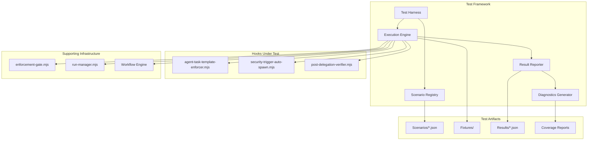
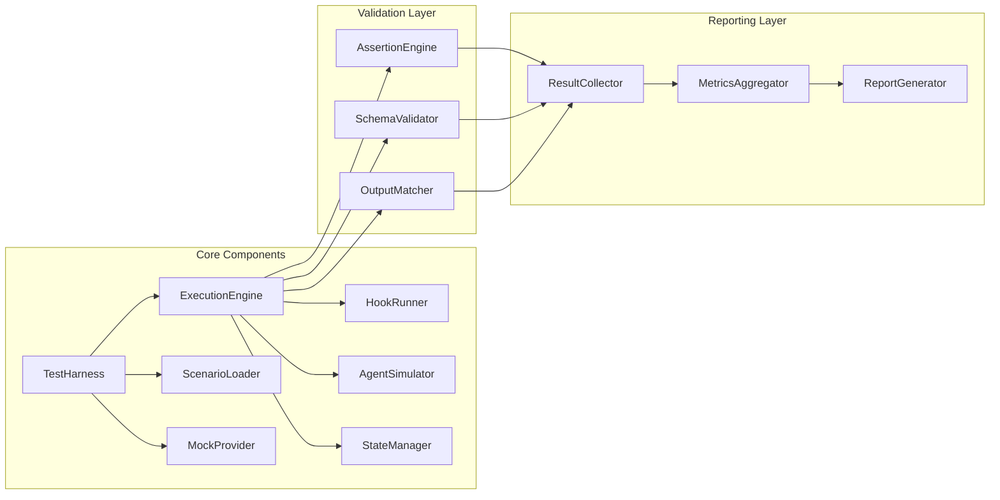
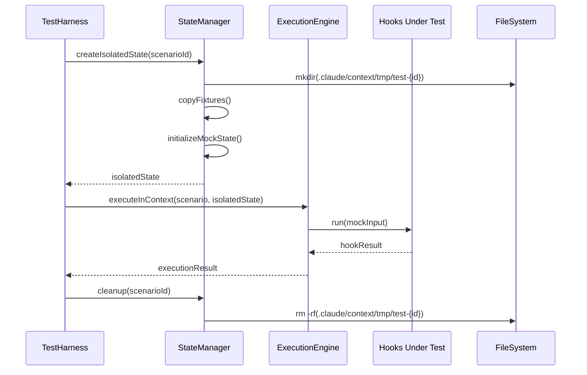
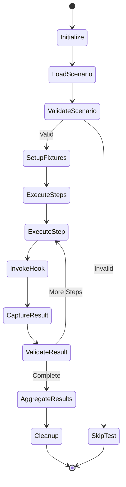
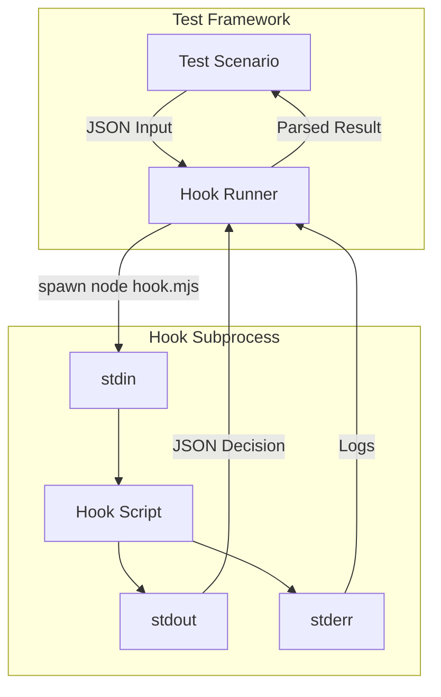

# A2A Test Framework Architecture

## Document metadata

| Field        | Value                     |
| ------------ | ------------------------- |
| Version      | 1.0.0                     |
| Status       | Draft                     |
| Author       | Winston (Architect Agent) |
| Created      | 2026-01-16                |
| Last Updated | 2026-01-16                |

---

## Executive summary

This document specifies the comprehensive test framework architecture for validating Agent-to-Agent (A2A) communication patterns across the 34-agent orchestration system. The framework enables systematic testing of 18+ P0/P1 scenarios covering agent chains, template enforcement, security triggers, verification protocols, and workflow execution.

### Key design goals

1. **Isolated test execution** - Each test scenario runs in isolation without affecting other tests or production state
2. **Hook integration** - Direct integration with existing PreToolUse/PostToolUse hooks for validation
3. **CI/CD compatibility** - Test suite designed for automated execution in CI/CD pipelines
4. **Comprehensive diagnostics** - Detailed failure analysis with root cause identification
5. **Extensibility** - Scenario format supports future test categories without framework changes

---

## Architecture overview

### System context diagram



### Component architecture



---

## Test harness design

### Core responsibilities

The test harness (`a2a-test-harness.mjs`) serves as the orchestration layer for test execution:

1. **Test lifecycle management** - Initialize, execute, cleanup test runs
2. **Environment isolation** - Create isolated test environments with mock state
3. **Hook injection** - Inject test hooks into the execution pipeline
4. **Result aggregation** - Collect and aggregate results across test scenarios

### Test harness API specification

```javascript
/**
 * A2A Test Harness
 *
 * Provides isolated test execution environment for A2A communication validation.
 */
export class A2ATestHarness {
  /**
   * Initialize test harness with configuration
   * @param {TestHarnessConfig} config - Harness configuration
   */
  constructor(config) {}

  /**
   * Load and register test scenarios
   * @param {string|string[]} scenarioPaths - Path(s) to scenario files
   * @returns {Promise<ScenarioSet>}
   */
  async loadScenarios(scenarioPaths) {}

  /**
   * Execute a single test scenario
   * @param {string} scenarioId - Scenario identifier
   * @param {ExecutionOptions} options - Execution options
   * @returns {Promise<TestResult>}
   */
  async executeScenario(scenarioId, options = {}) {}

  /**
   * Execute all loaded scenarios
   * @param {ExecutionOptions} options - Execution options
   * @returns {Promise<TestSuiteResult>}
   */
  async executeAll(options = {}) {}

  /**
   * Execute scenarios matching filter
   * @param {ScenarioFilter} filter - Filter criteria
   * @param {ExecutionOptions} options - Execution options
   * @returns {Promise<TestSuiteResult>}
   */
  async executeFiltered(filter, options = {}) {}

  /**
   * Get test coverage metrics
   * @returns {CoverageReport}
   */
  getCoverage() {}

  /**
   * Generate test report
   * @param {ReportFormat} format - Output format (json, markdown, html)
   * @returns {Promise<string>}
   */
  async generateReport(format = 'json') {}

  /**
   * Cleanup test artifacts
   * @returns {Promise<void>}
   */
  async cleanup() {}
}
```

### Configuration schema

```typescript
interface TestHarnessConfig {
  // Base configuration
  projectRoot: string; // Project root directory
  testDir: string; // Test artifacts directory
  scenarioDir: string; // Scenario definition directory
  fixtureDir: string; // Test fixtures directory

  // Execution settings
  parallelExecution: boolean; // Run tests in parallel (default: false for A2A)
  maxParallelTests: number; // Maximum parallel tests (default: 1)
  timeout: number; // Default test timeout in ms (default: 30000)
  retryCount: number; // Retry count for flaky tests (default: 0)

  // Isolation settings
  isolationMode: 'full' | 'partial' | 'none'; // Test isolation level
  mockHooks: boolean; // Use mock hooks instead of real ones
  mockAgents: boolean; // Use mock agent responses

  // Hook configuration
  hooks: {
    preToolUse: string[]; // PreToolUse hooks to test
    postToolUse: string[]; // PostToolUse hooks to test
  };

  // Reporting settings
  reportDir: string; // Report output directory
  reportFormats: ('json' | 'markdown' | 'html')[];
  verboseLogging: boolean; // Enable verbose test logging
  captureToolOutput: boolean; // Capture all tool outputs
}
```

### Test isolation strategy



---

## Execution engine design

### Engine responsibilities

The execution engine handles the actual test execution:

1. **Scenario interpretation** - Parse and validate scenario definitions
2. **Agent simulation** - Simulate agent delegation via mock Task tool calls
3. **Hook execution** - Execute hooks with controlled inputs
4. **State verification** - Verify state changes and outputs

### Execution flow



### Execution engine API

```javascript
/**
 * A2A Test Execution Engine
 */
export class ExecutionEngine {
  /**
   * Execute a complete test scenario
   * @param {TestScenario} scenario - Scenario to execute
   * @param {IsolatedState} state - Isolated test state
   * @returns {Promise<ScenarioResult>}
   */
  async executeScenario(scenario, state) {}

  /**
   * Execute a single scenario step
   * @param {ScenarioStep} step - Step to execute
   * @param {IsolatedState} state - Test state
   * @param {StepContext} context - Execution context from previous steps
   * @returns {Promise<StepResult>}
   */
  async executeStep(step, state, context) {}

  /**
   * Invoke a hook with test input
   * @param {string} hookName - Hook filename
   * @param {HookInput} input - Hook input data
   * @returns {Promise<HookResult>}
   */
  async invokeHook(hookName, input) {}

  /**
   * Simulate a Task tool call (agent delegation)
   * @param {TaskInput} taskInput - Task input (agent-task.schema.json format)
   * @returns {Promise<TaskResult>}
   */
  async simulateTaskCall(taskInput) {}

  /**
   * Validate step results against expectations
   * @param {StepResult} actual - Actual result
   * @param {StepExpectation} expected - Expected result
   * @returns {ValidationResult}
   */
  validateStepResult(actual, expected) {}
}
```

### Hook runner implementation

```javascript
/**
 * Hook Runner - Executes hooks in isolated subprocess
 */
export class HookRunner {
  /**
   * Run a PreToolUse hook
   * @param {string} hookPath - Path to hook script
   * @param {object} toolInput - Tool input to validate
   * @returns {Promise<HookDecision>}
   */
  async runPreToolUse(hookPath, toolInput) {
    const input = JSON.stringify({
      tool_name: toolInput.tool_name || 'Task',
      tool_input: toolInput.tool_input,
    });

    const result = await this.executeHook(hookPath, input);
    return this.parseHookDecision(result);
  }

  /**
   * Run a PostToolUse hook
   * @param {string} hookPath - Path to hook script
   * @param {object} toolResult - Tool result to analyze
   * @returns {Promise<HookAnalysis>}
   */
  async runPostToolUse(hookPath, toolResult) {
    const input = JSON.stringify({
      tool_name: toolResult.tool_name || 'Task',
      tool_input: toolResult.tool_input,
      tool_result: toolResult.tool_result,
    });

    const result = await this.executeHook(hookPath, input);
    return this.parseHookAnalysis(result);
  }

  /**
   * Execute hook in subprocess with timeout
   */
  async executeHook(hookPath, stdinInput) {
    return new Promise((resolve, reject) => {
      const child = spawn('node', [hookPath], {
        stdio: ['pipe', 'pipe', 'pipe'],
        timeout: this.config.hookTimeout || 5000,
      });

      let stdout = '';
      let stderr = '';

      child.stdout.on('data', data => (stdout += data));
      child.stderr.on('data', data => (stderr += data));

      child.on('close', code => {
        resolve({ stdout, stderr, exitCode: code });
      });

      child.on('error', reject);

      child.stdin.write(stdinInput);
      child.stdin.end();
    });
  }
}
```

---

## Scenario format specification

### Scenario structure

Test scenarios are defined in JSON format following a structured schema:

```json
{
  "$schema": "../schemas/a2a-test-scenario.schema.json",
  "scenario_id": "string (required, unique identifier)",
  "name": "string (required, human-readable name)",
  "description": "string (required, detailed description)",
  "category": "string (required, one of defined categories)",
  "priority": "string (P0|P1|P2, test priority)",
  "tags": ["array of strings for filtering"],

  "preconditions": {
    "fixtures": ["fixture files to load"],
    "state": {"initial state setup"},
    "environment": {"environment variables"}
  },

  "steps": [
    {
      "step_id": "string (unique within scenario)",
      "action": "string (action type)",
      "input": {"action input data"},
      "expected": {
        "decision": "string (expected decision)",
        "outputs": ["expected output files"],
        "state_changes": {"expected state changes"},
        "errors": ["expected errors"],
        "warnings": ["expected warnings"]
      },
      "timeout_ms": 30000
    }
  ],

  "assertions": [
    {
      "type": "string (assertion type)",
      "target": "string (what to assert on)",
      "operator": "string (comparison operator)",
      "expected": "any (expected value)"
    }
  ],

  "cleanup": {
    "remove_files": ["files to delete"],
    "restore_state": true
  },

  "metadata": {
    "created_at": "ISO timestamp",
    "author": "string",
    "related_hooks": ["hook filenames"],
    "jira_ticket": "string (optional)"
  }
}
```

### Category definitions

| Category                | Description                      | Test Focus                                      |
| ----------------------- | -------------------------------- | ----------------------------------------------- |
| `agent-chain`           | Agent-to-agent delegation chains | Sequential agent handoffs, artifact passing     |
| `template-enforcement`  | Task template validation         | Schema compliance, required fields, blocking    |
| `security-trigger`      | Security keyword detection       | Keyword matching, agent suggestions, priority   |
| `verification-protocol` | Post-delegation verification     | Error detection, deliverable checking, verdicts |
| `workflow-execution`    | Full workflow execution          | End-to-end workflow, step sequencing            |
| `complex-graph`         | Multi-agent parallel/fan-out     | DAG execution, dependency resolution            |

### Action types

| Action                      | Description                | Input Schema                                 |
| --------------------------- | -------------------------- | -------------------------------------------- |
| `invoke_pretooluse_hook`    | Execute PreToolUse hook    | `{hook, tool_name, tool_input}`              |
| `invoke_posttooluse_hook`   | Execute PostToolUse hook   | `{hook, tool_name, tool_input, tool_result}` |
| `simulate_task_delegation`  | Simulate Task tool call    | `agent-task.schema.json` format              |
| `simulate_agent_chain`      | Execute agent chain        | `{agents: [{type, task}...]}`                |
| `validate_enforcement_gate` | Run enforcement gate       | `{runId, workflow, step, ...}`               |
| `verify_artifact_exists`    | Check artifact creation    | `{path, schema?}`                            |
| `verify_state_change`       | Verify state modification  | `{path, expected}`                           |
| `inject_mock_response`      | Inject mock agent response | `{agent, response}`                          |

### Assertion operators

| Operator       | Description              | Example                                   |
| -------------- | ------------------------ | ----------------------------------------- |
| `equals`       | Exact equality           | `expected: "allow"`                       |
| `contains`     | String/array contains    | `expected: "error"`                       |
| `matches`      | Regex match              | `expected: "^BLOCKED:"`                   |
| `exists`       | File/key exists          | `target: ".claude/context/artifacts/..."` |
| `schema_valid` | Validates against schema | `expected: "agent-task.schema.json"`      |
| `count_equals` | Array length check       | `expected: 3`                             |
| `greater_than` | Numeric comparison       | `expected: 5`                             |
| `less_than`    | Numeric comparison       | `expected: 100`                           |
| `includes_all` | Array contains all       | `expected: ["agent1", "agent2"]`          |

### Example scenario: Template enforcement

```json
{
  "scenario_id": "a2a-template-001",
  "name": "Block freeform task delegation",
  "description": "Verify that freeform text prompts are blocked by template enforcer hook",
  "category": "template-enforcement",
  "priority": "P0",
  "tags": ["hook", "blocking", "template"],

  "preconditions": {
    "fixtures": [],
    "state": {},
    "environment": {}
  },

  "steps": [
    {
      "step_id": "invoke-with-freeform",
      "action": "invoke_pretooluse_hook",
      "input": {
        "hook": "agent-task-template-enforcer.mjs",
        "tool_name": "Task",
        "tool_input": {
          "prompt": "implement the login feature"
        }
      },
      "expected": {
        "decision": "block",
        "outputs": [],
        "state_changes": {},
        "errors": [],
        "warnings": []
      },
      "timeout_ms": 5000
    }
  ],

  "assertions": [
    {
      "type": "hook_decision",
      "target": "steps.invoke-with-freeform.result.decision",
      "operator": "equals",
      "expected": "block"
    },
    {
      "type": "hook_output",
      "target": "steps.invoke-with-freeform.result.reason",
      "operator": "contains",
      "expected": "AGENT TASK TEMPLATE VIOLATION"
    }
  ],

  "cleanup": {
    "remove_files": [],
    "restore_state": true
  },

  "metadata": {
    "created_at": "2026-01-16T00:00:00Z",
    "author": "architect",
    "related_hooks": ["agent-task-template-enforcer.mjs"]
  }
}
```

---

## Integration strategy

### Hook integration

The test framework integrates with existing hooks through subprocess execution:



### Workflow integration

For workflow-level tests, the framework integrates with the run-manager:

```javascript
/**
 * Workflow Integration for A2A Testing
 */
export class WorkflowTestIntegration {
  /**
   * Create test workflow run
   * @param {string} workflowPath - Workflow YAML path
   * @param {object} inputs - Workflow inputs
   * @returns {Promise<TestWorkflowRun>}
   */
  async createTestRun(workflowPath, inputs) {
    const runId = `test-${Date.now()}-${Math.random().toString(36).slice(2, 8)}`;

    // Use run-manager to create run with test isolation
    await this.runManager.create({
      runId,
      workflow: workflowPath,
      isolated: true,
      testMode: true,
    });

    return {
      runId,
      workflowPath,
      inputs,
      state: 'created',
    };
  }

  /**
   * Execute workflow step with mock agent
   * @param {TestWorkflowRun} run - Test run
   * @param {number} stepNumber - Step to execute
   * @param {object} mockResponse - Mock agent response
   * @returns {Promise<StepResult>}
   */
  async executeStep(run, stepNumber, mockResponse) {
    // Inject mock response
    this.mockProvider.setResponse(run.runId, stepNumber, mockResponse);

    // Execute step
    const result = await this.workflowEngine.executeStep(run.runId, stepNumber);

    return result;
  }
}
```

### Enforcement gate integration

```javascript
/**
 * Enforcement Gate Test Integration
 */
export class EnforcementGateIntegration {
  /**
   * Test enforcement gate validation
   * @param {string} gateType - Gate type (plan, signoffs, security, skills)
   * @param {object} params - Gate parameters
   * @returns {Promise<GateTestResult>}
   */
  async testGate(gateType, params) {
    // Import enforcement gate functions
    const { validatePlanRating, validateSignoffs, enforceSecurityTriggers, validateSkillUsage } =
      await import('../tools/enforcement-gate.mjs');

    switch (gateType) {
      case 'plan':
        return validatePlanRating(params.runId, params.planId, params.options);
      case 'signoffs':
        return validateSignoffs(params.runId, params.workflow, params.step, params.options);
      case 'security':
        return enforceSecurityTriggers(params.taskDescription, params.assignedAgents);
      case 'skills':
        return validateSkillUsage(params.agentType, params.taskDescription, params.executionLog);
      default:
        throw new Error(`Unknown gate type: ${gateType}`);
    }
  }
}
```

---

## Result reporting

### Result structure

```typescript
interface TestSuiteResult {
  // Summary
  summary: {
    total: number;
    passed: number;
    failed: number;
    skipped: number;
    duration_ms: number;
    pass_rate: number; // percentage
  };

  // Individual results
  results: ScenarioResult[];

  // Coverage metrics
  coverage: {
    hooks_tested: string[];
    hooks_coverage: number; // percentage
    categories_tested: string[];
    agents_simulated: string[];
    workflow_steps_tested: number;
  };

  // Metadata
  metadata: {
    run_id: string;
    started_at: string;
    completed_at: string;
    environment: string;
    configuration: TestHarnessConfig;
  };
}

interface ScenarioResult {
  scenario_id: string;
  name: string;
  category: string;
  status: 'passed' | 'failed' | 'skipped' | 'error';
  duration_ms: number;

  // Step results
  steps: StepResult[];

  // Assertion results
  assertions: AssertionResult[];

  // Failure details (if failed)
  failure?: {
    step_id: string;
    message: string;
    expected: any;
    actual: any;
    stack_trace?: string;
  };

  // Diagnostics
  diagnostics: {
    logs: string[];
    captured_outputs: object;
    state_snapshots: object[];
  };
}
```

### Report formats

#### JSON report (machine-readable)

```json
{
  "summary": {
    "total": 18,
    "passed": 16,
    "failed": 2,
    "skipped": 0,
    "duration_ms": 45230,
    "pass_rate": 88.89
  },
  "results": [...],
  "coverage": {...},
  "metadata": {...}
}
```

#### Markdown report (human-readable)

```markdown
# A2A Test Report

## Summary

| Metric      | Value       |
| ----------- | ----------- |
| Total Tests | 18          |
| Passed      | 16 (88.89%) |
| Failed      | 2           |
| Duration    | 45.23s      |

## Failed Tests

### a2a-template-003: Validate partial JSON handling

**Status**: FAILED
**Category**: template-enforcement
**Duration**: 1.23s

**Failure Details**:

- Step: invoke-with-partial-json
- Expected: decision = "block"
- Actual: decision = "allow"

**Root Cause Analysis**:
Hook did not detect missing `verification` field in partial JSON input.

...
```

### Diagnostics generation

```javascript
/**
 * Diagnostics Generator
 */
export class DiagnosticsGenerator {
  /**
   * Generate failure diagnostics
   * @param {ScenarioResult} result - Failed scenario result
   * @returns {FailureDiagnostics}
   */
  generateFailureDiagnostics(result) {
    return {
      scenario_id: result.scenario_id,
      failure_point: result.failure.step_id,

      root_cause_analysis: this.analyzeRootCause(result),
      suggested_fixes: this.suggestFixes(result),

      related_scenarios: this.findRelatedScenarios(result),
      hook_coverage_impact: this.calculateCoverageImpact(result),

      reproduction_steps: this.generateReproductionSteps(result),
      relevant_logs: this.extractRelevantLogs(result),
    };
  }

  /**
   * Analyze root cause of failure
   */
  analyzeRootCause(result) {
    const failure = result.failure;
    const step = result.steps.find(s => s.step_id === failure.step_id);

    // Categorize failure type
    if (failure.message.includes('timeout')) {
      return {
        type: 'timeout',
        cause: 'Hook execution exceeded timeout',
        recommendation: 'Increase timeout or optimize hook',
      };
    }

    if (failure.expected !== failure.actual) {
      return {
        type: 'assertion_failure',
        cause: `Expected ${JSON.stringify(failure.expected)}, got ${JSON.stringify(failure.actual)}`,
        recommendation: 'Review hook logic or update expected value',
      };
    }

    // ... more analysis patterns
  }
}
```

---

## CI/CD integration

### GitHub Actions workflow

```yaml
name: A2A Test Suite

on:
  push:
    branches: [main, 'feat/**']
    paths:
      - '.claude/hooks/**'
      - '.claude/agents/**'
      - '.claude/workflows/**'
      - '.claude/tests/a2a-framework/**'
  pull_request:
    branches: [main]
    paths:
      - '.claude/hooks/**'
      - '.claude/agents/**'
      - '.claude/workflows/**'

jobs:
  a2a-tests:
    runs-on: ubuntu-latest

    steps:
      - uses: actions/checkout@v4

      - name: Setup Node.js
        uses: actions/setup-node@v4
        with:
          node-version: '20'
          cache: 'pnpm'

      - name: Install dependencies
        run: pnpm install

      - name: Run A2A Tests
        run: |
          node .claude/tests/a2a-framework/runner.mjs \
            --scenarios .claude/tests/a2a-framework/scenarios \
            --report-format json,markdown \
            --output .claude/context/reports/a2a-test-results
        env:
          CI: true
          NODE_ENV: test

      - name: Upload Test Results
        uses: actions/upload-artifact@v4
        if: always()
        with:
          name: a2a-test-results
          path: .claude/context/reports/a2a-test-results/

      - name: Fail on Test Failures
        if: failure()
        run: exit 1
```

### Test runner CLI

```bash
# Run all A2A tests
node .claude/tests/a2a-framework/runner.mjs

# Run specific category
node .claude/tests/a2a-framework/runner.mjs --category template-enforcement

# Run with verbose output
node .claude/tests/a2a-framework/runner.mjs --verbose

# Generate coverage report
node .claude/tests/a2a-framework/runner.mjs --coverage

# Run in CI mode (strict, no retries)
node .claude/tests/a2a-framework/runner.mjs --ci

# Run single scenario
node .claude/tests/a2a-framework/runner.mjs --scenario a2a-template-001
```

---

## Directory structure

```
.claude/tests/a2a-framework/
├── runner.mjs                    # Test runner entry point
├── test-harness.mjs             # Test harness implementation
├── execution-engine.mjs         # Execution engine
├── hook-runner.mjs              # Hook subprocess runner
├── mock-provider.mjs            # Mock response provider
├── state-manager.mjs            # Test state management
├── assertion-engine.mjs         # Assertion validation
├── diagnostics-generator.mjs    # Failure diagnostics
├── report-generator.mjs         # Report generation
│
├── schemas/
│   └── a2a-test-scenario.schema.json  # Scenario schema
│
├── scenarios/
│   ├── category-1-agent-chain/
│   │   ├── a2a-chain-001.json
│   │   ├── a2a-chain-002.json
│   │   └── ...
│   ├── category-2-template-enforcement/
│   │   ├── a2a-template-001.json
│   │   └── ...
│   ├── category-3-security-trigger/
│   │   └── ...
│   ├── category-4-verification-protocol/
│   │   └── ...
│   ├── category-5-workflow-execution/
│   │   └── ...
│   └── category-6-complex-graph/
│       └── ...
│
├── fixtures/
│   ├── mock-agent-responses/
│   ├── sample-task-inputs/
│   ├── workflow-snapshots/
│   └── security-trigger-data/
│
├── test-plan.md                 # Detailed test plan (this file pair)
└── config/
    ├── default.json             # Default test configuration
    └── ci.json                  # CI-specific configuration
```

---

## Design decisions and tradeoffs

### Decision 1: Subprocess isolation for hooks

**Choice**: Execute hooks in subprocesses rather than importing directly

**Rationale**:

- Hooks use stdin/stdout for communication (as designed)
- Prevents state pollution between tests
- Matches production execution model
- Enables timeout enforcement

**Tradeoff**: Slower execution (subprocess overhead) but higher fidelity

### Decision 2: Sequential test execution (default)

**Choice**: Run tests sequentially by default, parallel opt-in

**Rationale**:

- A2A tests may modify shared state (files, run state)
- Prevents race conditions in hook execution
- Simpler debugging of failures
- CI can enable parallel for speed

**Tradeoff**: Slower test suite but more reliable results

### Decision 3: JSON scenario format

**Choice**: JSON over YAML for scenario definitions

**Rationale**:

- Schema validation with JSON Schema
- Consistent with existing artifact formats
- Programmatic generation support
- No YAML parsing dependencies

**Tradeoff**: More verbose but more explicit and validatable

### Decision 4: Mock responses over full agent execution

**Choice**: Use mock agent responses instead of real agent execution

**Rationale**:

- Tests focus on A2A communication, not agent implementation
- Deterministic results
- Fast execution
- No API costs

**Tradeoff**: May miss integration issues with real agent behavior

---

## Open questions

1. **Coverage metrics**: How should we measure hook coverage vs scenario coverage?
2. **Flaky test handling**: Should we implement automatic retry for flaky tests?
3. **Performance benchmarks**: Should we track hook execution time as a metric?
4. **Snapshot testing**: Should we implement snapshot-based assertions for complex outputs?
5. **Visual test reporting**: Is an HTML dashboard needed for test results?

---

## References

- Hook implementations: `.claude/hooks/*.mjs`
- Enforcement gate: `.claude/tools/enforcement-gate.mjs`
- Agent task schema: `.claude/schemas/agent-task.schema.json`
- Workflow definitions: `.claude/workflows/*.yaml`
- Run manager: `.claude/tools/run-manager.mjs`

---

## Appendix: Type definitions

```typescript
// Full TypeScript definitions for test framework types

interface HookInput {
  tool_name: string;
  tool_input: object;
}

interface HookResult {
  decision: 'allow' | 'block';
  reason?: string;
  suggestion?: string;
  metadata?: object;
}

interface StepResult {
  step_id: string;
  status: 'passed' | 'failed' | 'error';
  duration_ms: number;
  result: any;
  error?: Error;
}

interface AssertionResult {
  type: string;
  target: string;
  operator: string;
  expected: any;
  actual: any;
  passed: boolean;
  message?: string;
}

interface CoverageReport {
  hooks: {
    tested: string[];
    total: number;
    percentage: number;
  };
  categories: {
    tested: string[];
    total: number;
    percentage: number;
  };
  scenarios: {
    executed: number;
    total: number;
    percentage: number;
  };
}
```

---

## Version history

| Version | Date       | Author    | Changes                            |
| ------- | ---------- | --------- | ---------------------------------- |
| 1.0.0   | 2026-01-16 | architect | Initial architecture specification |
