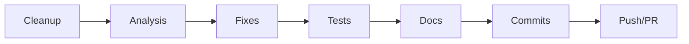

# Workflow Step Ordering Guide

## Golden Rule

**NEVER DOCUMENT SUCCESS UNTIL VALIDATION PROVES IT**

Tests must pass BEFORE documentation is updated. This prevents documenting failures and ensures accuracy.

## The Correct Order



1. **Cleanup**: Remove temp files, build artifacts
2. **Analysis**: Lint, code review, security review
3. **Fixes**: Implement changes, fix issues
4. **Tests**: Run all tests, validate success
5. **Docs**: Update documentation (AFTER validation)
6. **Commits**: Create conventional commits
7. **Push/PR**: Push to remote, create PR

## Why Test Before Docs?

### Problem: Docs Before Tests (❌)
```yaml
- id: '05-update-docs'  # Documents changes
- id: '06-verify-tests'  # Tests fail ❌
```

**What Happens**:
- Documentation says "Feature X works"
- Tests fail, Feature X doesn't work
- Documentation is now inaccurate
- Readers trust docs, waste time debugging
- Rework required: revert docs, fix code, retest, redocument

### Solution: Tests Before Docs (✅)
```yaml
- id: '06-verify-tests'  # Tests pass ✅
- id: '05-update-docs'  # Document success
```

**What Happens**:
- Tests validate Feature X works
- Documentation accurately reflects success
- Readers can trust documentation
- No rework required

### Benefits
- **Accuracy**: Docs reflect actual working code
- **Trust**: Readers can rely on documentation
- **Efficiency**: No rework from documenting failures
- **Quality**: Catch issues before documentation

## Step Dependencies

### Dependency Graph
```
Cleanup (no dependencies)
  ↓
Analysis (depends on: Cleanup)
  ↓
Fixes (depends on: Analysis)
  ↓
Tests (depends on: Fixes)
  ↓
Docs (depends on: Tests)
  ↓
Commits (depends on: Docs)
  ↓
Push/PR (depends on: Commits)
```

### Sequencing Rules
1. **Cleanup must be first**: Remove artifacts before analysis
2. **Analysis before fixes**: Identify issues before fixing
3. **Fixes before tests**: Implement changes before validation
4. **Tests before docs**: Validate before documenting
5. **Docs before commits**: Include updated docs in commit
6. **Commits before push**: Commit changes before pushing

## 10+ Workflow Patterns

### Pattern 1: Bug Fix
```yaml
steps:
  - lint            # Check code style
  - code-review     # Review fix
  - fix-bug         # Implement fix
  - test            # Validate fix works
  - update-docs     # Document fix
  - commit          # Commit changes
```

**Example**:
```bash
# 1. Lint
npm run lint

# 2. Code review
# (manual review of git diff)

# 3. Fix bug
# (implement fix in code)

# 4. Test
npm test  # Must pass ✅

# 5. Update docs
# Update CHANGELOG.md with fix details

# 6. Commit
git add . && git commit -m "fix: resolve memory leak in cache"
```

### Pattern 2: New Feature
```yaml
steps:
  - architect       # Design feature
  - developer       # Implement feature
  - code-review     # Review implementation
  - test            # Validate feature works
  - update-docs     # Document feature
  - commit          # Commit changes
```

**Example**:
```bash
# 1. Architect
# Create design doc for feature

# 2. Developer
# Implement feature code

# 3. Code review
# Review implementation

# 4. Test
npm test  # Must pass ✅

# 5. Update docs
# Add feature to README.md

# 6. Commit
git commit -m "feat: add user authentication"
```

### Pattern 3: Security Fix
```yaml
steps:
  - security-review  # Identify vulnerability
  - fix              # Implement fix
  - test             # Validate fix
  - security-review  # Re-verify security
  - update-docs      # Document fix (AFTER validation)
  - commit           # Commit changes
```

**Example**:
```bash
# 1. Security review
# Identify SQL injection vulnerability

# 2. Fix
# Implement parameterized queries

# 3. Test
npm run test:security  # Must pass ✅

# 4. Security re-review
# Verify vulnerability fixed

# 5. Update docs
# Add to SECURITY.md

# 6. Commit
git commit -m "security: fix SQL injection in user query"
```

### Pattern 4: Performance Optimization
```yaml
steps:
  - performance-engineer  # Profile code
  - developer             # Implement optimization
  - test                  # Validate correctness
  - benchmark             # Measure improvement
  - update-docs           # Document optimization (AFTER validation)
  - commit                # Commit changes
```

**Example**:
```bash
# 1. Profile
node --prof app.js

# 2. Optimize
# Implement caching

# 3. Test
npm test  # Must pass ✅

# 4. Benchmark
npm run benchmark  # Measure improvement

# 5. Update docs
# Add performance notes to README.md

# 6. Commit
git commit -m "perf: add caching layer (50% faster)"
```

### Pattern 5: Refactor
```yaml
steps:
  - architect      # Plan refactor
  - developer      # Implement refactor
  - code-review    # Review changes
  - test           # Validate no regressions
  - update-docs    # Update docs (AFTER validation)
  - commit         # Commit changes
```

**Example**:
```bash
# 1. Plan
# Design new architecture

# 2. Refactor
# Implement changes

# 3. Code review
# Review refactored code

# 4. Test
npm test  # Must pass ✅

# 5. Update docs
# Update architecture docs

# 6. Commit
git commit -m "refactor: modularize auth system"
```

### Pattern 6: Documentation Only
```yaml
steps:
  - technical-writer  # Write docs
  - review            # Review docs
  - commit            # Commit docs
```

**Note**: Skip tests for docs-only changes (no code changes).

**Example**:
```bash
# 1. Write
# Update documentation

# 2. Review
# Review for clarity and accuracy

# 3. Commit
git commit -m "docs: improve installation guide"
```

### Pattern 7: Hotfix
```yaml
steps:
  - fix             # Quick fix
  - test            # Minimal testing
  - minimal-docs    # Brief changelog entry
  - commit          # Commit immediately
  - emergency-deploy # Deploy to production
```

**Example**:
```bash
# 1. Fix
# Critical production bug

# 2. Test
npm test  # Essential tests only

# 3. Minimal docs
echo "Hotfix: resolve auth timeout" >> CHANGELOG.md

# 4. Commit
git commit -m "hotfix: resolve auth timeout"

# 5. Deploy
./deploy-emergency.sh
```

### Pattern 8: Breaking Change
```yaml
steps:
  - architect         # Plan breaking change
  - developer         # Implement change
  - code-review       # Review changes
  - test              # Validate correctness
  - migration-guide   # Write migration guide (AFTER validation)
  - update-docs       # Update docs
  - commit            # Commit with BREAKING CHANGE
```

**Example**:
```bash
# 1. Plan
# Design new API

# 2. Implement
# Implement breaking change

# 3. Code review
# Review changes

# 4. Test
npm test  # Must pass ✅

# 5. Migration guide
# Create MIGRATION.md with upgrade path

# 6. Update docs
# Update API docs

# 7. Commit
git commit -m "feat!: redesign auth API

BREAKING CHANGE: auth.login() now returns Promise<User>"
```

### Pattern 9: Dependency Update
```yaml
steps:
  - update            # Update dependency
  - test              # Validate compatibility
  - compatibility-check # Check breaking changes
  - update-docs       # Document update (AFTER validation)
  - commit            # Commit changes
```

**Example**:
```bash
# 1. Update
npm install react@18.0.0

# 2. Test
npm test  # Must pass ✅

# 3. Compatibility check
# Review breaking changes

# 4. Update docs
# Update package.json and CHANGELOG.md

# 5. Commit
git commit -m "deps: upgrade react to 18.0.0"
```

### Pattern 10: Infrastructure
```yaml
steps:
  - devops        # Implement infrastructure
  - test          # Validate infrastructure works
  - monitoring    # Set up monitoring
  - update-docs   # Document infrastructure (AFTER validation)
  - commit        # Commit IaC files
```

**Example**:
```bash
# 1. Implement
# Create Terraform configs

# 2. Test
terraform plan  # Validate plan
terraform apply  # Must succeed ✅

# 3. Monitoring
# Configure CloudWatch alarms

# 4. Update docs
# Update INFRASTRUCTURE.md

# 5. Commit
git commit -m "infra: add production Kubernetes cluster"
```

### Pattern 11: API Design
```yaml
steps:
  - api-designer    # Design API contract
  - developer       # Implement API
  - test            # Validate API works
  - api-docs        # Generate API docs (AFTER validation)
  - commit          # Commit changes
```

**Example**:
```bash
# 1. Design
# Create OpenAPI spec

# 2. Implement
# Implement API endpoints

# 3. Test
npm run test:api  # Must pass ✅

# 4. API docs
# Generate docs from OpenAPI spec

# 5. Commit
git commit -m "feat: add user management API"
```

### Pattern 12: Database Migration
```yaml
steps:
  - database-architect  # Design schema changes
  - developer           # Write migration
  - test-migration      # Test on staging
  - validate-data       # Validate data integrity
  - update-docs         # Document migration (AFTER validation)
  - commit              # Commit migration files
```

**Example**:
```bash
# 1. Design
# Plan schema changes

# 2. Write migration
# Create migration files

# 3. Test migration
npm run migrate:staging  # Must succeed ✅

# 4. Validate data
# Check data integrity

# 5. Update docs
# Add migration notes to MIGRATIONS.md

# 6. Commit
git commit -m "feat: add user_preferences table"
```

### Pattern 13: CI/CD Pipeline Update
```yaml
steps:
  - devops          # Update pipeline config
  - test-pipeline   # Run pipeline on test branch
  - validate        # Verify all stages pass
  - update-docs     # Document pipeline (AFTER validation)
  - commit          # Commit pipeline changes
```

**Example**:
```bash
# 1. Update pipeline
# Modify .github/workflows/ci.yml

# 2. Test pipeline
# Push to test branch, verify workflow runs

# 3. Validate
# All stages pass ✅

# 4. Update docs
# Update CI/CD section in README.md

# 5. Commit
git commit -m "ci: add automated security scanning"
```

### Pattern 14: Accessibility Improvement
```yaml
steps:
  - accessibility-expert  # Audit accessibility
  - developer             # Implement fixes
  - test-a11y             # Run accessibility tests
  - validate-wcag         # Verify WCAG compliance
  - update-docs           # Document improvements (AFTER validation)
  - commit                # Commit changes
```

**Example**:
```bash
# 1. Audit
# Run axe-core accessibility audit

# 2. Implement fixes
# Add ARIA labels, keyboard navigation

# 3. Test accessibility
npm run test:a11y  # Must pass ✅

# 4. Validate WCAG
# Verify WCAG 2.1 AA compliance

# 5. Update docs
# Update ACCESSIBILITY.md

# 6. Commit
git commit -m "a11y: improve keyboard navigation"
```

## Anti-Patterns

### Anti-Pattern 1: Tests After Docs (❌)
```yaml
- update-docs  # Document success
- test         # Tests fail ❌
```

**Problem**: Documentation claims success before validation.

**Fix**: Swap order - test first, then document.

### Anti-Pattern 2: Commits Before Tests (❌)
```yaml
- fix-bug
- commit      # Commit changes
- test        # Tests fail ❌
```

**Problem**: Broken code committed to repository.

**Fix**: Test before committing.

### Anti-Pattern 3: Docs Without Validation (❌)
```yaml
- fix-bug
- update-docs  # Document fix
# (no tests!)
```

**Problem**: No validation that fix actually works.

**Fix**: Add test step before docs.

### Anti-Pattern 4: Deploy Before Tests (❌)
```yaml
- fix-bug
- deploy      # Deploy to production
- test        # Tests fail ❌
```

**Problem**: Broken code in production.

**Fix**: Test before deployment.

### Anti-Pattern 5: Multiple Independent Fixes in One Commit (❌)
```yaml
- fix-bug-1
- fix-bug-2
- fix-bug-3
- test-all
- commit-all  # One massive commit
```

**Problem**: Hard to revert single fix if needed.

**Fix**: Separate commits per fix.

### Anti-Pattern 6: Skipping Code Review (❌)
```yaml
- developer    # Implement feature
- test         # Tests pass
- commit       # No review!
```

**Problem**: Quality issues, bugs, and technical debt slip through.

**Fix**: Add code review step before testing.

### Anti-Pattern 7: Documenting Before Implementation (❌)
```yaml
- update-docs  # Document feature
- developer    # Implement feature
- test         # Feature differs from docs!
```

**Problem**: Documentation doesn't match implementation.

**Fix**: Document after implementation and validation.

## Real Examples

### Example 1: Add User Authentication
```bash
# Correct Order
1. architect        # Design auth system
2. developer        # Implement auth
3. code-review      # Review implementation
4. test             # npm test (must pass ✅)
5. update-docs      # Update README.md
6. commit           # git commit -m "feat: add user auth"
7. push             # git push

# Validation Points
- Tests pass: 100% ✅
- Code reviewed: Approved ✅
- Docs updated: README.md, API.md ✅
```

### Example 2: Fix Memory Leak
```bash
# Correct Order
1. lint             # npm run lint (pass ✅)
2. code-review      # Review fix
3. fix-leak         # Implement fix
4. test             # npm test (pass ✅)
5. benchmark        # Verify memory usage reduced
6. update-docs      # Add to CHANGELOG.md
7. commit           # git commit -m "fix: resolve memory leak"
8. push             # git push

# Validation Points
- Lint clean: 0 errors ✅
- Tests pass: 100% ✅
- Memory usage: Reduced 50% ✅
```

### Example 3: Breaking API Change
```bash
# Correct Order
1. architect         # Design new API
2. developer         # Implement change
3. code-review       # Review changes
4. test              # npm test (pass ✅)
5. migration-guide   # Create MIGRATION.md
6. update-docs       # Update API.md, README.md
7. commit            # git commit with BREAKING CHANGE
8. push              # git push

# Validation Points
- Tests pass: 100% ✅
- Migration guide: Complete ✅
- Docs updated: API.md, README.md, MIGRATION.md ✅
```

### Example 4: Performance Optimization
```bash
# Correct Order
1. performance-engineer  # Profile code
2. developer             # Implement optimization
3. code-review           # Review changes
4. test                  # npm test (pass ✅)
5. benchmark             # Measure improvement
6. update-docs           # Update PERFORMANCE.md
7. commit                # git commit -m "perf: optimize query"
8. push                  # git push

# Validation Points
- Tests pass: 100% ✅
- Benchmark: 3x faster ✅
- Docs updated: PERFORMANCE.md ✅
```

## Troubleshooting

### Issue 1: Tests Run After Docs
**Symptom**: Documentation updated, then tests fail

**Fix**:
```yaml
# Before (Wrong)
- update-docs
- test

# After (Correct)
- test
- update-docs
```

### Issue 2: Commits Before Tests
**Symptom**: Broken code in git history

**Fix**:
```bash
# Undo last commit
git reset --soft HEAD~1

# Run tests
npm test

# Recommit if tests pass
git commit -m "..."
```

### Issue 3: Deploy Before Tests
**Symptom**: Production outage from broken deployment

**Fix**:
```yaml
# Before (Wrong)
- deploy
- test

# After (Correct)
- test
- deploy
```

### Issue 4: Skipping Tests Entirely
**Symptom**: No validation that changes work

**Fix**: Add test step before documentation:
```yaml
- fix-bug
- test        # Add this!
- update-docs
```

### Issue 5: Documentation Out of Sync
**Symptom**: Docs don't match code behavior

**Fix**: Always update docs after tests pass:
```yaml
- test        # Validate behavior
- update-docs # Document actual behavior
```

### Issue 6: Incomplete Code Review
**Symptom**: Quality issues slip through

**Fix**: Add thorough code review before testing:
```yaml
- developer
- code-review  # Add this!
- test
```

## Best Practices Checklist

### Before Starting Work
- [ ] Clean up temp files and build artifacts
- [ ] Verify all dependencies are installed
- [ ] Create feature branch from main

### During Development
- [ ] Follow single responsibility principle
- [ ] Write clean, maintainable code
- [ ] Add unit tests for new code
- [ ] Follow project coding standards

### Before Testing
- [ ] Run linter and fix issues
- [ ] Get code review approval
- [ ] Ensure all changes committed to branch

### During Testing
- [ ] Run all unit tests
- [ ] Run integration tests
- [ ] Run end-to-end tests if applicable
- [ ] Verify all tests pass (100%)

### After Testing Passes
- [ ] Update CHANGELOG.md
- [ ] Update README.md if needed
- [ ] Update API docs if applicable
- [ ] Create migration guide for breaking changes

### Before Committing
- [ ] Verify all docs are updated
- [ ] Use conventional commit format
- [ ] Include Co-Authored-By if applicable
- [ ] Ensure commit message is descriptive

### Before Pushing
- [ ] Verify no merge conflicts
- [ ] Ensure all commits are clean
- [ ] Verify remote branch is up to date
- [ ] Run final validation checks

## Version History

| Version | Date | Changes |
|---------|------|---------|
| 1.0.0 | 2025-01-15 | Initial release - complete workflow ordering guide |
