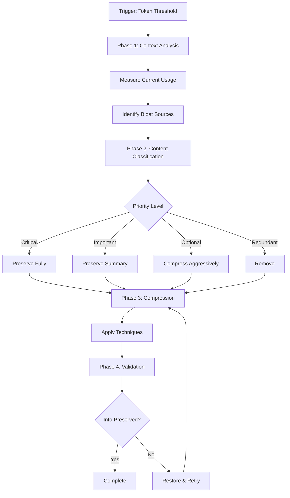

# Context Compressor Workflow

Systematic workflow for optimizing context in long-running sessions. This workflow enables agents to work efficiently within token limits by intelligently compressing verbose content while preserving critical information.



**Extended Thinking**: Long sessions accumulate context that exceeds token limits, causing truncation of critical information. This workflow provides a systematic approach to compress context intelligently, ensuring decisions, file locations, and action items survive compression while removing verbose analysis, redundant content, and completed work details. By following this workflow, agents can maintain continuity across session boundaries and work effectively even in complex, multi-phase projects.

## When to Use

### Token Threshold Triggers

| Threshold | Action | Urgency |
|-----------|--------|---------|
| 50,000 tokens | Monitor closely | Low |
| 75,000 tokens | Begin Phase 1 analysis | Medium |
| 100,000 tokens | Execute full workflow | High |
| 125,000 tokens | Emergency compression | Critical |

### Session Duration Triggers

| Duration | Action |
|----------|--------|
| 30 minutes | Check context size |
| 60 minutes | Run analysis phase |
| 90 minutes | Execute compression if needed |
| 120 minutes | Mandatory compression checkpoint |

### Situational Triggers

- **Context window warning** from the model
- **Memory system full** notification
- **Session handoff** preparation
- **Multi-agent coordination** requiring context sharing
- **Long-running task** with accumulated output

## Phase 1: Context Analysis

**Goal**: Measure current context size and identify sources of bloat.

### Step 1.1: Measure Current Context

**Agent**: context-compressor

**Task**:

```javascript
Task({
  subagent_type: 'general-purpose',
  description: 'Analyzing current context size and composition',
  prompt: `You are the CONTEXT-COMPRESSOR agent.

## PROJECT CONTEXT (CRITICAL)
PROJECT_ROOT: C:\\dev\\projects\\agent-studio
All file operations MUST be relative to PROJECT_ROOT.

## Task
Analyze current context to measure token usage and identify compression opportunities.

## Instructions
1. Read your agent definition: .claude/agents/core/context-compressor.md
2. **Invoke skill**: Skill({ skill: "context-compressor" })
3. Catalog current context by category:
   - Conversation history (messages, decisions, Q&A)
   - Code snippets (implementations, examples)
   - Error messages and stack traces
   - Documentation and explanations
   - File contents read during session
   - Tool outputs (Bash, Grep, Glob results)
4. Estimate token usage per category
5. Identify top 5 bloat sources (largest token consumers)
6. Save analysis to: .claude/context/memory/active_context.md

## Output Format
- **Total Estimated Tokens**: [estimate]
- **Category Breakdown**:
  - Conversation: [X tokens, Y%]
  - Code: [X tokens, Y%]
  - Errors: [X tokens, Y%]
  - Documentation: [X tokens, Y%]
  - File Contents: [X tokens, Y%]
  - Tool Outputs: [X tokens, Y%]
- **Top Bloat Sources**:
  1. [source]: [tokens]
  2. [source]: [tokens]
  ...

## Memory Protocol
Record analysis findings to .claude/context/memory/active_context.md
`,
});
```

### Step 1.2: Identify Bloat Patterns

**Bloat Pattern Indicators**:

| Pattern | Indicator | Example |
|---------|-----------|---------|
| Verbose explanations | Multiple paragraphs explaining simple concepts | "Let me explain how this works..." |
| Repeated content | Same information appears multiple times | Reading same file in multiple messages |
| Full stack traces | Complete error traces with all frames | 50+ line stack traces |
| Uncompressed code | Large functions included verbatim | 200+ line implementations |
| Exploration artifacts | Search results, glob outputs | "Found 47 matching files..." |
| Superseded decisions | Old decisions replaced by newer ones | "Initially we chose X, then changed to Y" |
| Completed task details | Full details of finished work | Step-by-step logs of completed tasks |

### Step 1.3: Calculate Compression Potential

**Compression Potential by Category**:

| Category | Typical Compression Ratio | Strategy |
|----------|---------------------------|----------|
| Conversation history | 70-90% | Extract decisions only |
| Code implementations | 50-80% | Keep signatures, summarize body |
| Error messages | 60-80% | Keep message + location, drop frames |
| Documentation | 40-60% | Keep headings + key points |
| File contents | 80-95% | Reference by path, don't include |
| Tool outputs | 70-90% | Keep patterns, drop repetitions |

## Phase 2: Content Classification

**Goal**: Categorize all content by importance level for compression decisions.

### Classification Levels

#### CRITICAL (Never Compress)

Content that MUST be preserved in full:

- **Active task context**: Current task ID, subject, status
- **Blocking decisions**: Decisions that affect current work
- **Error root causes**: The actual cause of bugs being fixed
- **File paths being modified**: Exact locations of changes
- **Security-sensitive information**: Auth flows, credentials handling
- **Unsaved work**: Code changes not yet committed
- **Open questions**: Unresolved decisions requiring user input

#### IMPORTANT (Preserve Summary)

Content that should be summarized but not removed:

- **Key decisions made**: What was decided and why (brief)
- **Architecture patterns used**: Design decisions
- **Dependencies identified**: What code depends on what
- **Test results**: Pass/fail status, not full output
- **File modifications**: List of changed files with brief description
- **Progress markers**: What phases/steps are complete

#### OPTIONAL (Compress Aggressively)

Content that can be heavily compressed:

- **Exploration results**: Summarize findings, drop search output
- **Verbose explanations**: Reduce to single sentence
- **Code examples**: Reference location instead of including
- **Documentation quotes**: Summarize key points
- **Historical context**: Compress to timeline entries
- **Alternative approaches**: Note they were considered, drop details

#### REDUNDANT (Remove)

Content that should be removed entirely:

- **Superseded decisions**: Old decisions replaced by newer ones
- **Duplicate information**: Same content repeated multiple times
- **Completed task details**: Verbose logs of finished work
- **Failed approaches**: Detailed logs of abandoned attempts
- **Exploration dead ends**: Searches that yielded nothing useful
- **Verbose tool output**: Large outputs already processed

### Classification Task

**Agent**: context-compressor

**Task**:

```javascript
Task({
  subagent_type: 'general-purpose',
  description: 'Classifying context content by importance',
  prompt: `You are the CONTEXT-COMPRESSOR agent.

## PROJECT CONTEXT
PROJECT_ROOT: C:\\dev\\projects\\agent-studio

## Task
Classify all context content by importance level for compression.

## Instructions
1. **Invoke skill**: Skill({ skill: "context-compressor" })
2. Review context analysis from Phase 1
3. For each content block, assign classification:
   - CRITICAL: Preserve fully (active tasks, blocking decisions, file paths)
   - IMPORTANT: Preserve summary (decisions, architecture, progress)
   - OPTIONAL: Compress aggressively (exploration, verbose explanations)
   - REDUNDANT: Remove (superseded, duplicate, completed details)
4. Create classification report
5. Calculate compression targets per level

## Classification Criteria
- Is this needed to continue current work? -> CRITICAL
- Would losing this require re-discovery? -> IMPORTANT
- Is this nice-to-have context? -> OPTIONAL
- Is this already captured elsewhere? -> REDUNDANT

## Output Format
### Critical (Preserve Fully)
- [item]: [reason]

### Important (Preserve Summary)
- [item]: [reason]

### Optional (Compress)
- [item]: [reason]

### Redundant (Remove)
- [item]: [reason]

### Compression Target
- Current: [X tokens]
- After compression: [Y tokens]
- Reduction: [Z%]

## Memory Protocol
Update .claude/context/memory/active_context.md with classification
`,
});
```

## Phase 3: Compression

**Goal**: Apply compression techniques to reduce token usage while preserving critical information.

### Compression Techniques

#### Technique 1: Decision Extraction

**Before** (verbose):
```
User: Should we use Redis or Memcached for the caching layer?
Assistant: Let me analyze both options for your use case.

Redis Pros:
- Supports complex data structures (lists, sets, sorted sets)
- Built-in pub/sub messaging
- Persistence options (RDB, AOF)
- Cluster mode for horizontal scaling
- Lua scripting support

Redis Cons:
- Single-threaded (though fast)
- Higher memory usage due to data structures

Memcached Pros:
- Multi-threaded by design
- Simple key-value operations are very fast
- Lower memory overhead

Memcached Cons:
- No persistence
- Limited data types (strings only)
- No pub/sub

Given your requirement for pub/sub support and the need to store session data
with complex structures, I recommend Redis.

User: Ok let's use Redis.
```

**After** (compressed):
```
Decision: Use Redis for caching
- Reason: Pub/sub support, complex data structures for sessions
- Date: [session date]
```

#### Technique 2: Code Summarization

**Before** (full implementation):
```javascript
// UserService.js - 150 lines
export class UserService {
  constructor(db, validator, logger) {
    this.db = db;
    this.validator = validator;
    this.logger = logger;
  }

  async createUser(userData) {
    // 30 lines of validation and creation logic
  }

  async getUserById(id) {
    // 20 lines of fetching logic
  }

  async updateUser(id, updates) {
    // 25 lines of update logic
  }

  // ... more methods
}
```

**After** (compressed):
```
UserService @ src/services/user.js
- Methods: createUser, getUserById, updateUser, deleteUser, findByEmail
- Dependencies: db, validator, logger
- Pattern: Repository with validation layer
- Tests: src/services/__tests__/user.test.js
```

#### Technique 3: Error Compression

**Before** (full stack trace):
```
Error: Cannot read property 'id' of undefined
    at UserController.getUser (src/controllers/user.js:45:23)
    at Layer.handle [as handle_request] (node_modules/express/lib/router/layer.js:95:5)
    at next (node_modules/express/lib/router/route.js:144:13)
    at Route.dispatch (node_modules/express/lib/router/route.js:114:3)
    at Layer.handle [as handle_request] (node_modules/express/lib/router/layer.js:95:5)
    at /node_modules/express/lib/router/index.js:284:15
    ... 15 more frames
```

**After** (compressed):
```
Error: Cannot read 'id' of undefined
Location: src/controllers/user.js:45
Cause: User object is null when accessing .id
Fix: Add null check before accessing user.id
```

#### Technique 4: Progress Summarization

**Before** (verbose log):
```
Phase 1: Setup
- Created project directory
- Initialized npm
- Installed express, cors, helmet
- Configured TypeScript
- Added ESLint and Prettier
- Created src directory structure
- Added environment configuration
- Set up dotenv

Phase 2: Core Implementation
- Created database connection module
- Added connection pooling
- Implemented migration system
- Created User model
- Added UserRepository
- Created UserService
- ... 20 more items
```

**After** (compressed):
```
Progress Summary:
- [x] Phase 1: Setup (complete) - 8 tasks
- [x] Phase 2: Core (complete) - 12 tasks
- [ ] Phase 3: API (in progress) - 3/8 tasks done
- Current: Implementing authentication middleware
```

### Compression Execution Task

**Agent**: context-compressor

**Task**:

```javascript
Task({
  subagent_type: 'general-purpose',
  description: 'Executing context compression',
  prompt: `You are the CONTEXT-COMPRESSOR agent.

## PROJECT CONTEXT
PROJECT_ROOT: C:\\dev\\projects\\agent-studio

## Task
Execute compression techniques on classified content.

## Instructions
1. **Invoke skill**: Skill({ skill: "context-compressor" })
2. Read classification from Phase 2
3. Apply compression techniques by level:

   **CRITICAL**: Keep as-is (no compression)

   **IMPORTANT**: Apply summary compression
   - Decisions: Extract decision + brief rationale
   - Code: Signature + purpose + location
   - Progress: Checklist format

   **OPTIONAL**: Apply aggressive compression
   - Exploration: Single-line findings
   - Explanations: One sentence max
   - Examples: Reference only

   **REDUNDANT**: Remove entirely
   - Mark as "[removed - redundant]"

4. Create compressed context summary
5. Save to: .claude/context/memory/compressed-session.md

## Compression Templates

### Decision Template
Decision: [what]
- Reason: [why, one line]
- Date: [when]

### Code Summary Template
[Name] @ [path]
- Methods: [list]
- Dependencies: [list]
- Tests: [path]

### Error Template
Error: [message]
Location: [file:line]
Cause: [root cause]
Status: [fixed/open]

### Progress Template
- [x] Phase N: [name] (complete)
- [ ] Phase M: [name] (X/Y tasks)
- Current: [what's being worked on]

## Output Format
Create compressed-session.md with sections:
1. Current Task
2. Decisions Made
3. Files Modified
4. Open Items
5. Key Locations

## Memory Protocol
Save compressed context to .claude/context/memory/compressed-session.md
`,
});
```

## Phase 4: Validation

**Goal**: Verify that compressed context preserves all critical information needed to continue work.

### Validation Checklist

| Check | Question | Pass Criteria |
|-------|----------|---------------|
| Task Continuity | Can work continue from compressed context? | Current task ID, status, and blockers are clear |
| Decision Integrity | Are all blocking decisions preserved? | Each decision has what + why + when |
| File Traceability | Can all modified files be located? | Full paths preserved, no ambiguous references |
| Error Context | Can bugs be reproduced from compressed info? | Error message + location + cause preserved |
| Progress Clarity | Is current progress state clear? | Completed/pending items distinguishable |
| Dependency Awareness | Are critical dependencies documented? | Key file relationships preserved |

### Validation Task

**Agent**: context-compressor

**Task**:

```javascript
Task({
  subagent_type: 'general-purpose',
  description: 'Validating compressed context integrity',
  prompt: `You are the CONTEXT-COMPRESSOR agent.

## PROJECT CONTEXT
PROJECT_ROOT: C:\\dev\\projects\\agent-studio

## Task
Validate that compressed context preserves critical information.

## Instructions
1. **Invoke skill**: Skill({ skill: "context-compressor" })
2. Read compressed context from Phase 3
3. Run validation checklist:

   [ ] TASK CONTINUITY
   - Current task ID is present
   - Task status is clear (in_progress, blocked, etc.)
   - Blockers are documented
   - Next steps are clear

   [ ] DECISION INTEGRITY
   - All active decisions are preserved
   - Each has: what, why, when
   - Superseded decisions are removed
   - No orphaned references

   [ ] FILE TRACEABILITY
   - All file paths are absolute or PROJECT_ROOT relative
   - Modified files are listed
   - Key locations are documented
   - No "that file" references (must be specific)

   [ ] ERROR CONTEXT
   - Open bugs have: message, location, cause
   - Fixed bugs have: fix summary
   - No orphaned error references

   [ ] PROGRESS CLARITY
   - Completed phases/tasks marked done
   - In-progress items identified
   - Remaining work is clear

   [ ] RECOVERY TEST
   - Could a fresh agent continue this work?
   - Is enough context preserved to avoid re-exploration?

4. If validation fails:
   - Identify missing critical information
   - Restore from original context
   - Re-run compression with adjustments

5. If validation passes:
   - Mark compression as complete
   - Update active_context.md with compressed version
   - Record compression metrics

## Output Format
### Validation Results
- Task Continuity: [PASS/FAIL]
- Decision Integrity: [PASS/FAIL]
- File Traceability: [PASS/FAIL]
- Error Context: [PASS/FAIL]
- Progress Clarity: [PASS/FAIL]
- Recovery Test: [PASS/FAIL]

### Compression Metrics
- Original tokens: [X]
- Compressed tokens: [Y]
- Reduction: [Z%]
- Critical info preserved: [100%]

### Issues Found (if any)
- [issue]: [resolution]

## Memory Protocol
Update .claude/context/memory/active_context.md with validated compressed context
`,
});
```

### Recovery Procedure

If validation fails:

1. **Identify Missing Information**: What critical content was lost?
2. **Locate Original**: Find the uncompressed source
3. **Restore Selectively**: Add back only critical portions
4. **Re-validate**: Run validation checklist again
5. **Adjust Classification**: Update classification rules to prevent future loss

## Preservation Rules

### NEVER Compress

These items must ALWAYS be preserved in full:

| Item | Reason |
|------|--------|
| Current task ID and subject | Required for task tracking |
| Active file paths being modified | Needed for accurate edits |
| Uncommitted code changes | Would be lost otherwise |
| Open blockers and questions | Require user input |
| Security-sensitive decisions | Context matters for security |
| Test failure root causes | Needed to fix bugs |
| Active error messages | Needed for debugging |
| Dependency relationships | Needed for impact analysis |

### ALWAYS Summarize (Never Remove)

| Item | Summary Format |
|------|----------------|
| Architectural decisions | Decision: [what] because [why] |
| Technology choices | Using [X] for [purpose] |
| Key file locations | [Component]: [path] |
| Test results | [X/Y] tests passing |
| Phase completion | Phase N: [status] |

### SAFE to Remove

| Item | Condition |
|------|-----------|
| Verbose explanations | After decision is captured |
| Full code blocks | After signature + location captured |
| Search/glob results | After findings summarized |
| Stack traces | After location + cause captured |
| Alternative approaches | After chosen approach documented |
| Historical iterations | After final version captured |

## Metrics

### Compression Success Metrics

| Metric | Target | Critical Threshold |
|--------|--------|-------------------|
| Token Reduction | 50-70% | Minimum 30% |
| Critical Info Preserved | 100% | 100% (non-negotiable) |
| Recovery Test Pass | Yes | Yes (non-negotiable) |
| Validation Pass Rate | 100% | Minimum 95% |

### Compression Quality Indicators

**Good Compression**:
- Decisions are clear and actionable
- File paths are complete and accurate
- Progress state is unambiguous
- A fresh agent could continue the work

**Bad Compression**:
- "See above" or "that file" references remain
- Decisions lack rationale
- Progress is unclear
- Critical errors are missing

## Workflow Verification

### Phase Gate Checks

**Phase 1 Complete (Analysis)**:
- [ ] Token usage estimated
- [ ] Bloat sources identified
- [ ] Compression potential calculated

**Phase 2 Complete (Classification)**:
- [ ] All content classified
- [ ] Critical items identified
- [ ] Compression targets set

**Phase 3 Complete (Compression)**:
- [ ] Techniques applied per classification
- [ ] Compressed context created
- [ ] No critical information lost

**Phase 4 Complete (Validation)**:
- [ ] All validation checks pass
- [ ] Recovery test passes
- [ ] Metrics recorded

## Related Workflows

- **Session Handoff**: Uses compressed context for agent transitions
- **Swarm Coordination**: Shares compressed context between agents
- **Router Decision**: Triggers compression at token thresholds

## Memory Protocol

**After completing compression**:
- Record compression metrics to `.claude/context/memory/learnings.md`
- Update active context in `.claude/context/memory/active_context.md`
- If patterns discovered, add to compression techniques

> ASSUME INTERRUPTION: Compressed context in memory survives; verbose context does not.
