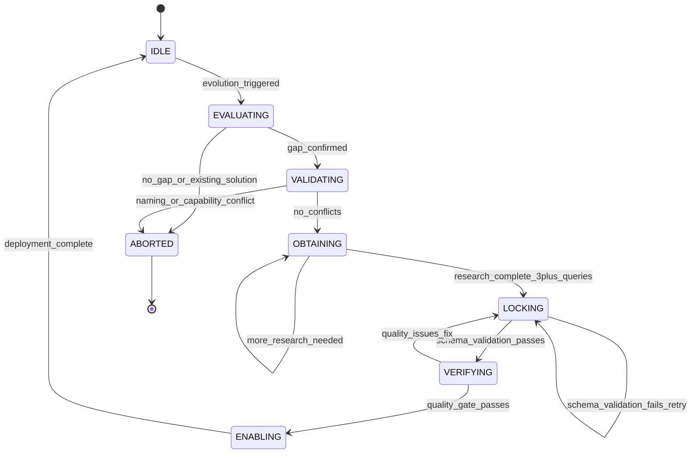

# EVOLVE Workflow

> **LOCKED-IN**: This workflow MUST be followed exactly. Hooks enforce compliance.
> **NO DEVIATION**: Skipping phases, bypassing gates, or ignoring research is a VIOLATION.

## Overview

The EVOLVE workflow is the mandatory process for creating new ecosystem artifacts (agents, skills, workflows, hooks, schemas, templates). It ensures research-backed, validated, quality-gated artifact creation.

```
E → V → O → L → V → E
│   │   │   │   │   │
│   │   │   │   │   └─ Enable & Monitor
│   │   │   │   └───── Verify Quality
│   │   │   └───────── Lock (Create Artifact)
│   │   └───────────── Obtain Research (MANDATORY - CANNOT SKIP)
│   └───────────────── Validate No Conflicts
└─────────────────────── Evaluate Need
```

**Extended Thinking**: This workflow exists because creating ecosystem artifacts without research leads to poorly designed, inconsistent, and redundant components. By enforcing a mandatory research phase (OBTAIN), we ensure every new artifact is informed by best practices, existing patterns, and real-world examples. The state machine prevents shortcuts, and hooks enforce compliance at each phase transition. This is the only way to maintain ecosystem integrity as the framework evolves.

## ROUTER UPDATE REQUIRED (CRITICAL - DO NOT SKIP)

**After creating this workflow, update CLAUDE.md Section 8.6:**

```markdown
| **Evolution Workflow** | `.claude/workflows/core/evolution-workflow.md` | Locked-in EVOLVE process for self-evolution |
```

**Verification:**

```bash
grep "evolution-workflow" .claude/CLAUDE.md || echo "ERROR: CLAUDE.md NOT UPDATED!"
```

**WHY**: This workflow defines how the ecosystem evolves. It must be discoverable.

---

## State Machine

### State Diagram



### States

| State        | Description                            | Valid Actions                           |
| ------------ | -------------------------------------- | --------------------------------------- |
| `IDLE`       | No evolution in progress               | Start new evolution                     |
| `EVALUATING` | Checking if evolution is needed        | Analyze gap, check existing artifacts   |
| `VALIDATING` | Checking for conflicts                 | Verify naming, check capability overlap |
| `OBTAINING`  | Researching best practices (MANDATORY) | Execute queries, analyze codebase       |
| `LOCKING`    | Creating the artifact                  | Invoke creator skill, validate schema   |
| `VERIFYING`  | Quality assurance                      | Check completeness, verify protocols    |
| `ENABLING`   | Deploying to ecosystem                 | Update routing, catalogs, memory        |
| `ABORTED`    | Evolution cancelled                    | Document reason, recommend alternative  |
| `BLOCKED`    | Gate failed, awaiting resolution       | Fix blocker, retry phase                |

### Transitions

| From         | To           | Condition                       | Enforcement Hook                 |
| ------------ | ------------ | ------------------------------- | -------------------------------- |
| `IDLE`       | `EVALUATING` | Evolution triggered             | `evolution-trigger-detector.cjs` |
| `EVALUATING` | `VALIDATING` | Gap confirmed                   | -                                |
| `EVALUATING` | `ABORTED`    | No gap / Existing solution      | -                                |
| `VALIDATING` | `OBTAINING`  | No conflicts                    | `conflict-detector.cjs`          |
| `VALIDATING` | `ABORTED`    | Naming/capability conflict      | -                                |
| `OBTAINING`  | `LOCKING`    | Research complete (3+ queries)  | `research-enforcement.cjs`       |
| `OBTAINING`  | `OBTAINING`  | More research needed            | -                                |
| `LOCKING`    | `VERIFYING`  | Schema validation passes        | `evolution-state-guard.cjs`      |
| `LOCKING`    | `LOCKING`    | Schema validation fails (retry) | -                                |
| `VERIFYING`  | `ENABLING`   | Quality gate passes             | `quality-gate-validator.cjs`     |
| `VERIFYING`  | `LOCKING`    | Quality issues (fix)            | -                                |
| `ENABLING`   | `IDLE`       | Deployment complete             | `evolution-audit.cjs`            |

---

## Phase Details

### Phase 1: EVALUATE (Gate 1)

**Purpose**: Confirm evolution is actually needed before investing time.

**State**: `EVALUATING`

**Entry Conditions**:

- User request for new capability
- Router detects no matching agent/skill
- Pattern analyzer suggests evolution
- Evolution state is `IDLE`

**Actions**:

```javascript
// 1. Update evolution state
Edit('.claude/context/evolution-state.json', {
  state: 'evaluating',
  currentEvolution: {
    type: 'agent|skill|workflow|hook|schema|template',
    name: 'proposed-name',
    phase: 'evaluate',
    startedAt: new Date().toISOString(),
    gatePassed: false,
  },
});

// 2. Check if similar artifact exists
Glob('.claude/agents/**/*.md');
Glob('.claude/skills/*/SKILL.md');
Glob('.claude/workflows/**/*.md');
Grep('similar-capability-pattern', '.claude/');

// 3. Read skill catalog for existing solutions
Read('.claude/context/artifacts/skill-catalog.md');

// 4. Analyze the gap using structured thinking
// (Use mcp__sequential-thinking__sequentialthinking if available)
```

**Exit Conditions** (ALL required):

- [ ] Gap clearly identified and documented
- [ ] No existing artifact meets the need (verified with Glob/Grep)
- [ ] Request is within ecosystem scope (not external integration)
- [ ] Evolution state updated to `EVALUATING`

**Failure Mode**:

- If existing solution found: ABORT with recommendation to use existing artifact
- Document path to existing artifact for user

**Gate Validation Script**:

```javascript
// Gate 1 validation
const gate1 = {
  gapIdentified: true, // Must document what's missing
  noExistingSolution: true, // Glob/Grep confirmed no match
  withinScope: true, // Not external API/integration
  stateUpdated: true, // evolution-state.json reflects EVALUATING
};
const gate1Passed = Object.values(gate1).every(v => v === true);
```

---

### Phase 2: VALIDATE (Gate 2)

**Purpose**: Ensure no conflicts with existing ecosystem artifacts.

**State**: `VALIDATING`

**Entry Conditions**:

- Phase 1 gates passed
- Evolution state is `EVALUATING` with `gatePassed: true`

**Actions**:

```javascript
// 1. Update evolution state
Edit('.claude/context/evolution-state.json', {
  state: 'validating',
  currentEvolution: { phase: 'validate' },
});

// 2. Check naming conflicts
Read('.claude/context/artifacts/skill-catalog.md');
Grep('proposed-name', '.claude/agents/');
Grep('proposed-name', '.claude/skills/');
Grep('proposed-name', '.claude/workflows/');

// 3. Check capability overlaps
// Read similar artifacts and compare capabilities section

// 4. Verify naming conventions
// Pattern: [a-z][a-z0-9-]* (kebab-case, lowercase)
const namePattern = /^[a-z][a-z0-9-]*$/;
const isValidName = namePattern.test('proposed-name');
```

**Exit Conditions** (ALL required):

- [ ] No naming conflicts with existing artifacts
- [ ] No capability conflicts that would cause routing ambiguity
- [ ] Name follows ecosystem conventions (`[a-z][a-z0-9-]*`)
- [ ] Name is unique in ecosystem

**Naming Conventions**:

| Artifact | Convention                      | Example                                  | Regex                       |
| -------- | ------------------------------- | ---------------------------------------- | --------------------------- |
| Agent    | `<domain>-<role>`               | `mobile-ux-reviewer`, `data-engineer`    | `^[a-z]+-[a-z]+(-[a-z]+)*$` |
| Skill    | `<verb>-<object>` or `<domain>` | `code-analyzer`, `tdd`, `github-mcp`     | `^[a-z]+(-[a-z]+)*$`        |
| Workflow | `<process>-workflow`            | `feature-development-workflow`           | `^[a-z]+-workflow$`         |
| Hook     | `<trigger>-<action>`            | `pre-commit-validator`, `security-guard` | `^[a-z]+-[a-z]+(-[a-z]+)*$` |
| Schema   | `<artifact>-schema`             | `agent-schema`, `skill-schema`           | `^[a-z]+-schema$`           |

**Failure Mode**:

- If naming conflict: ABORT or propose alternative name
- If capability conflict: ABORT and recommend enhancing existing artifact

**Gate Validation Script**:

```javascript
// Gate 2 validation
const gate2 = {
  noNamingConflicts: true, // Grep returned no matches
  noCapabilityOverlap: true, // No routing ambiguity
  conventionCompliant: true, // Name matches pattern
  uniqueInEcosystem: true, // Not a duplicate
};
const gate2Passed = Object.values(gate2).every(v => v === true);
```

---

### Phase 3: OBTAIN (Gate 3) - MANDATORY RESEARCH

> **CRITICAL**: This phase CANNOT be skipped. NO artifact creation without research.
> **Enforcement**: `research-enforcement.cjs` BLOCKS artifact creation without research evidence.

**Purpose**: Research best practices before creating anything.

**State**: `OBTAINING`

**Entry Conditions**:

- Phase 2 gates passed
- Evolution state is `VALIDATING` with `gatePassed: true`

**Actions**:

```javascript
// 1. Update evolution state
Edit('.claude/context/evolution-state.json', {
  state: 'obtaining',
  currentEvolution: { phase: 'obtain' },
});

// 2. INVOKE research-synthesis skill (MANDATORY)
Skill({ skill: 'research-synthesis' });

// The skill will execute:
// - Minimum 3 Exa/WebSearch queries
// - Analysis of existing codebase patterns
// - Structured research report output
```

**Research Protocol** (from research-synthesis skill):

| Query # | Purpose                                         | Example                                            |
| ------- | ----------------------------------------------- | -------------------------------------------------- |
| 1       | Best practices for artifact type in domain      | "GraphQL schema validation best practices 2025"    |
| 2       | Implementation patterns and real-world examples | "GraphQL schema validator implementation patterns" |
| 3       | Claude/AI agent specific patterns               | "AI agent GraphQL review automation"               |
| 4+      | Additional domain-specific research             | Custom queries as needed                           |

**Codebase Analysis** (MANDATORY):

- Examine 2+ similar artifacts in ecosystem
- Document patterns used in existing artifacts
- Note any established conventions

**Research Report Location**: `.claude/context/artifacts/research-reports/<artifact-name>-research.md`

**Exit Conditions** (ALL required):

- [ ] Minimum 3 research queries executed (with evidence in report)
- [ ] Minimum 3 external sources consulted (URLs documented)
- [ ] Existing codebase patterns documented (2+ similar artifacts analyzed)
- [ ] Research report saved to correct location
- [ ] Design decisions documented with rationale AND source
- [ ] Risk assessment completed with mitigations

**Failure Mode**:

- CANNOT PROCEED without completing research
- Hook `research-enforcement.cjs` blocks Phase 4 entry
- Must complete all research requirements before advancing

**Gate Validation Script**:

```javascript
// Gate 3 validation - STRICT ENFORCEMENT
const gate3 = {
  queriesExecuted: 3, // Minimum 3 queries
  sourcesConsulted: 3, // Minimum 3 external sources
  codebasePatternsDocumented: 2, // Minimum 2 similar artifacts analyzed
  researchReportExists: true, // Report saved to correct location
  designDecisionsDocumented: true, // Each decision has rationale + source
  riskAssessmentCompleted: true, // Risks identified with mitigations
};
const gate3Passed =
  gate3.queriesExecuted >= 3 &&
  gate3.sourcesConsulted >= 3 &&
  gate3.codebasePatternsDocumented >= 2 &&
  gate3.researchReportExists &&
  gate3.designDecisionsDocumented &&
  gate3.riskAssessmentCompleted;
```

---

### Phase 4: LOCK (Gate 4)

**Purpose**: Create the artifact using appropriate creator skill.

**State**: `LOCKING`

**Entry Conditions**:

- Phase 3 gates passed
- Research report exists at correct location
- Evolution state is `OBTAINING` with `gatePassed: true`

**Actions**:

```javascript
// 1. Update evolution state
Edit('.claude/context/evolution-state.json', {
  state: 'locking',
  currentEvolution: { phase: 'lock' },
});

// 2. Invoke the appropriate creator skill
switch (artifactType) {
  case 'agent':
    Skill({ skill: 'agent-creator' });
    break;
  case 'skill':
    Skill({ skill: 'skill-creator' });
    break;
  case 'workflow':
    Skill({ skill: 'workflow-creator' });
    break;
  case 'hook':
    Skill({ skill: 'hook-creator' });
    break;
  case 'schema':
    Skill({ skill: 'schema-creator' });
    break;
  case 'template':
    Skill({ skill: 'template-creator' });
    break;
}

// 3. Creator skill will:
// - Load appropriate template
// - Apply research findings
// - Validate against JSON schema
// - Create artifact at correct location
```

**Artifact Locations**:

| Artifact | Location Pattern                         |
| -------- | ---------------------------------------- |
| Agent    | `.claude/agents/<category>/<name>.md`    |
| Skill    | `.claude/skills/<name>/SKILL.md`         |
| Workflow | `.claude/workflows/<category>/<name>.md` |
| Hook     | `.claude/hooks/<category>/<name>.cjs`    |
| Schema   | `.claude/schemas/<name>.json`            |
| Template | `.claude/templates/<name>.md`            |

**Exit Conditions** (ALL required):

- [ ] Artifact file created at correct location
- [ ] YAML frontmatter passes schema validation
- [ ] All required fields present (see creator skill for specific requirements)
- [ ] Task tools included in tools array: `TaskUpdate`, `TaskList`, `TaskCreate`, `TaskGet`
- [ ] `task-management-protocol` in skills array
- [ ] Memory Protocol section present in body
- [ ] Task Progress Protocol section present in body

**Required Sections for Agents**:

| Section                | Required Content                                |
| ---------------------- | ----------------------------------------------- |
| Core Persona           | Identity, Style, Approach, Values               |
| Responsibilities       | At least 3 numbered items                       |
| Workflow               | Step 0 (Load Skills) + numbered execution steps |
| Task Progress Protocol | Iron Laws + code examples                       |
| Memory Protocol        | Before/After/During sections                    |

**Failure Mode**:

- If schema validation fails: RETRY with fixes
- If required fields missing: RETRY with additions
- Maximum 3 retries before ABORT

**Gate Validation Script**:

```javascript
// Gate 4 validation
const gate4 = {
  artifactExists: true, // File at correct location
  schemaValidation: 'passed', // YAML frontmatter valid
  requiredFieldsComplete: true, // All required fields present
  taskToolsPresent: true, // TaskUpdate, TaskList, etc. in tools
  taskManagementProtocol: true, // In skills array
  memoryProtocolSection: true, // Section exists in body
  taskProgressSection: true, // Section exists in body
};
const gate4Passed = Object.values(gate4).every(v => v === true || v === 'passed');
```

---

### Phase 5: VERIFY (Gate 5)

**Purpose**: Quality assurance before deployment.

**State**: `VERIFYING`

**Entry Conditions**:

- Phase 4 gates passed
- Artifact exists and is schema-valid
- Evolution state is `LOCKING` with `gatePassed: true`

**Actions**:

```javascript
// 1. Update evolution state
Edit('.claude/context/evolution-state.json', {
  state: 'verifying',
  currentEvolution: { phase: 'verify' },
});

// 2. Read the created artifact
Read('created-artifact-path');

// 3. Check for placeholder content
const placeholderPatterns = [
  'TODO',
  'TBD',
  '[FILL IN]',
  '...',
  '<fill-in>',
  '[placeholder]',
  'FIXME',
];
// Grep for each pattern - any match = FAIL

// 4. Verify examples are functional
// Check that code examples are complete, not pseudo-code

// 5. For agents, verify assigned skills exist
Glob('.claude/skills/*/SKILL.md');
// Compare against agent's skills array

// 6. Run validation tools
Bash("node .claude/tools/validate-agents.mjs 2>&1 | grep '<agent-name>'");
```

**Verification Checklist**:

| Check                  | Criteria                       | Failure Action                 |
| ---------------------- | ------------------------------ | ------------------------------ |
| Placeholders           | No TODO, TBD, FIXME, etc.      | Return to LOCK                 |
| Task Progress Protocol | Complete with Iron Laws        | Return to LOCK                 |
| Memory Protocol        | All sections present           | Return to LOCK                 |
| Assigned Skills        | All exist in `.claude/skills/` | Return to LOCK or remove skill |
| Referenced Tools       | All are valid Claude tools     | Return to LOCK                 |
| Examples               | Complete and executable        | Return to LOCK                 |
| Documentation          | Explains when/why to use       | Return to LOCK                 |

**Quality Standards**:

| Section                | Minimum Requirement                         |
| ---------------------- | ------------------------------------------- |
| Core Persona           | 4 fields: Identity, Style, Approach, Values |
| Responsibilities       | At least 3 numbered items                   |
| Workflow               | Step 0 + at least 3 execution steps         |
| Task Progress Protocol | Iron Laws + 2 code examples                 |
| Memory Protocol        | Before/After/During sections                |

**Exit Conditions** (ALL required):

- [ ] All sections complete (no placeholders)
- [ ] Task Progress Protocol complete with Iron Laws
- [ ] Memory Protocol complete with file paths
- [ ] All assigned skills exist
- [ ] All referenced tools are valid
- [ ] Examples are complete and correct
- [ ] Documentation is comprehensive

**Failure Mode**:

- If quality issues found: RETURN to LOCK for fixes
- Document specific issues for fix iteration
- Maximum 5 fix iterations before ABORT

**Gate Validation Script**:

```javascript
// Gate 5 validation
const gate5 = {
  noPlaceholders: true, // No TODO, TBD, etc.
  taskProtocolComplete: true, // Iron Laws + examples
  memoryProtocolComplete: true, // All sections present
  skillsValid: true, // All assigned skills exist
  toolsValid: true, // All tools are real
  examplesComplete: true, // No pseudo-code
  documentationComplete: true, // When/why documented
};
const gate5Passed = Object.values(gate5).every(v => v === true);
```

---

### Phase 6: ENABLE (Gate 6)

**Purpose**: Deploy artifact to ecosystem and register for discovery.

**State**: `ENABLING`

**Entry Conditions**:

- Phase 5 gates passed
- Artifact verified and quality-approved
- Evolution state is `VERIFYING` with `gatePassed: true`

**Actions**:

```javascript
// 1. Update evolution state
Edit('.claude/context/evolution-state.json', {
  state: 'enabling',
  currentEvolution: { phase: 'enable' },
});

// 2. Update CLAUDE.md routing table (for agents)
if (artifactType === 'agent') {
  Edit('.claude/CLAUDE.md', {
    // Add to routing table in Section 3
    old_string: '| System routing',
    new_string: `| ${requestType} | \`${agentName}\` | \`.claude/agents/${category}/${agentName}.md\` |\n| System routing`,
  });

  // Verify update
  Bash("grep '<agent-name>' .claude/CLAUDE.md || echo 'ERROR: Not in routing table!'");
}

// 3. Update skill catalog (for skills)
if (artifactType === 'skill') {
  Edit('.claude/context/artifacts/skill-catalog.md', 'new skill entry');
}

// 4. Update workflow table (for workflows)
if (artifactType === 'workflow') {
  Edit('.claude/CLAUDE.md', {
    // Add to Section 8.6 Enterprise Workflows
  });
}

// 5. Record in evolution state history
Edit('.claude/context/evolution-state.json', {
  state: 'idle',
  currentEvolution: null,
  evolutions: [
    ...existingEvolutions,
    {
      type: artifactType,
      name: artifactName,
      path: artifactPath,
      completedAt: new Date().toISOString(),
      researchReport: researchReportPath,
      registrations: ['CLAUDE.md', 'other-registrations'],
    },
  ],
});

// 6. Record in memory files
Edit('.claude/context/memory/learnings.md', 'evolution record');
Edit('.claude/context/memory/decisions.md', 'ADR for design decisions');
```

**Post-Enable Verification**:

```bash
# For agents - MUST succeed
grep "<agent-name>" .claude/CLAUDE.md || echo "FAILED: Not in routing table"

# For skills - MUST succeed
grep "<skill-name>" .claude/context/artifacts/skill-catalog.md || echo "FAILED: Not in catalog"

# For workflows - MUST succeed
grep "<workflow-name>" .claude/CLAUDE.md || echo "FAILED: Not in workflow table"
```

**Exit Conditions** (ALL required):

- [ ] CLAUDE.md routing table updated (if agent)
- [ ] Skill catalog updated (if skill)
- [ ] Workflow table updated (if workflow)
- [ ] Evolution state updated with completed evolution
- [ ] Memory files updated with learnings and decisions
- [ ] Artifact is discoverable by Router (grep verification passes)

**Failure Mode**:

- If CLAUDE.md update fails: ROLLBACK and retry
- If verification fails: Fix registration and re-verify
- Never leave artifact unregistered (invisible to Router)

**Gate Validation Script**:

```javascript
// Gate 6 validation
const gate6 = {
  claudeMdUpdated: true, // Routing/workflow table updated
  catalogUpdated: true, // Skill catalog if skill
  evolutionStateUpdated: true, // History recorded
  learningsRecorded: true, // learnings.md updated
  decisionsRecorded: true, // decisions.md updated
  discoverableByRouter: true, // grep verification passes
};
const gate6Passed = Object.values(gate6).every(v => v === true);
```

---

## Enforcement Hooks

| Hook                             | Phase         | Type        | Trigger                         | Action                                     |
| -------------------------------- | ------------- | ----------- | ------------------------------- | ------------------------------------------ |
| `evolution-trigger-detector.cjs` | IDLE→EVALUATE | PostToolUse | Detects evolution keywords      | Initiates EVOLVE workflow                  |
| `conflict-detector.cjs`          | VALIDATE      | PreToolUse  | Before creator skill invocation | Blocks if naming/capability conflict       |
| `research-enforcement.cjs`       | OBTAIN→LOCK   | PreToolUse  | Before Write/Edit for artifacts | Blocks creation without research report    |
| `evolution-state-guard.cjs`      | ALL           | PreToolUse  | Any phase transition            | Enforces state machine, prevents skipping  |
| `quality-gate-validator.cjs`     | VERIFY        | PreToolUse  | Before ENABLE transition        | Blocks incomplete/placeholder artifacts    |
| `evolution-audit.cjs`            | ENABLE        | PostToolUse | After deployment                | Logs all evolutions, verifies registration |

### Hook Implementation Pattern

```javascript
// research-enforcement.cjs (example)
module.exports = {
  name: 'research-enforcement',
  triggers: ['PreToolUse'],
  tools: ['Write', 'Edit'],

  async handler(context) {
    const { tool, input } = context;

    // Check if creating artifact file
    const artifactPaths = ['.claude/agents/', '.claude/skills/', '.claude/workflows/'];
    const isArtifactCreation = artifactPaths.some(p => input.file_path?.includes(p));

    if (!isArtifactCreation) return { allow: true };

    // Check evolution state
    const state = JSON.parse(fs.readFileSync('.claude/context/evolution-state.json'));

    // Verify research completed
    if (state.state !== 'locking' || !state.currentEvolution?.researchReport) {
      return {
        allow: false,
        error:
          'BLOCKED: Cannot create artifact without completing OBTAIN phase. Research report required.',
      };
    }

    // Verify research report exists
    if (!fs.existsSync(state.currentEvolution.researchReport)) {
      return {
        allow: false,
        error: `BLOCKED: Research report not found at ${state.currentEvolution.researchReport}`,
      };
    }

    return { allow: true };
  },
};
```

---

## Iron Laws of Evolution

These rules are INVIOLABLE. Violations break the workflow.

```
1. NO ARTIFACT WITHOUT RESEARCH
   - Phase O (OBTAIN) is MANDATORY and cannot be bypassed
   - Minimum 3 queries, 3 sources, research report required
   - "I already know" is NOT valid - execute the queries
   - Hook `research-enforcement.cjs` blocks creation without research

2. NO DEPLOYMENT WITHOUT VALIDATION
   - All 6 gates must pass before artifact is live
   - Partial completion = incomplete evolution = BLOCKED
   - Never skip VERIFY phase

3. NO STATE TRANSITION WITHOUT UPDATE
   - Always update evolution-state.json before phase change
   - State is the source of truth for recovery
   - Lost state = restart evolution from beginning

4. NO DEVIATION FROM EVOLVE
   - Follow the workflow exactly as specified
   - No shortcuts, no "just this once"
   - The process exists to prevent mistakes

5. NO BYPASSING SCHEMA VALIDATION
   - All artifacts must pass their JSON schema
   - Missing required fields = blocked gate
   - Invalid YAML frontmatter = blocked gate

6. NO ARTIFACT WITHOUT ROUTING
   - Agents MUST be in CLAUDE.md routing table
   - Skills MUST be in skill catalog
   - Workflows MUST be in CLAUDE.md workflow table
   - Unregistered artifacts are INVISIBLE to the system
```

---

## Evolution State Schema

**File**: `.claude/context/evolution-state.json`

```json
{
  "state": "idle|evaluating|validating|obtaining|locking|verifying|enabling|blocked|failed",
  "lastUpdated": "ISO-timestamp",
  "currentEvolution": {
    "type": "agent|skill|workflow|hook|schema|template",
    "name": "artifact-name",
    "phase": "evaluate|validate|obtain|lock|verify|enable",
    "startedAt": "ISO-timestamp",
    "gatePassed": false,
    "gateResults": {
      "gate1": { "passed": true, "checks": {} },
      "gate2": { "passed": true, "checks": {} },
      "gate3": { "passed": false, "checks": { "queriesExecuted": 2 } }
    },
    "researchReport": "path/to/report.md",
    "artifactPath": "path/to/artifact",
    "blockedReason": null,
    "blockedAt": null,
    "recommendedAction": null
  },
  "evolutions": []
}
```

---

## Usage Examples

### Example 1: Router Detects Evolution Need

**User Request**: "I need an agent to review GraphQL schemas"

**Router Analysis**:

```
[ROUTER] Analyzing: "I need an agent to review GraphQL schemas"
- Intent: Capability gap
- Complexity: High (new agent creation)
- Domain: GraphQL
- Risk: Medium

[ROUTER] No matching agent found in routing table
[ROUTER] Triggering EVOLVE workflow via evolution-orchestrator
```

**Router Spawn**:

```javascript
Task({
  subagent_type: 'evolution-orchestrator',
  model: 'opus',
  description: 'Creating new graphql-schema-reviewer agent',
  prompt: `You are the EVOLUTION-ORCHESTRATOR agent.

## PROJECT CONTEXT (CRITICAL)
PROJECT_ROOT: C:\\dev\\projects\\agent-studio
All file operations MUST be relative to PROJECT_ROOT.

## Your Assigned Task
Create agent for: "GraphQL schema review"

## Instructions
1. Read your agent definition: .claude/agents/orchestrators/evolution-orchestrator.md
2. Follow EVOLVE workflow: .claude/workflows/core/evolution-workflow.md
3. Execute all 6 phases with gate validation
4. MANDATORY: Complete OBTAIN phase with 3+ research queries

## Memory Protocol
1. Read .claude/context/memory/learnings.md first
2. Update evolution-state.json at every phase transition
3. Record decisions to .claude/context/memory/decisions.md
`,
});
```

### Example 2: Full EVOLVE Execution

```
[EVOLUTION-ORCHESTRATOR] Starting EVOLVE workflow...

=== Phase E: EVALUATE ===
- Reading evolution state: idle, no current evolution
- Searching for existing agents: Glob(".claude/agents/**/*graphql*.md")
- Result: No GraphQL-specific agent found
- Gap confirmed: Need GraphQL schema reviewer
- State updated: evaluating
- Gate 1 PASSED

=== Phase V: VALIDATE ===
- Checking naming conflicts: "graphql-schema-reviewer"
- Grep results: No matches in agents/, skills/, workflows/
- Convention check: kebab-case ✓, domain-role pattern ✓
- State updated: validating
- Gate 2 PASSED

=== Phase O: OBTAIN ===
- Invoking research-synthesis skill
- Query 1: "GraphQL schema design best practices 2025"
  → Found: Apollo GraphQL docs, GraphQL spec, community patterns
- Query 2: "GraphQL schema validation tools patterns"
  → Found: graphql-inspector, eslint-plugin-graphql, custom validators
- Query 3: "AI agent GraphQL review automation"
  → Found: GitHub Copilot patterns, automated review tools
- Codebase analysis: Reading api-integrator.md, architect.md patterns
- Research report saved: .claude/context/artifacts/research-reports/graphql-schema-reviewer-research.md
- State updated: obtaining
- Gate 3 PASSED (3 queries, 5 sources, 2 patterns)

=== Phase L: LOCK ===
- Invoking agent-creator skill
- Applying research findings to template
- Creating: .claude/agents/domain/graphql-schema-reviewer.md
- Schema validation: PASSED
- Required fields: COMPLETE (tools, skills, protocols)
- State updated: locking
- Gate 4 PASSED

=== Phase V: VERIFY ===
- Reading created artifact
- Placeholder check: NONE found
- Task Progress Protocol: COMPLETE with Iron Laws
- Memory Protocol: COMPLETE with all sections
- Skills validation: All assigned skills exist
- State updated: verifying
- Gate 5 PASSED

=== Phase E: ENABLE ===
- Updating CLAUDE.md routing table
- grep "graphql-schema-reviewer" .claude/CLAUDE.md → FOUND
- Updating evolution state history
- Recording to learnings.md and decisions.md
- State updated: idle
- Gate 6 PASSED

[EVOLUTION-ORCHESTRATOR] Evolution complete!
Created: graphql-schema-reviewer agent
Location: .claude/agents/domain/graphql-schema-reviewer.md
Research: .claude/context/artifacts/research-reports/graphql-schema-reviewer-research.md
```

---

## Error Recovery

### If Phase Fails

| Phase    | Failure                 | Recovery                           |
| -------- | ----------------------- | ---------------------------------- |
| EVALUATE | Existing solution found | ABORT, recommend existing artifact |
| VALIDATE | Naming conflict         | ABORT or propose alternative name  |
| OBTAIN   | Research incomplete     | STAY in OBTAIN, complete queries   |
| LOCK     | Schema validation fails | RETRY with fixes (max 3 attempts)  |
| VERIFY   | Quality issues found    | RETURN to LOCK, fix issues         |
| ENABLE   | Registration fails      | RETRY registration, verify grep    |

### State Recovery Protocol

If evolution is interrupted (context reset, error):

```javascript
// 1. Check evolution state
const state = JSON.parse(fs.readFileSync('.claude/context/evolution-state.json'));

if (state.state !== 'idle' && state.currentEvolution) {
  // 2. Resume from current phase
  const currentPhase = state.currentEvolution.phase;

  // 3. Check if gate was passed
  if (state.currentEvolution.gatePassed) {
    // Advance to next phase
  } else {
    // Re-execute current phase
  }
}
```

### Blocked State Handling

When state is `BLOCKED`:

```javascript
{
  "state": "blocked",
  "currentEvolution": {
    "phase": "validate",
    "gatePassed": false,
    "blockedReason": "Naming conflict: agent 'data-scientist' already exists",
    "blockedAt": "ISO-timestamp",
    "recommendedAction": "Use existing data-scientist agent or choose different name"
  }
}
```

Resolution:

1. Read `blockedReason` and `recommendedAction`
2. Take recommended action (use existing, rename, abort)
3. Update state to continue or abort

---

## Workflow Integration

This workflow integrates with:

| Workflow             | Integration Point                                   |
| -------------------- | --------------------------------------------------- |
| Router Decision      | Router triggers EVOLVE when capability gap detected |
| Artifact Lifecycle   | EVOLVE is specialized lifecycle for new artifacts   |
| External Integration | External artifacts may trigger evolution needs      |

**Related Skills**:

| Skill                | Used In Phase      |
| -------------------- | ------------------ |
| `research-synthesis` | OBTAIN (MANDATORY) |
| `agent-creator`      | LOCK               |
| `skill-creator`      | LOCK               |
| `workflow-creator`   | LOCK               |
| `hook-creator`       | LOCK               |
| `schema-creator`     | LOCK               |
| `template-creator`   | LOCK               |

---

## Workflow Verification Checklist

Before marking evolution complete:

- [ ] All 6 phases executed in order
- [ ] All 6 gates passed
- [ ] Research report exists with 3+ queries
- [ ] Artifact file exists at correct location
- [ ] YAML frontmatter is schema-valid
- [ ] Task Progress Protocol section complete
- [ ] Memory Protocol section complete
- [ ] CLAUDE.md updated (grep verification passes)
- [ ] evolution-state.json history updated
- [ ] learnings.md updated
- [ ] decisions.md updated (ADR for design decisions)

---

## Final Deliverables

Every successful evolution produces:

1. **Artifact File**: `.claude/<type>/<category>/<name>.md` (or appropriate extension)
2. **Research Report**: `.claude/context/artifacts/research-reports/<name>-research.md`
3. **CLAUDE.md Entry**: Updated routing/workflow/skill table
4. **Evolution Record**: Entry in `evolution-state.json` evolutions array
5. **Memory Updates**: Entries in `learnings.md` and `decisions.md`

---

**WORKFLOW STATUS**: LOCKED-IN. Follow exactly as specified. No deviation allowed.
