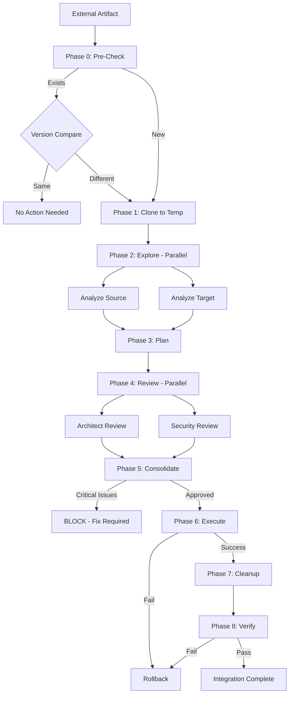

# External Integration Workflow

Safely integrate external code, skills, agents, workflows, and templates from GitHub repositories or other sources into the Claude Code Enterprise Framework.



**Extended Thinking**: External integrations pose significant risks: code quality issues, security vulnerabilities, supply chain attacks, dependency conflicts, and framework incompatibilities. This workflow establishes a robust multi-phase validation process using isolated environments, parallel expert reviews, and rollback procedures. The workflow prioritizes safety over speed by never polluting the main codebase until all validations pass.

## ROUTER UPDATE REQUIRED (CRITICAL - DO NOT SKIP)

**After creating this workflow, you MUST update CLAUDE.md:**

1. Add to Section 3 "Multi-Agent Workflows" with path reference
2. Update Section 8.6 "ENTERPRISE WORKFLOWS" with full workflow entry
3. Update learnings.md with integration summary

**Verification:**
```bash
grep "external-integration" .claude/CLAUDE.md || echo "ERROR: CLAUDE.md NOT UPDATED!"
```

**WHY**: Workflows not documented in CLAUDE.md will never be invoked by the Router.

---

## Configuration Options

### Integration Source

- **github**: GitHub repository URL
- **local**: Local directory path
- **archive**: .zip or .tar.gz archive file
- **url**: Direct URL to downloadable artifact

### Artifact Type

- **skill**: Skill with SKILL.md and supporting scripts
- **agent**: Agent definition markdown file
- **workflow**: Multi-agent orchestration workflow
- **template**: Code or artifact template
- **hook**: Pre/post tool execution hook
- **mixed**: Repository contains multiple artifact types

### Risk Level

- **low**: Well-known source, simple artifacts, no dependencies
- **medium**: Unknown source OR complex artifacts OR external dependencies
- **high**: Security-sensitive OR supply chain concerns OR framework modifications

## Prerequisites

Before starting this workflow:

1. **Required context**: Source URL or path to external artifact
2. **Required permissions**: Write access to `.claude/` directories
3. **Required tools**: Git (for GitHub cloning), unzip/tar (for archives)
4. **Safety check**: Ensure `.claude/context/tmp/` is writable and gitignored

## Phase 0: Pre-Check

### Step 0.1: Check Local Existence

**Agent**: architect

**Task Spawn**:

```javascript
Task({
  subagent_type: 'general-purpose',
  description: 'Architect checking if artifact exists locally',
  prompt: `You are the ARCHITECT agent.

## PROJECT CONTEXT
PROJECT_ROOT: C:\\dev\\projects\\agent-studio
All operations relative to PROJECT_ROOT.

## Task
Check if artifact already exists in the framework before integration.

## Instructions
1. Read your agent definition: .claude/agents/core/architect.md
2. **Invoke skills**: Skill({ skill: "repo-rag" })
3. Search for artifact by name in:
   - .claude/agents/ (if integrating agent)
   - .claude/skills/ (if integrating skill)
   - .claude/workflows/ (if integrating workflow)
   - .claude/templates/ (if integrating template)
   - .claude/hooks/ (if integrating hook)
4. If artifact exists:
   - Compare versions (if versioned)
   - Determine if update is needed
   - Save findings to: .claude/context/tmp/pre-check-results.md
5. If artifact does NOT exist:
   - Document in .claude/context/tmp/pre-check-results.md
   - Indicate integration should proceed

## Output
- .claude/context/tmp/pre-check-results.md with existence check results

## Memory Protocol
1. Read .claude/context/memory/learnings.md first
2. Record findings to .claude/context/memory/learnings.md
`,
});
```

**Expected Output**: `.claude/context/tmp/pre-check-results.md` with artifact existence status and version comparison

**Gate Decision**: If artifact exists and is up-to-date, STOP workflow. If update needed or new artifact, proceed to Phase 1.

## Phase 1: Clone & Isolate

### Step 1.1: Clone to Temporary Location

**Agent**: developer

**Task Spawn**:

```javascript
Task({
  subagent_type: 'general-purpose',
  description: 'Developer cloning external artifact to isolated temp directory',
  prompt: `You are the DEVELOPER agent.

## PROJECT CONTEXT
PROJECT_ROOT: C:\\dev\\projects\\agent-studio
All operations relative to PROJECT_ROOT.

## Task
Clone external artifact to isolated temporary directory for validation.

## Instructions
1. Read your agent definition: .claude/agents/core/developer.md
2. Create isolation directory: .claude/context/tmp/<repo-name>/
3. Clone/download artifact to isolation directory:
   - For GitHub repos: git clone <url> .claude/context/tmp/<repo-name>/
   - For archives: extract to .claude/context/tmp/<repo-name>/
   - For local: copy to .claude/context/tmp/<repo-name>/
4. Verify clone succeeded (check for expected files)
5. Document directory structure in: .claude/context/tmp/<repo-name>/STRUCTURE.md

## Critical Safety Rules
- NEVER copy directly to .claude/agents/, .claude/skills/, etc.
- ALL external code stays in .claude/context/tmp/ until validated
- If clone fails, document error and STOP workflow

## Output
- .claude/context/tmp/<repo-name>/ populated with external code
- .claude/context/tmp/<repo-name>/STRUCTURE.md with directory structure

## Memory Protocol
1. Read .claude/context/memory/learnings.md first
2. Record any clone issues to .claude/context/memory/issues.md
`,
});
```

**Expected Output**: External artifact isolated in `.claude/context/tmp/<repo-name>/` with structure documentation

## Phase 2: Explore (Parallel)

### Step 2.1: Analyze Source Repository

**Agent**: architect (exploring source)

**Task Spawn**:

```javascript
Task({
  subagent_type: 'general-purpose',
  description: 'Architect analyzing source artifact structure',
  prompt: `You are the ARCHITECT agent.

## PROJECT CONTEXT
PROJECT_ROOT: C:\\dev\\projects\\agent-studio

## Task
Analyze the structure and contents of the isolated external artifact.

## Instructions
1. Read your agent definition: .claude/agents/core/architect.md
2. **Invoke skills**: Skill({ skill: "repo-rag" })
3. Explore .claude/context/tmp/<repo-name>/:
   - Identify artifact type (skill, agent, workflow, template, hook, mixed)
   - Map file structure and dependencies
   - Identify entry points (SKILL.md, agent.md, etc.)
   - Check for package.json, requirements.txt, dependencies
   - Look for README, documentation
4. Document findings in: .claude/context/reports/source-analysis.md

## Analysis Checklist
- [ ] Artifact type identified
- [ ] Dependencies documented
- [ ] Entry points found
- [ ] Documentation exists
- [ ] File structure mapped

## Output
- .claude/context/reports/source-analysis.md

## Memory Protocol
1. Read .claude/context/memory/learnings.md first
2. Record artifact patterns to .claude/context/memory/learnings.md
`,
});
```

### Step 2.2: Analyze Target Framework Location

**Agent**: architect (exploring target)

**Task Spawn**:

```javascript
Task({
  subagent_type: 'general-purpose',
  description: 'Architect analyzing framework target location',
  prompt: `You are the ARCHITECT agent.

## PROJECT CONTEXT
PROJECT_ROOT: C:\\dev\\projects\\agent-studio

## Task
Analyze the target location in the framework where artifact will be integrated.

## Instructions
1. Read your agent definition: .claude/agents/core/architect.md
2. **Invoke skills**: Skill({ skill: "repo-rag" })
3. Based on artifact type, explore target location:
   - Skills: .claude/skills/
   - Agents: .claude/agents/
   - Workflows: .claude/workflows/
   - Templates: .claude/templates/
   - Hooks: .claude/hooks/
4. Document:
   - Existing similar artifacts
   - Naming conventions
   - Structural patterns
   - Integration requirements
5. Save findings to: .claude/context/reports/target-analysis.md

## Analysis Checklist
- [ ] Target location identified
- [ ] Naming conventions documented
- [ ] Similar artifacts found
- [ ] Integration patterns identified

## Output
- .claude/context/reports/target-analysis.md

## Memory Protocol
1. Read .claude/context/memory/learnings.md first
2. Record framework patterns to .claude/context/memory/learnings.md
`,
});
```

**Expected Output**: Two parallel analysis reports showing source structure and target framework patterns

## Phase 3: Plan

### Step 3.1: Create Integration Plan

**Agent**: planner

**Task Spawn**:

```javascript
Task({
  subagent_type: 'general-purpose',
  description: 'Planner creating integration plan',
  prompt: `You are the PLANNER agent.

## PROJECT CONTEXT
PROJECT_ROOT: C:\\dev\\projects\\agent-studio

## Task
Create a detailed plan for integrating the external artifact into the framework.

## Instructions
1. Read your agent definition: .claude/agents/core/planner.md
2. **Invoke skills**:
   - Skill({ skill: "plan-generator" })
   - Skill({ skill: "complexity-assessment" })
3. Read analysis reports:
   - .claude/context/reports/source-analysis.md
   - .claude/context/reports/target-analysis.md
   - .claude/context/tmp/pre-check-results.md
4. Create integration plan covering:
   - File mapping (source → target)
   - Naming transformations needed
   - Dependency installation steps
   - Framework modifications (CLAUDE.md, registries)
   - Validation tests
   - Rollback procedure
5. Identify conflicts, overlaps, and risks
6. Save plan to: .claude/context/plans/external-integration-plan.md

## Plan Must Include
- [ ] Source-to-target file mapping
- [ ] Dependency installation steps
- [ ] Framework updates required (CLAUDE.md, registries)
- [ ] Validation checklist
- [ ] Rollback procedure
- [ ] Risk assessment

## Output
- .claude/context/plans/external-integration-plan.md

## Memory Protocol
1. Read .claude/context/memory/learnings.md first
2. Record planning decisions to .claude/context/memory/decisions.md
`,
});
```

**Expected Output**: `.claude/context/plans/external-integration-plan.md` with comprehensive integration strategy

## Phase 4: Review (Parallel)

### Step 4.1: Architect Review

**Agent**: architect

**Task Spawn**:

```javascript
Task({
  subagent_type: 'general-purpose',
  description: 'Architect reviewing integration plan for structural alignment',
  prompt: `You are the ARCHITECT agent.

## PROJECT CONTEXT
PROJECT_ROOT: C:\\dev\\projects\\agent-studio

## Task
Review integration plan for framework structural alignment and compatibility.

## Instructions
1. Read your agent definition: .claude/agents/core/architect.md
2. **Invoke skills**: Skill({ skill: "architecture-review" })
3. Review:
   - .claude/context/plans/external-integration-plan.md
   - .claude/context/tmp/<repo-name>/ (source code)
4. Check for:
   - Framework structure violations
   - Naming convention mismatches
   - Dependency conflicts
   - Missing framework integrations
   - Documentation gaps
5. Document findings in: .claude/context/reports/architect-review.md

## Review Checklist
- [ ] Framework structure alignment
- [ ] Naming conventions followed
- [ ] Dependencies compatible
- [ ] Documentation adequate
- [ ] Integration points identified

## Output
- .claude/context/reports/architect-review.md with structural concerns

## Memory Protocol
1. Read .claude/context/memory/learnings.md first
2. Record architectural concerns to .claude/context/memory/issues.md
`,
});
```

### Step 4.2: Security Review

**Agent**: security-architect

**Task Spawn**:

```javascript
Task({
  subagent_type: 'general-purpose',
  model: 'opus',
  description: 'Security Architect reviewing for vulnerabilities and supply chain risks',
  prompt: `You are the SECURITY-ARCHITECT agent.

## PROJECT CONTEXT
PROJECT_ROOT: C:\\dev\\projects\\agent-studio

## Task
Review external artifact for security vulnerabilities and supply chain risks.

## Instructions
1. Read your agent definition: .claude/agents/specialized/security-architect.md
2. **Invoke skills**: Skill({ skill: "security-architect" })
3. Review:
   - .claude/context/tmp/<repo-name>/ (all source code)
   - .claude/context/plans/external-integration-plan.md
4. Analyze for:
   - Malicious code patterns
   - Unsafe dependency versions
   - Supply chain attack vectors
   - Code injection vulnerabilities
   - Credential leakage risks
   - Filesystem access patterns
5. **Script Execution Security**:
   - Review all executable files (.sh, .ps1, .bat, .cmd)
   - Check package.json/setup.py/Makefile for dangerous commands
   - Flag: curl|bash, eval(), exec() with dynamic input, subprocess(shell=True)
   - Check pre-commit hooks and install scripts
6. **Dependency Security**:
   - Run npm audit / pip-audit / cargo audit as applicable
   - Check for typosquatting package names
   - Verify no install-time binary downloads
   - Check for pinned versions and integrity checksums
7. **Data Exfiltration Prevention**:
   - Check for hardcoded exfiltration URLs
   - Verify no credential harvesting (.ssh, .aws, .npmrc scanning)
   - Check for suspicious network calls in init code
   - Flag any telemetry that collects sensitive data
8. Document findings in: .claude/context/reports/security-review.md

## Security Checklist
- [ ] No malicious code detected
- [ ] Dependencies have no known CVEs
- [ ] No hardcoded credentials
- [ ] Filesystem access is scoped
- [ ] Network access is justified
- [ ] Supply chain provenance verified

### Script Execution Security

**Check for malicious scripts:**
- [ ] Review all executable files (.sh, .ps1, .bat, .cmd)
- [ ] Check package.json scripts for command injection
- [ ] Check setup.py/pyproject.toml for malicious install hooks
- [ ] Check Makefile targets for dangerous commands
- [ ] Check pre-commit hooks for unauthorized actions

**Dangerous patterns to flag:**
- \`curl | bash\` or \`wget | sh\` (remote code execution)
- \`eval()\` with user input
- \`exec()\` with dynamic strings
- \`subprocess.call(shell=True)\` with untrusted input
- \`os.system()\` with string concatenation
- \`child_process.exec()\` with unsanitized input
- PowerShell \`Invoke-Expression\` or \`iex\` with external content
- Downloading and executing binaries in install scripts

### Dependency Security

- [ ] Check for known vulnerable dependencies (npm audit, pip-audit, cargo audit)
- [ ] Verify dependency sources (official registries only)
- [ ] Check for typosquatting package names (lodash vs lodahs, requests vs request)
- [ ] Verify no dependencies with install scripts that download binaries
- [ ] Check for pinned vs unpinned versions (prefer pinned for security)
- [ ] Verify integrity checksums where available (package-lock.json, yarn.lock)
- [ ] Check transitive dependencies for known vulnerabilities

### Data Exfiltration Prevention

- [ ] Check for hardcoded URLs that could exfiltrate data
- [ ] Check for environment variable access patterns (especially secrets)
- [ ] Verify no credential harvesting patterns (password, token, key collection)
- [ ] Check for suspicious network calls in initialization code
- [ ] Review any telemetry or analytics code for data leakage
- [ ] Check for base64 encoding of sensitive data before transmission
- [ ] Verify no filesystem scanning for credentials (.ssh, .aws, .npmrc)
- [ ] Check for clipboard access or keylogging patterns

## Output
- .claude/context/reports/security-review.md with security assessment

## CRITICAL
- Flag ANY security concerns as BLOCKING issues
- Recommend mitigation strategies for each finding
- Script execution vulnerabilities are ALWAYS BLOCKING
- Dependency vulnerabilities with CVSS >= 7.0 are BLOCKING
- Data exfiltration patterns are ALWAYS BLOCKING

## Memory Protocol
1. Read .claude/context/memory/learnings.md first
2. Record security findings to .claude/context/memory/issues.md
`,
});
```

**Expected Output**: Two parallel review documents (architect + security) with concerns and mitigations

## Phase 5: Consolidate

### Step 5.1: Merge Review Feedback

**Agent**: planner

**Task Spawn**:

```javascript
Task({
  subagent_type: 'general-purpose',
  description: 'Planner consolidating review feedback into updated plan',
  prompt: `You are the PLANNER agent.

## PROJECT CONTEXT
PROJECT_ROOT: C:\\dev\\projects\\agent-studio

## Task
Update integration plan based on architect and security reviews.

## Instructions
1. Read your agent definition: .claude/agents/core/planner.md
2. Read review outputs:
   - .claude/context/reports/architect-review.md
   - .claude/context/reports/security-review.md
3. For each concern:
   - Assess severity (BLOCKING, HIGH, MEDIUM, LOW)
   - Add mitigation steps to plan
   - Update file mappings if needed
   - Enhance validation checks
4. If BLOCKING issues found:
   - Mark integration as BLOCKED
   - Document reason in plan
   - Save and STOP workflow
5. If no BLOCKING issues:
   - Update plan with mitigations
   - Save to: .claude/context/plans/external-integration-plan-final.md

## Consolidation Checklist
- [ ] All review concerns addressed
- [ ] Mitigations added to plan
- [ ] BLOCKING issues resolved or workflow stopped
- [ ] Validation enhanced

## Output
- .claude/context/plans/external-integration-plan-final.md

## Memory Protocol
1. Record consolidation decisions to .claude/context/memory/decisions.md
`,
});
```

**Expected Output**: `.claude/context/plans/external-integration-plan-final.md` with all mitigations incorporated

**Gate Decision**: If BLOCKING issues exist, STOP workflow and notify user. Otherwise proceed to execution.

## Phase 6: Execute

### Step 6.1: Execute Integration

**Agent**: Appropriate creator agent (agent-creator, skill-creator, developer)

**Task Spawn**:

```javascript
Task({
  subagent_type: 'general-purpose',
  description: 'Creator agent executing integration from temp to framework',
  prompt: `You are the {{CREATOR_AGENT}} agent.

## PROJECT CONTEXT
PROJECT_ROOT: C:\\dev\\projects\\agent-studio

## Task
Execute the integration plan to move artifact from temp to framework location.

## Instructions
1. Read your agent definition: .claude/agents/{{category}}/{{creator-agent}}.md
2. **Invoke skills**: Skill({ skill: "{{creator-skill}}" })
3. Read final plan: .claude/context/plans/external-integration-plan-final.md
4. Execute integration steps:
   - Copy files from .claude/context/tmp/<repo-name>/ to target location
   - Apply naming transformations
   - Install dependencies (if any)
   - Update catalogs/registries:
     * .claude/context/artifacts/creator-registry.json
     * .claude/context/artifacts/skill-catalog.md (if skill)
   - Update CLAUDE.md (MANDATORY):
     * Section 3 (if new agent)
     * Section 8.5/8.6 (if skill/workflow)
   - Create validation tests
5. Verify integration:
   - Check files exist in target location
   - Verify CLAUDE.md updated
   - Verify registry updated
6. Document completion in: .claude/context/reports/integration-complete.md

## Integration Checklist
- [ ] Files copied to correct location
- [ ] Naming conventions applied
- [ ] Dependencies installed
- [ ] Registries updated
- [ ] CLAUDE.md updated (MANDATORY)
- [ ] Validation tests created
- [ ] Integration verified

## CRITICAL
- Do NOT delete temp directory yet (needed for rollback)
- Verify CLAUDE.md update with grep

## Output
- Artifact integrated into framework
- .claude/context/reports/integration-complete.md

## Memory Protocol
1. Read .claude/context/memory/learnings.md first
2. Record integration learnings to .claude/context/memory/learnings.md
`,
});
```

**Expected Output**: Artifact successfully integrated into framework with all registries and documentation updated

## Phase 7: Cleanup

### Step 7.1: Remove Temporary Directory

**Agent**: developer

**Task Spawn**:

```javascript
Task({
  subagent_type: 'general-purpose',
  description: 'Developer cleaning up temporary integration directory',
  prompt: `You are the DEVELOPER agent.

## PROJECT CONTEXT
PROJECT_ROOT: C:\\dev\\projects\\agent-studio

## Task
Clean up temporary directory after successful integration.

## Instructions
1. Read your agent definition: .claude/agents/core/developer.md
2. Verify integration succeeded:
   - Read .claude/context/reports/integration-complete.md
   - Confirm artifact exists in target location
3. Remove temporary directory:
   - Delete .claude/context/tmp/<repo-name>/
4. Clean up analysis/plan files (optional):
   - Archive to .claude/context/archive/integrations/<repo-name>/
   - Or delete if not needed
5. Update learnings.md with integration summary

## Cleanup Checklist
- [ ] Integration verified complete
- [ ] Temp directory removed
- [ ] Analysis files archived or deleted
- [ ] Learnings updated

## Output
- Clean workspace
- Updated learnings.md

## Memory Protocol
1. Record integration completion to .claude/context/memory/learnings.md
`,
});
```

**Expected Output**: Clean workspace with temp directory removed and learnings documented

## Phase 8: Verify

### Step 8.1: Integration Verification

**Agent**: qa

**Task Spawn**:

```javascript
Task({
  subagent_type: 'general-purpose',
  description: 'QA verifying integration works correctly',
  prompt: `You are the QA agent.

## PROJECT CONTEXT
PROJECT_ROOT: C:\\dev\\projects\\agent-studio

## Task
Verify the integrated artifact works correctly in the framework.

## Instructions
1. Read your agent definition: .claude/agents/core/qa.md
2. **Invoke skills**: Skill({ skill: "qa-workflow" })
3. Run verification tests:
   - For skills: Test Skill({ skill: "<name>" }) invocation
   - For agents: Test agent definition can be read
   - For workflows: Verify workflow file structure
   - For templates: Validate template placeholders
   - For hooks: Check hook registration
4. Verify framework updates:
   - grep "<artifact-name>" .claude/CLAUDE.md
   - Check creator-registry.json includes artifact
   - Check skill-catalog.md (if skill)
5. Document verification results in: .claude/context/reports/verification-results.md

## Verification Checklist
- [ ] Artifact is functional
- [ ] CLAUDE.md references artifact
- [ ] Registry includes artifact
- [ ] No errors when invoking/using artifact
- [ ] Documentation is accessible

## Output
- .claude/context/reports/verification-results.md

## Memory Protocol
1. Record verification results to .claude/context/memory/learnings.md
2. Record any issues to .claude/context/memory/issues.md
`,
});
```

**Expected Output**: `.claude/context/reports/verification-results.md` confirming successful integration

## Workflow Verification

### Phase Gate Checks

After each phase, verify:

**Phase 0 Complete:**
- [ ] Pre-check results documented
- [ ] Decision made: proceed or skip

**Phase 1 Complete:**
- [ ] Artifact isolated in .claude/context/tmp/
- [ ] Structure documented

**Phase 2 Complete:**
- [ ] Source analysis complete
- [ ] Target analysis complete

**Phase 3 Complete:**
- [ ] Integration plan created with all required sections

**Phase 4 Complete:**
- [ ] Architect review complete
- [ ] Security review complete
- [ ] No BLOCKING issues or workflow stopped

**Phase 5 Complete:**
- [ ] Final plan incorporates all mitigations

**Phase 6 Complete:**
- [ ] Artifact integrated
- [ ] CLAUDE.md updated
- [ ] Registries updated

**Phase 7 Complete:**
- [ ] Temp directory removed
- [ ] Learnings documented

**Phase 8 Complete:**
- [ ] Verification passed
- [ ] Integration confirmed functional

### Final Deliverables

- [ ] Artifact integrated at target location
- [ ] `.claude/CLAUDE.md` updated with references
- [ ] `.claude/context/artifacts/creator-registry.json` updated
- [ ] `.claude/context/artifacts/skill-catalog.md` updated (if skill)
- [ ] `.claude/context/memory/learnings.md` updated
- [ ] `.claude/context/reports/verification-results.md` confirms success

## Error Recovery

### If Phase 0 determines artifact exists and is current:

1. Document decision in learnings.md
2. STOP workflow - no integration needed
3. Notify user: "Artifact already exists and is up-to-date"

### If Phase 1 clone/download fails:

1. Document error in issues.md
2. Check network connectivity, permissions, URL validity
3. Retry clone with corrected parameters
4. If persistent failure, STOP workflow and notify user

### If Phase 4 review finds BLOCKING issues:

1. Document BLOCKING issues in .claude/context/reports/blockers.md
2. Planner marks plan as BLOCKED
3. STOP workflow
4. Notify user with blocker details and recommended actions
5. Do NOT proceed to Phase 6

### If Phase 5 consolidation finds conflicts:

1. Document conflicts in .claude/context/reports/conflicts.md
2. Attempt automatic resolution if possible
3. If manual resolution needed, pause workflow
4. Request user input for conflict resolution
5. Update plan with user decisions

### If Phase 6 integration fails:

1. **ROLLBACK IMMEDIATELY**:
   - Delete partially copied files from target location
   - Revert CLAUDE.md changes (git restore)
   - Revert registry changes (git restore)
2. Document failure in issues.md
3. Preserve temp directory for debugging
4. Notify user with failure details
5. Provide rollback confirmation

### If Phase 8 verification fails:

1. **ROLLBACK INTEGRATION**:
   - Remove artifact from target location
   - Revert CLAUDE.md changes
   - Revert registry changes
2. Restore temp directory if cleaned up
3. Document verification failure in issues.md
4. Analyze failure cause
5. Update integration plan with fixes
6. Optionally re-run from Phase 6 with fixes

## Rollback Procedure (CRITICAL)

**When to rollback**: Phase 6 failure, Phase 8 verification failure, user request

**Rollback steps**:

```javascript
Task({
  subagent_type: 'general-purpose',
  description: 'Developer executing rollback of failed integration',
  prompt: `You are the DEVELOPER agent.

## PROJECT CONTEXT
PROJECT_ROOT: C:\\dev\\projects\\agent-studio

## Task
Rollback failed integration to restore framework to pre-integration state.

## Instructions
1. Read your agent definition: .claude/agents/core/developer.md
2. Execute rollback steps:
   - Remove artifact from target location
   - Git restore .claude/CLAUDE.md
   - Git restore .claude/context/artifacts/creator-registry.json
   - Git restore .claude/context/artifacts/skill-catalog.md (if skill)
   - Preserve .claude/context/tmp/<repo-name>/ for analysis
3. Verify rollback:
   - Confirm artifact removed from target
   - Confirm CLAUDE.md reverted
   - Confirm registries reverted
4. Document rollback in: .claude/context/reports/rollback-complete.md

## Rollback Checklist
- [ ] Artifact removed from target location
- [ ] CLAUDE.md reverted
- [ ] Registries reverted
- [ ] Temp directory preserved
- [ ] Rollback verified

## Output
- Framework restored to pre-integration state
- .claude/context/reports/rollback-complete.md

## Memory Protocol
1. Record rollback reason to .claude/context/memory/issues.md
`,
});
```

## Related Workflows

- **Codebase Integration Skill**: For integrating entire codebases, use `Skill({ skill: "codebase-integration" })`
- **Feature Development Workflow**: May spawn external-integration as sub-workflow for third-party libraries
- **Security Review Workflow**: Phase 4 Security Review can be extracted as standalone workflow

## Customization Points

This workflow can be adapted for:

1. **Batch Integration**: Modify to handle multiple artifacts from single repository
2. **Upgrade Workflow**: Enhance Phase 0 to support in-place upgrades of existing artifacts
3. **Fork Integration**: Add phase to fork external repo before integration for customization
4. **Dependency Tree Integration**: Recursively integrate transitive dependencies

## Usage Example

```javascript
// Router spawning external-integration workflow
Task({
  subagent_type: 'general-purpose',
  description: 'Orchestrating external-integration workflow',
  prompt: `Execute external-integration workflow.

## Parameters
- Source: https://github.com/example/awesome-skill
- Artifact Type: skill
- Risk Level: medium

## Instructions
Follow the phased workflow in: .claude/workflows/core/external-integration.md

1. Start with Phase 0: Pre-Check
2. Proceed through phases sequentially
3. Spawn parallel agents in Phase 2 and Phase 4
4. Execute rollback if any phase fails
5. Verify integration in Phase 8

## Critical
- NEVER skip security review (Phase 4)
- ALWAYS isolate in temp directory first (Phase 1)
- ALWAYS update CLAUDE.md (Phase 6)
- ALWAYS verify before declaring success (Phase 8)
`,
});
```
