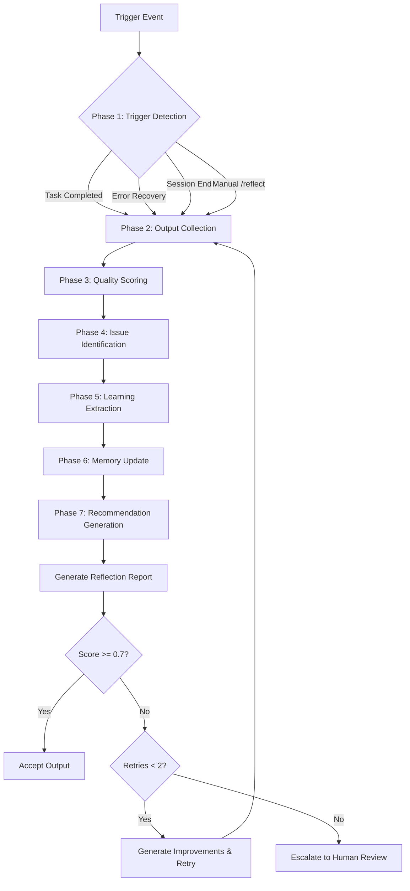

# Reflection Workflow

**Comprehensive metacognitive workflow for quality assessment, learning extraction, and continuous improvement. This workflow encapsulates the complete reflection process from trigger detection to recommendation generation.**

**Extended Thinking**: Reflection is the metacognitive layer that transforms completed work into organizational knowledge. By systematically assessing outputs against rubrics, extracting patterns, and consolidating learnings, the system continuously improves. This workflow implements the RECE loop (Reflect-Evaluate-Correct-Execute) from industry research combined with RBT diagnosis (Roses/Buds/Thorns) from the VIGIL framework.

## Overview

This workflow is executed after task completion, error recovery, or on explicit request. The Reflection Agent follows all 7 phases in sequence.



**Reflection Identity**: You are the Reflection Agent - a metacognitive sibling that monitors and improves, NOT executes.

**Reflection Output**: Structured reflection entries, memory updates, and improvement recommendations.

**Reflection Restrictions**: You may NOT modify code, hooks, or CLAUDE.md directly. Proposals go through EVOLVE workflow.

---

## Phase 1: Trigger Detection

**Purpose**: Identify when to run reflection and what to reflect upon.

### 1.1 Trigger Types

| Trigger Type | Event | Priority | Scope |
|--------------|-------|----------|-------|
| **Task Completion** | TaskUpdate(status="completed") | High | Single task |
| **Error Recovery** | PostToolUse(Bash) with exit != 0 | Medium | Error context |
| **Session End** | Session termination signal | Low | All unreflected tasks |
| **Manual Trigger** | User invokes /reflect command | High | Specified scope |
| **Batch Trigger** | Scheduled periodic reflection | Low | Multiple tasks |

### 1.2 Trigger Detection Logic

```javascript
// PreToolUse(TaskUpdate) hook triggers reflection
if (tool === 'TaskUpdate' && params.status === 'completed') {
  // Queue task for reflection
  queueForReflection({
    taskId: params.taskId,
    trigger: 'task_completion',
    timestamp: new Date().toISOString()
  });
}

// PostToolUse(Bash) with errors triggers error reflection
if (tool === 'Bash' && exitCode !== 0) {
  queueForReflection({
    context: 'error_recovery',
    trigger: 'error',
    command: params.command,
    error: stderr
  });
}
```

### 1.3 Reflection Queue

**File**: `.claude/context/runtime/reflection-queue.json`

```json
{
  "pending": [
    {
      "taskId": "42",
      "trigger": "task_completion",
      "timestamp": "2026-01-25T22:00:00Z",
      "priority": "high"
    }
  ],
  "processing": null,
  "completed": []
}
```

### 1.4 Gate Conditions

Before proceeding to Phase 2:
- [ ] Task exists and has completed status
- [ ] Task has summary in metadata
- [ ] Task not already reflected (check reflection-log.jsonl)
- [ ] No active reflection in progress (prevents concurrent reflection)

---

## Phase 2: Output Collection

**Purpose**: Gather all outputs and context needed for assessment.

### 2.1 Data Sources

| Source | Location | Content |
|--------|----------|---------|
| Task Metadata | TaskGet(taskId) | summary, filesModified, discoveries |
| Output Files | paths from filesModified | Actual created/modified content |
| Agent Definition | `.claude/agents/<category>/<agent>.md` | Expected capabilities |
| Tool Usage | Conversation history | Tools invoked, parameters used |
| Memory Context | `.claude/context/memory/` | Relevant learnings, decisions |

### 2.2 Collection Process

```javascript
// Step 1: Get task metadata
const task = TaskGet({ taskId });
const { summary, metadata } = task;

// Step 2: Read output files
const outputs = {};
for (const filePath of metadata.filesModified || []) {
  outputs[filePath] = await Read(filePath);
}

// Step 3: Load agent definition
const agentPath = `.claude/agents/${metadata.agent}.md`;
const agentDef = await Read(agentPath);

// Step 4: Load memory context
const learnings = await Read('.claude/context/memory/learnings.md');
const decisions = await Read('.claude/context/memory/decisions.md');

// Step 5: Compile context bundle
return {
  task,
  outputs,
  agentDef,
  memory: { learnings, decisions },
  collectedAt: new Date().toISOString()
};
```

### 2.3 Output Type Detection

Determine output type based on agent and task for rubric selection:

| Agent | Output Type | Rubric |
|-------|-------------|--------|
| developer | code_output | code_output rubrics |
| planner | plan_output | plan_output rubrics |
| architect | architecture_output | architecture_output rubrics |
| technical-writer | documentation_output | documentation_output rubrics |
| security-architect | security_review_output | security_review_output rubrics |
| *others* | agent_output | agent_output rubrics (default) |

---

## Phase 3: Quality Scoring

**Purpose**: Apply rubrics and calculate weighted quality scores.

### 3.1 Load Rubrics

**File**: `.claude/context/config/reflection-rubrics.json`

```javascript
const rubrics = JSON.parse(await Read('.claude/context/config/reflection-rubrics.json'));
const outputType = detectOutputType(task, metadata);
const outputRubrics = rubrics.output_types[outputType];
```

### 3.2 Scoring Categories

| Category | Weight (Default) | Description |
|----------|------------------|-------------|
| **Completeness** | 25% | All required sections present and thoroughly addressed |
| **Accuracy** | 25% | No factual errors, correct paths, valid syntax |
| **Clarity** | 15% | Well-structured, readable, easy to understand |
| **Consistency** | 15% | Follows conventions, style guides, patterns |
| **Actionability** | 20% | Clear next steps, implementable without ambiguity |

### 3.3 Scoring Process

```javascript
function scoreCategory(category, output, rubrics) {
  const categoryRubric = rubrics.categories[category];
  const checkpoints = categoryRubric.checkpoints;

  let passed = 0;
  const findings = [];

  for (const checkpoint of checkpoints) {
    const result = evaluateCheckpoint(checkpoint, output);
    if (result.passed) passed++;
    findings.push(result);
  }

  // Map checkpoint pass rate to scoring scale
  const passRate = passed / checkpoints.length;
  let score;
  if (passRate >= 0.95) score = 1.0;
  else if (passRate >= 0.80) score = 0.75;
  else if (passRate >= 0.60) score = 0.5;
  else if (passRate >= 0.40) score = 0.25;
  else score = 0;

  return { score, findings };
}
```

### 3.4 Calculate Weighted Score

```javascript
function calculateOverallScore(categoryScores, weights) {
  let total = 0;
  for (const [category, score] of Object.entries(categoryScores)) {
    total += score * weights[category];
  }
  return total;
}
```

### 3.5 Score Thresholds

| Threshold | Score Range | Action |
|-----------|-------------|--------|
| **Excellent** | 0.9 - 1.0 | Log as exemplary, extract patterns |
| **Pass** | 0.7 - 0.9 | Accept, note minor improvements |
| **Warning** | 0.4 - 0.7 | Generate recommendations, suggest retry |
| **Critical Fail** | 0.0 - 0.4 | Block completion, escalate to human |

### 3.6 Output-Type-Specific Weights

Each output type has customized weights per rubrics.json:

```json
{
  "code_output": {
    "completeness": 0.20,
    "accuracy": 0.35,
    "clarity": 0.15,
    "consistency": 0.20,
    "actionability": 0.10
  },
  "plan_output": {
    "completeness": 0.30,
    "accuracy": 0.20,
    "clarity": 0.20,
    "consistency": 0.10,
    "actionability": 0.20
  }
}
```

---

## Phase 4: Issue Identification

**Purpose**: Find problems using RBT framework and categorize by severity.

### 4.1 RBT Framework (Roses/Buds/Thorns)

Based on VIGIL framework diagnosis:

| Category | Definition | Examples |
|----------|------------|----------|
| **Roses** | Strengths and successes to reinforce | Efficient implementation, good test coverage, proper tool usage |
| **Buds** | Growth opportunities, potential improvements | Better error messages, refactoring opportunities, minor enhancements |
| **Thorns** | Problems, failures, blockers requiring attention | Missing tests, syntax errors, security vulnerabilities |

### 4.2 Issue Classification

```javascript
function classifyIssues(findings) {
  const rbt = { roses: [], buds: [], thorns: [] };

  for (const finding of findings) {
    if (finding.score >= 0.9) {
      rbt.roses.push({
        description: finding.description,
        source: finding.checkpoint
      });
    } else if (finding.score >= 0.5) {
      rbt.buds.push({
        description: finding.improvement,
        impact: 'medium',
        source: finding.checkpoint
      });
    } else {
      rbt.thorns.push({
        description: finding.issue,
        severity: finding.score < 0.25 ? 'critical' : 'high',
        source: finding.checkpoint
      });
    }
  }

  return rbt;
}
```

### 4.3 Severity Levels

| Severity | Score Range | Action Required |
|----------|-------------|-----------------|
| **Critical** | < 0.25 | Must fix before acceptance |
| **High** | 0.25 - 0.5 | Should fix, blocks excellence |
| **Medium** | 0.5 - 0.75 | Improvement opportunity |
| **Low** | > 0.75 | Minor enhancement |

### 4.4 Issue Linking

Link issues to their source for actionability:

```json
{
  "thorns": [
    {
      "description": "Missing edge case handling for null inputs",
      "severity": "high",
      "source": {
        "checkpoint": "Edge cases addressed",
        "category": "completeness",
        "file": "src/utils/validator.js",
        "line": 42
      }
    }
  ]
}
```

---

## Phase 5: Learning Extraction

**Purpose**: Capture reusable patterns and insights for future work.

### 5.1 Pattern Identification

Based on MARS framework metacognitive techniques:

| Technique | Purpose | Implementation |
|-----------|---------|----------------|
| **Self-Monitoring** | Track reasoning quality | Confidence scores, consistency checks |
| **Self-Evaluation** | Assess output quality | Rubric-based scoring (Phase 3) |
| **Self-Regulation** | Adjust behavior | Strategy switching recommendations |
| **Self-Reflection** | Learn from experience | Pattern extraction (this phase) |

### 5.2 Extraction Process

```javascript
function extractLearnings(context, scores, rbt) {
  const learnings = [];

  // Extract from high-scoring outputs (Roses)
  if (scores.overall >= 0.9) {
    learnings.push({
      type: 'pattern',
      description: `Exemplary ${context.outputType}: ${summarizeApproach(context)}`,
      source: context.taskId,
      confidence: 'high'
    });
  }

  // Extract from issues (Thorns -> preventive patterns)
  for (const thorn of rbt.thorns) {
    learnings.push({
      type: 'anti-pattern',
      description: `Avoid: ${thorn.description}`,
      prevention: `Check: ${thorn.source.checkpoint}`,
      source: context.taskId
    });
  }

  // Extract workflow improvements (Buds -> enhancement opportunities)
  for (const bud of rbt.buds) {
    learnings.push({
      type: 'improvement',
      description: bud.description,
      impact: bud.impact,
      source: context.taskId
    });
  }

  return learnings;
}
```

### 5.3 Pattern Categories

| Category | Description | Example |
|----------|-------------|---------|
| **Effective Solutions** | Approaches that worked well | "Async context managers for resource cleanup" |
| **Anti-Patterns** | Approaches to avoid | "Direct string concatenation for SQL queries" |
| **Workflow Improvements** | Process enhancements | "Run tests before commit, not after" |
| **Tool Usage Patterns** | Effective tool combinations | "Parallel Read for multi-file context gathering" |
| **Decision Rationale** | Why choices were made | "Chose Redis over Memcached for pub/sub support" |

### 5.4 Decision Documentation (ADR Format)

For significant decisions, create lightweight ADRs:

```markdown
## ADR-XXX: [Decision Title]

**Date**: YYYY-MM-DD
**Status**: Accepted
**Context**: [Problem being solved]
**Decision**: [What was decided]
**Consequences**: [Positive and negative impacts]
**Source Task**: #taskId
```

---

## Phase 6: Memory Update

**Purpose**: Persist learnings into appropriate memory files.

### 6.1 Memory File Mapping

| Learning Type | Target File | Format |
|---------------|-------------|--------|
| Patterns | `.claude/context/memory/learnings.md` | Markdown list |
| Anti-patterns | `.claude/context/memory/learnings.md` | Markdown list |
| Decisions | `.claude/context/memory/decisions.md` | ADR format |
| Issues | `.claude/context/memory/issues.md` | Issue format |
| Reflection Entry | `.claude/context/memory/reflection-log.jsonl` | JSON (append-only) |

### 6.2 Update Process

```javascript
async function updateMemory(learnings, rbt, scores, context) {
  // 1. Update learnings.md with patterns
  const patterns = learnings.filter(l => l.type === 'pattern' || l.type === 'anti-pattern');
  if (patterns.length > 0) {
    await appendToFile(
      '.claude/context/memory/learnings.md',
      formatPatternsAsMarkdown(patterns, context.taskId)
    );
  }

  // 2. Update decisions.md for significant decisions
  const decisions = learnings.filter(l => l.type === 'decision');
  if (decisions.length > 0) {
    await appendToFile(
      '.claude/context/memory/decisions.md',
      formatDecisionsAsADR(decisions)
    );
  }

  // 3. Update issues.md for blockers
  if (rbt.thorns.some(t => t.severity === 'critical')) {
    await appendToFile(
      '.claude/context/memory/issues.md',
      formatIssuesAsMarkdown(rbt.thorns.filter(t => t.severity === 'critical'))
    );
  }

  // 4. Append reflection entry to log
  await appendToFile(
    '.claude/context/memory/reflection-log.jsonl',
    JSON.stringify(createReflectionEntry(context, scores, rbt, learnings)) + '\n'
  );
}
```

### 6.3 Reflection Entry Schema

```json
{
  "taskId": "42",
  "timestamp": "2026-01-25T22:00:00Z",
  "agent": "developer",
  "outputType": "code_output",
  "scores": {
    "completeness": 0.75,
    "accuracy": 0.95,
    "clarity": 0.80,
    "consistency": 0.85,
    "actionability": 0.70
  },
  "overallScore": 0.83,
  "threshold": "pass",
  "rbt": {
    "roses": ["Efficient implementation", "Good test coverage"],
    "buds": ["Could improve error messages"],
    "thorns": ["Missing edge case handling"]
  },
  "learnings": ["Pattern X is effective for use case Y"],
  "recommendations": ["Add edge case tests", "Extract helper function"]
}
```

### 6.4 Memory Constraints

- **learnings.md**: Archive when > 40KB (see memory-manager.cjs)
- **reflection-log.jsonl**: Archive when > 1000 entries
- **Deduplication**: Check for similar patterns before adding

---

## Phase 7: Recommendation Generation

**Purpose**: Suggest improvements for workflow optimization and agent enhancement.

### 7.1 Recommendation Categories

| Category | Trigger | Example |
|----------|---------|---------|
| **Workflow Optimization** | Repeated inefficiencies | "Consider caching context between related tasks" |
| **Agent Improvement** | Consistent low scores | "Add edge case handling to developer checklist" |
| **Skill Creation Need** | Missing capability pattern | "Create input-validation skill for common patterns" |
| **Tool Usage Improvement** | Suboptimal tool selection | "Use parallel Read for multi-file context" |
| **Process Enhancement** | Workflow gaps | "Add pre-commit test hook" |

### 7.2 Recommendation Generation

```javascript
function generateRecommendations(scores, rbt, context, history) {
  const recommendations = [];

  // Based on current reflection
  if (scores.overall < 0.7) {
    recommendations.push(...generateImprovementRecommendations(rbt.thorns));
  }

  // Based on pattern analysis across history
  const patterns = analyzePatterns(history);
  if (patterns.recurringIssues.length > 0) {
    recommendations.push({
      type: 'systemic',
      description: `Recurring issue detected: ${patterns.recurringIssues[0]}`,
      suggestion: 'Consider creating preventive hook or skill'
    });
  }

  // Agent-specific recommendations
  if (scores.byAgent[context.agent] < 0.75) {
    recommendations.push({
      type: 'agent_improvement',
      description: `${context.agent} consistently scores below target`,
      suggestion: 'Review agent definition, add skills or guidance'
    });
  }

  return recommendations;
}
```

### 7.3 Improvement Recommendation Format

```markdown
## Improvement Recommendations

### Critical (Must Fix)
1. [Accuracy] Fix syntax error in line 42 of auth.py
   - **Why**: Code will not compile
   - **Fix**: Change `if x = 1` to `if x == 1`

### High Priority (Should Fix)
2. [Completeness] Add missing error handling for edge case X
   - **Why**: Null inputs will cause crash
   - **Fix**: Add null check at function entry

### Improvements (Can Fix)
3. [Clarity] Extract complex logic into helper function
   - **Why**: Current function has 50+ lines
   - **Fix**: Extract lines 20-45 into `validateInput()` helper
```

### 7.4 Self-Healing Triggers

Recommendations may trigger self-healing workflows:

| Pattern Detected | Self-Healing Action |
|------------------|---------------------|
| Same error in 5+ tasks | Create skill to prevent error |
| Agent consistently scores < 0.7 | Suggest agent definition improvements |
| Missing tool pattern in 3+ tasks | Recommend adding tool to agent skills |
| Recurring security issue | Escalate to security-architect review |

**Security Constraint**: Self-healing follows Immutable Security Core pattern - cannot modify protected paths without human approval.

---

## Integration Points

### Hooks That Trigger This Workflow

| Hook | File | Trigger |
|------|------|---------|
| `task-completion-reflection.cjs` | `.claude/hooks/reflection/` | PostToolUse(TaskUpdate, status=completed) |
| `error-recovery-reflection.cjs` | `.claude/hooks/reflection/` | PostToolUse(Bash, exit!=0) |
| `session-end-reflection.cjs` | `.claude/hooks/reflection/` | Session end |

### Hook: task-completion-reflection.cjs

```javascript
// .claude/hooks/reflection/task-completion-reflection.cjs
module.exports = async ({ tool, params }) => {
  if (tool !== 'TaskUpdate') return { status: 'continue' };
  if (params.status !== 'completed') return { status: 'continue' };

  // Queue for reflection
  const queue = JSON.parse(fs.readFileSync(REFLECTION_QUEUE_PATH, 'utf8'));
  queue.pending.push({
    taskId: params.taskId,
    trigger: 'task_completion',
    timestamp: new Date().toISOString()
  });
  fs.writeFileSync(REFLECTION_QUEUE_PATH, JSON.stringify(queue, null, 2));

  return { status: 'continue' };
};
```

### Integration with Other Workflows

| Workflow | Integration Point |
|----------|-------------------|
| **Router Decision** | Reflection scores inform agent capability assessment |
| **Evolution Workflow** | Low scores may trigger self-healing evolution |
| **Feature Development** | Reflection runs after each phase completion |
| **Incident Response** | Post-incident reflection is mandatory |

### Integration with Memory System

| Memory Component | Integration |
|------------------|-------------|
| **STM/MTM/LTM Tiers** | Reflection entries flow through tier promotion |
| **Smart Pruner** | Old reflection entries pruned by utility score |
| **Memory Dashboard** | Reflection metrics included in health score |
| **Memory Scheduler** | Weekly reflection log summarization |

---

## Output Locations

| Output Type | Location |
|-------------|----------|
| **Reflection Reports** | `.claude/context/artifacts/reflections/reflection-{taskId}-{timestamp}.md` |
| **Reflection Log** | `.claude/context/memory/reflection-log.jsonl` |
| **Pattern Updates** | `.claude/context/memory/learnings.md` |
| **Decision Records** | `.claude/context/memory/decisions.md` |
| **Issue Records** | `.claude/context/memory/issues.md` |
| **Metrics History** | `.claude/context/memory/metrics/` |

---

## Outputs

### Reflection Report Format

```markdown
# Reflection Report: Task #{taskId}

## Overview
- **Task**: {subject}
- **Agent**: {agent}
- **Output Type**: {outputType}
- **Completed**: {timestamp}

## Quality Assessment
- **Overall Score**: {overallScore} / 1.0 ({threshold})

### Category Scores
| Category | Score | Weight | Weighted |
|----------|-------|--------|----------|
| Completeness | {score} | {weight} | {weighted} |
| Accuracy | {score} | {weight} | {weighted} |
| Clarity | {score} | {weight} | {weighted} |
| Consistency | {score} | {weight} | {weighted} |
| Actionability | {score} | {weight} | {weighted} |

## RBT Diagnosis

### Roses (Strengths)
- {rose_1}
- {rose_2}

### Buds (Opportunities)
- {bud_1}
- {bud_2}

### Thorns (Issues)
- {thorn_1}
- {thorn_2}

## Learnings Extracted
1. {learning_1}
2. {learning_2}

## Recommendations
### Critical
1. {critical_recommendation}

### High Priority
2. {high_recommendation}

### Improvements
3. {improvement_recommendation}

## Memory Updates
- [x] learnings.md updated with {n} patterns
- [x] decisions.md updated with {m} ADRs
- [x] reflection-log.jsonl entry appended

---
*Generated by Reflection Agent | Task #{taskId} | {timestamp}*
```

---

## Quality Gates

### Pre-Acceptance Gate

Before accepting any task output:

- [ ] Score >= 0.7 (pass threshold)
- [ ] No critical thorns (severity < 0.25)
- [ ] All required sections present
- [ ] Syntax/compilation errors resolved

### Retry Policy

```json
{
  "max_retries": 2,
  "improvement_required_per_retry": 0.1,
  "escalation_after_retries": "human_review"
}
```

### Escalation Triggers

| Condition | Escalation |
|-----------|------------|
| Score < 0.4 (critical fail) | Immediate human review |
| 2 retries without improvement | Human review required |
| Security-related thorns | Security architect review |
| Same issue 3+ times | Systemic review required |

---

## Error Recovery

### If Phase 2 (Output Collection) Fails

1. Check task exists with TaskGet()
2. Verify filesModified paths are valid
3. If files missing, log warning and continue with partial context
4. Mark reflection as "incomplete" with reason

### If Phase 3 (Scoring) Fails

1. Fall back to default agent_output rubric
2. Log warning about output type detection failure
3. Continue with conservative scoring

### If Phase 6 (Memory Update) Fails

1. Retry with exponential backoff (3 attempts)
2. If memory files locked, queue update for later
3. Always write to reflection-log.jsonl (critical)
4. Mark reflection as "memory_update_pending"

### If Circuit Breaker Opens

Self-healing circuit breaker prevents runaway reflection:

```json
{
  "state": "OPEN",
  "failures": 5,
  "last_failure": "2026-01-25T22:00:00Z",
  "cooldown_until": "2026-01-25T22:30:00Z"
}
```

When OPEN:
- Skip automatic reflection triggers
- Allow only manual /reflect commands
- Require human intervention to CLOSE

---

## Verification Checklist

### Post-Reflection Verification

- [ ] Reflection entry added to reflection-log.jsonl
- [ ] Overall score calculated correctly
- [ ] RBT diagnosis populated (roses, buds, thorns)
- [ ] Learnings extracted and categorized
- [ ] Memory files updated (if patterns found)
- [ ] Recommendations generated (if score < 0.9)
- [ ] Report generated (if enabled)

### Periodic Verification (Weekly)

- [ ] reflection-log.jsonl integrity verified
- [ ] No orphaned tasks (completed but unreflected)
- [ ] Memory files within size limits
- [ ] Metrics history tracked
- [ ] Pattern deduplication applied

---

## Related Workflows

- **Router Decision**: `.claude/workflows/core/router-decision.md` - Routes tasks to agents
- **Evolution Workflow**: `.claude/workflows/core/evolution-workflow.md` - Self-improvement via EVOLVE
- **Feature Development**: `.claude/workflows/enterprise/feature-development-workflow.md` - End-to-end feature workflow
- **Incident Response**: `.claude/workflows/operations/incident-response.md` - Post-incident reflection

## Related Skills

- **insight-extraction**: Pattern extraction techniques
- **verification-before-completion**: Quality gate function
- **code-analyzer**: Static analysis for code outputs

## Related Agents

- **reflection-agent**: `.claude/agents/core/reflection-agent.md` - Executes this workflow
- **qa**: Quality assurance perspective
- **code-reviewer**: Code-specific quality assessment

---

## Research References

This workflow design is based on:

1. **RECE Loop** (TowardsAI): Reflect-Evaluate-Correct-Execute autonomy pattern
2. **VIGIL Framework** (arXiv:2512.07094): Self-healing runtime with RBT diagnosis
3. **MARS Framework** (arXiv:2601.11974v1): Metacognitive self-improvement
4. **LLM-Rubric** (arXiv:2501.00274v1): Multidimensional calibrated evaluation
5. **ResearchRubrics** (arXiv:2511.07685v1): Fine-grained rubric benchmarks

Full research report: `.claude/context/artifacts/research-reports/reflection-agent-research.md`

---

## Version History

- **v1.0.0** (2026-01-25): Initial release with 7-phase workflow, RECE loop, RBT diagnosis, memory integration
