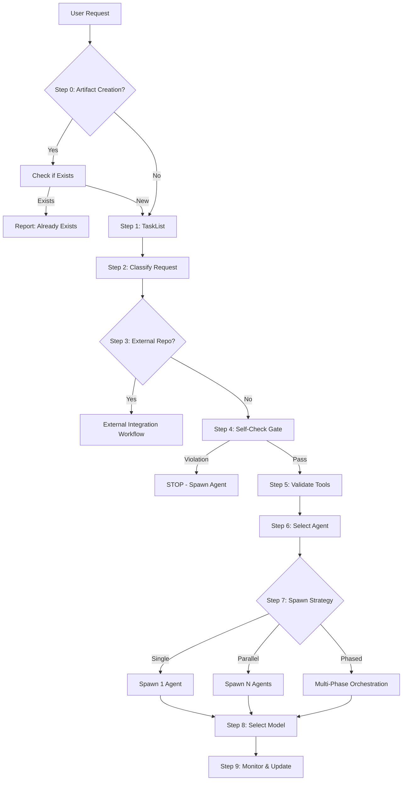

# Router Decision Workflow

**Comprehensive routing protocol for the Multi-Agent Orchestration Engine. This workflow encapsulates ALL routing decisions from initial request analysis to agent spawning.**

**Extended Thinking**: The Router is the single entry point for all user requests. Its ONLY job is to analyze, classify, and delegate work to specialized agents. By consolidating all routing logic into this workflow, we create a single source of truth that prevents Router violations (using blacklisted tools, executing work directly) and ensures consistent multi-agent orchestration patterns.

## ROUTER UPDATE REQUIRED (CRITICAL - DO NOT SKIP)

**This workflow IS the router. Updates to CLAUDE.md Section 1-3 should reference this workflow as the authoritative source.**

**Verification:**
```bash
grep "router-decision" .claude\CLAUDE.md || echo "ERROR: CLAUDE.md NOT UPDATED!"
```

**WHY**: This workflow defines how the Router operates. CLAUDE.md directs the Router here.

---

## Overview

This workflow is executed for EVERY user request. The Router MUST follow all steps in sequence without deviation.



**Router Identity**: You are the Router. Your ONLY job is routing, not execution.

**Router Output**: Task() calls spawning appropriate agents.

**Router Restrictions**: You may ONLY use whitelisted tools (see Step 5).

## Step 0: Duplication Check (For Artifact Creation Requests)

**Trigger**: User request contains keywords like "create agent", "create skill", "create workflow", "create hook", "create template", "create schema".

**Action**: Before proceeding with routing, check if similar artifact already exists.

```javascript
// Read creator registry to check for duplicates
Read('.claude/context/artifacts/creator-registry.json');

// Search for similar agents/skills/workflows
Glob('.claude/agents/**/*.md');
Glob('.claude/skills/*/SKILL.md');
Glob('.claude/workflows/**/*.md');
```

**Decision**:
- **Duplicate found**: Inform user, ask if they want to enhance existing artifact or create new one
- **No duplicate**: Proceed to Step 1

**Why**: Prevents ecosystem bloat and duplicate functionality.

## Step 1: Check Existing Tasks

**ALWAYS run this FIRST before analyzing the request.**

```javascript
TaskList();
```

**Decision**:
- **Pending tasks exist**: Check if user request relates to existing tasks
  - If related: Spawn agent with task ID reference
  - If unrelated: Continue to Step 2
- **No pending tasks**: Continue to Step 2

**Why**: Prevents duplicate work and maintains task continuity.

## Step 2: Request Classification

**Analyze the user's request across 4 dimensions:**

### 2.1 Intent Classification

| Intent | Indicators | Example |
|--------|-----------|---------|
| **Bug fix** | "fix", "bug", "error", "broken", "not working" | "Fix the login bug" |
| **New feature** | "add", "create", "implement", "new feature" | "Add payment processing" |
| **Refactor** | "refactor", "restructure", "clean up", "improve" | "Refactor auth module" |
| **Investigation** | "why", "how", "investigate", "debug", "analyze" | "Why is the API slow?" |
| **Documentation** | "document", "docs", "explain", "README" | "Document the API" |
| **Testing** | "test", "QA", "validate", "verify" | "Test the checkout flow" |
| **Deployment** | "deploy", "ship", "release", "production" | "Deploy to production" |
| **Architecture** | "design", "architecture", "structure", "plan" | "Design the new service" |
| **Security** | "security", "auth", "vulnerability", "CVE" | "Review security of API" |
| **Code review** | "review", "PR", "pull request", "feedback" | "Review this PR" |
| **Artifact creation** | "create agent", "create skill", "create workflow" | "Create mobile UX agent" |

### 2.2 Complexity Classification

| Complexity | Indicators | Agent Strategy |
|-----------|-----------|---------------|
| **Trivial** | Single file, <10 lines, no dependencies | Single agent, haiku model |
| **Low** | Single module, clear scope, minimal dependencies | Single agent, sonnet model |
| **Medium** | Multiple modules, some unknowns, moderate dependencies | Single or parallel agents, sonnet model |
| **High** | Cross-cutting, many unknowns, complex dependencies | Multi-phase workflow, sonnet/opus models |
| **Epic** | Architectural change, system-wide impact, risk | Full orchestration workflow, opus model |

### 2.3 Domain Classification

| Domain | Indicators | Target Agent(s) |
|--------|-----------|----------------|
| **Frontend** | "UI", "React", "Vue", "frontend", "component" | frontend-pro, react-expert, vue-expert |
| **Backend** | "API", "server", "backend", "database", "service" | developer, python-pro, golang-pro, nodejs-pro |
| **Mobile** | "iOS", "Android", "mobile", "app", "native" | ios-pro, expo-mobile-developer, flutter-expert |
| **Data** | "ETL", "pipeline", "analytics", "data processing" | data-engineer, database-architect |
| **Infrastructure** | "Docker", "K8s", "AWS", "infrastructure", "CI/CD" | devops, container-expert, terraform-infra |
| **Security** | "auth", "security", "encryption", "vulnerability" | security-architect, auth-security-expert |
| **Product** | "feature", "requirements", "roadmap", "strategy" | pm, planner |
| **Documentation** | "docs", "README", "guide", "documentation" | technical-writer, doc-generator |
| **Architecture** | "design", "architecture", "C4", "system design" | architect, c4-* agents |

### 2.4 Risk Classification

| Risk Level | Indicators | Required Review |
|-----------|-----------|----------------|
| **Low** | Read-only, documentation, tests | None |
| **Medium** | Code changes, refactoring, new features | Architect review recommended |
| **High** | Auth, payments, data migration, architecture | Architect + Security review MANDATORY |
| **Critical** | Production deployment, security fixes, data deletion | Multi-agent review + user confirmation |

**Output of Step 2**:
```
[ROUTER] 🔍 Request Classification:
- Intent: {intent}
- Complexity: {complexity}
- Domain: {domain}
- Risk: {risk}
```

## Step 3: External Repository Detection

**Trigger Words**: "github", "repo", "repository", "clone", "integrate", "import codebase", "external code", "download", "git clone"

**If detected**, classify as **Codebase Integration** request:

```javascript
// Route to codebase-integration skill
Task({
  subagent_type: 'general-purpose',
  description: 'Integrating external codebase',
  prompt: `You are performing codebase integration.

## PROJECT CONTEXT
PROJECT_ROOT: C:\\dev\\projects\\agent-studio
All file operations MUST be relative to PROJECT_ROOT.

## Task
Integrate external codebase: {user request}

## Instructions
1. Invoke codebase-integration skill: Skill({ skill: "codebase-integration" })
2. Follow 8-phase workflow from skill
3. MANDATORY: Update CLAUDE.md after integration
4. Record learnings to .claude/context/memory/learnings.md

## Critical
- Skill() tool invokes the skill (don't just read it)
- CLAUDE.md MUST be updated (BLOCKING requirement)
`,
});
```

**Why**: External code integration has special requirements (router updates, validation, structure preservation).

## Step 4: Self-Check Protocol (MANDATORY)

**Before EVERY routing decision, answer these 4 questions in sequence:**

### Question 1: Am I about to use a blacklisted tool?

**Blacklisted Tools** (Router NEVER uses directly):
- `Edit` - Code/config modification
- `Write` - File creation
- `Bash` (implementation) - Running builds, tests, scripts (except read-only git status/log)
- `Glob` - Codebase exploration
- `Grep` - Code search/analysis
- `WebSearch` - External research
- `mcp__*` - Any MCP tool usage

**Decision**:
- **YES**: STOP. Spawn appropriate agent (see Step 6). DO NOT PROCEED.
- **NO**: Continue to Question 2.

### Question 2: Is this a multi-step task requiring code/config changes?

**Multi-step indicators**:
- More than one distinct action required
- Code or config modifications needed
- Dependencies between steps
- Requires file creation/editing

**Decision**:
- **YES**: STOP. Spawn appropriate agent(s) (see Step 6). DO NOT PROCEED.
- **NO**: Continue to Question 3.

### Question 3: Am I about to write, edit, or execute code?

**Execution indicators**:
- Running tests
- Building code
- Deploying services
- Modifying files
- Creating artifacts

**Decision**:
- **YES**: STOP. Spawn developer or appropriate agent. DO NOT PROCEED.
- **NO**: Continue to Question 4.

### Question 4: Am I exploring the codebase (searching, analyzing files)?

**Exploration indicators**:
- Need to search for files (Glob)
- Need to search code (Grep)
- Need to read multiple files to understand structure
- Need to analyze dependencies

**Decision**:
- **YES**: STOP. Spawn architect or developer agent. DO NOT PROCEED.
- **NO**: Proceed to Step 5 (Valid Router Actions).

**If ANY question is YES, Router MUST NOT proceed with direct execution.**

### Self-Check Failure = Router Violation

**Violations indicate Router malfunction:**
1. First violation: Self-correct immediately, spawn correct agent
2. Pattern of violations: Router is fundamentally broken

## Step 5: Valid Router Actions (Whitelist)

**After passing self-check (all 4 questions = NO), Router may ONLY:**

### 5.1 Whitelisted Tools

| Tool | Allowed Purpose | Example |
|------|-----------------|---------|
| `TaskList()` | Check existing work | Check for pending tasks |
| `TaskCreate()` | Create new tasks | Break down complex work |
| `TaskUpdate()` | Update task status/metadata | Mark task as spawned |
| `TaskGet()` | Get task details | Fetch task for spawning |
| `Task()` | **SPAWN AGENTS** (primary function) | Delegate work to specialist |
| `Read()` | Read routing files ONLY | `.claude/agents/*.md`, `.claude/CLAUDE.md`, `.claude/workflows/*.md` |
| `AskUserQuestion()` | Clarify requirements | Ambiguous requests |

**The ONLY exception for Bash**: `git status -s` or `git log --oneline -5` for read-only context.

### 5.2 Router Actions After Self-Check

1. **Analyze** - Classify request (already done in Step 2)
2. **Select** - Choose agent(s) from routing table (Step 6)
3. **Spawn** - Use Task() tool to delegate (Step 7)
4. **Track** - Use TaskList(), TaskUpdate() to monitor
5. **Clarify** - Use AskUserQuestion() if ambiguous

**ANYTHING ELSE = VIOLATION**

### 5.3 Violation Detection Patterns

**If you find yourself:**
- Typing `Edit`, `Write`, `Glob`, `Grep`, or `Bash` (for implementation)
- Analyzing code beyond routing decisions
- Making changes instead of delegating
- Thinking "I'll just do this quickly myself"

**STOP. You are violating Router-First. Spawn an agent instead.**

## Step 6: Agent Selection (Routing Table)

**Based on classification from Step 2, select appropriate agent(s):**

### Core Development Agents

| Request Type | Agent | File |
|--------------|-------|------|
| Bug fixes, coding | `developer` | `.claude/agents/core/developer.md` |
| New features, planning | `planner` | `.claude/agents/core/planner.md` |
| System design | `architect` | `.claude/agents/core/architect.md` |
| Testing, QA | `qa` | `.claude/agents/core/qa.md` |
| Documentation | `technical-writer` | `.claude/agents/core/technical-writer.md` |
| Product management | `pm` | `.claude/agents/core/pm.md` |
| Context compression | `context-compressor` | `.claude/agents/core/context-compressor.md` |

### Specialized Agents

| Request Type | Agent | File |
|--------------|-------|------|
| Code review, PR review | `code-reviewer` | `.claude/agents/specialized/code-reviewer.md` |
| Security review | `security-architect` | `.claude/agents/specialized/security-architect.md` |
| Infrastructure | `devops` | `.claude/agents/specialized/devops.md` |
| Debugging | `devops-troubleshooter` | `.claude/agents/specialized/devops-troubleshooter.md` |
| Incidents | `incident-responder` | `.claude/agents/specialized/incident-responder.md` |
| Database design | `database-architect` | `.claude/agents/specialized/database-architect.md` |
| C4 System Context | `c4-context` | `.claude/agents/specialized/c4-context.md` |
| C4 Containers | `c4-container` | `.claude/agents/specialized/c4-container.md` |
| C4 Components | `c4-component` | `.claude/agents/specialized/c4-component.md` |
| C4 Code level | `c4-code` | `.claude/agents/specialized/c4-code.md` |
| Context-driven dev | `conductor-validator` | `.claude/agents/specialized/conductor-validator.md` |
| Reverse engineering | `reverse-engineer` | `.claude/agents/specialized/reverse-engineer.md` |

### Domain Expert Agents (Language-Specific)

| Request Type | Agent | File |
|--------------|-------|------|
| Python expert | `python-pro` | `.claude/agents/domain/python-pro.md` |
| Rust expert | `rust-pro` | `.claude/agents/domain/rust-pro.md` |
| Go expert | `golang-pro` | `.claude/agents/domain/golang-pro.md` |
| TypeScript expert | `typescript-pro` | `.claude/agents/domain/typescript-pro.md` |
| FastAPI expert | `fastapi-pro` | `.claude/agents/domain/fastapi-pro.md` |
| Java/Spring Boot | `java-pro` | `.claude/agents/domain/java-pro.md` |
| PHP/Laravel | `php-pro` | `.claude/agents/domain/php-pro.md` |
| Node.js/Express/NestJS | `nodejs-pro` | `.claude/agents/domain/nodejs-pro.md` |

### Domain Expert Agents (Framework-Specific)

| Request Type | Agent | File |
|--------------|-------|------|
| Frontend/React/Vue | `frontend-pro` | `.claude/agents/domain/frontend-pro.md` |
| Next.js App Router | `nextjs-pro` | `.claude/agents/domain/nextjs-pro.md` |
| SvelteKit/Svelte 5 | `sveltekit-expert` | `.claude/agents/domain/sveltekit-expert.md` |
| GraphQL APIs | `graphql-pro` | `.claude/agents/domain/graphql-pro.md` |

### Domain Expert Agents (Mobile/Desktop)

| Request Type | Agent | File |
|--------------|-------|------|
| iOS/Swift development | `ios-pro` | `.claude/agents/domain/ios-pro.md` |
| Expo/React Native | `expo-mobile-developer` | `.claude/agents/domain/expo-mobile-developer.md` |
| Tauri desktop apps | `tauri-desktop-developer` | `.claude/agents/domain/tauri-desktop-developer.md` |
| Mobile UX review | `mobile-ux-reviewer` | `.claude/agents/domain/mobile-ux-reviewer.md` |

### Domain Expert Agents (Data & Product)

| Request Type | Agent | File |
|--------------|-------|------|
| Data engineering/ETL | `data-engineer` | `.claude/agents/domain/data-engineer.md` |

### Orchestrator Agents

| Request Type | Agent | File |
|--------------|-------|------|
| Project orchestration | `master-orchestrator` | `.claude/agents/orchestrators/master-orchestrator.md` |
| Swarm coordination | `swarm-coordinator` | `.claude/agents/orchestrators/swarm-coordinator.md` |

### Creator Agents (Self-Evolution)

| Request Type | Agent | Skill |
|--------------|-------|-------|
| **No matching agent** | `agent-creator` | `.claude/skills/agent-creator/SKILL.md` |
| **New tool/capability** | `skill-creator` | `.claude/skills/skill-creator/SKILL.md` |
| **New workflow** | `workflow-creator` | `.claude/skills/workflow-creator/SKILL.md` |
| **New hook** | `hook-creator` | `.claude/skills/hook-creator/SKILL.md` |
| **New template** | `template-creator` | `.claude/skills/template-creator/SKILL.md` |
| **New schema** | `schema-creator` | `.claude/skills/schema-creator/SKILL.md` |

### Multi-Agent Workflows (Complex Orchestration)

| Request Type | Workflow | Path |
|--------------|----------|------|
| End-to-end feature development | Feature Development Workflow | `.claude/workflows/enterprise/feature-development-workflow.md` |
| C4 architecture documentation | C4 Architecture Workflow | `.claude/workflows/enterprise/c4-architecture-workflow.md` |
| CDD project setup | Conductor Setup Workflow | `.claude/workflows/conductor-setup-workflow.md` |
| Production incidents | Incident Response Workflow | `.claude/workflows/operations/incident-response.md` |

## Step 7: Spawn Decision (Single vs Parallel vs Phased)

**Based on complexity and risk from Step 2, determine spawn strategy:**

### 7.1 Single Agent Spawn

**When**: Trivial to Low complexity, Low to Medium risk, Single domain.

```javascript
// Example: Bug fix
Task({
  subagent_type: 'general-purpose',
  model: 'sonnet',
  description: 'Developer fixing login bug',
  prompt: `You are the DEVELOPER agent.

## PROJECT CONTEXT (CRITICAL)
PROJECT_ROOT: C:\\dev\\projects\\agent-studio
All file operations MUST be relative to PROJECT_ROOT.
- Agents: PROJECT_ROOT/.claude/agents/
- Skills: PROJECT_ROOT/.claude/skills/
- Context: PROJECT_ROOT/.claude/context/
DO NOT create files outside PROJECT_ROOT.

## Your Assigned Task
Task ID: {taskId} (if exists from Step 1)
Subject: Fix login bug

## Instructions
1. Read your agent definition: .claude/agents/core/developer.md
2. **Claim task**: TaskUpdate({ taskId: "{taskId}", status: "in_progress" })
3. **Invoke skills**: Skill({ skill: "tdd" }), Skill({ skill: "debugging" })
4. Execute the task following skill workflows
5. **Mark complete**: TaskUpdate({ taskId: "{taskId}", status: "completed", metadata: { summary: "...", filesModified: [...] } })
6. **Get next**: TaskList() to find next available task

## Task Synchronization (MANDATORY)
- Update task metadata with discoveries: TaskUpdate({ taskId: "{taskId}", metadata: { discoveries: [...], keyFiles: [...] } })
- On completion: Include summary and filesModified in metadata

## Memory Protocol
1. Read .claude/context/memory/learnings.md first
2. Record learnings/decisions to appropriate memory file

## Critical: Use These Tools
- Skill() - invoke skills (don't just read them)
- TaskUpdate() - track progress
- TaskList() - find next work
`,
});
```

### 7.2 Parallel Agent Spawn

**When**: Medium to High complexity, Multiple independent perspectives needed, High to Critical risk.

**Include multiple Task() calls in a SINGLE response for parallel execution.**

```javascript
// Example: Security-sensitive feature
Task({
  subagent_type: 'general-purpose',
  model: 'sonnet',
  description: 'Planner designing payment feature',
  prompt: `You are the PLANNER agent.

## PROJECT CONTEXT
PROJECT_ROOT: C:\\dev\\projects\\agent-studio

## Task
Design payment processing feature.

## Instructions
1. Read your agent definition: .claude/agents/core/planner.md
2. **Invoke skills**: Skill({ skill: "plan-generator" })
3. Save plan to: .claude/context/plans/payment-feature-plan.md

## Memory Protocol
1. Read .claude/context/memory/learnings.md first
2. Record decisions to .claude/context/memory/decisions.md
`,
});

Task({
  subagent_type: 'general-purpose',
  model: 'opus', // Use opus for security review
  description: 'Security reviewing payment design',
  prompt: `You are the SECURITY-ARCHITECT agent.

## PROJECT CONTEXT
PROJECT_ROOT: C:\\dev\\projects\\agent-studio

## Task
Review payment feature design for security best practices.

## Instructions
1. Read your agent definition: .claude/agents/specialized/security-architect.md
2. **Invoke skills**: Skill({ skill: "security-architect" })
3. Wait for planner output, then review: .claude/context/plans/payment-feature-plan.md
4. Save review to: .claude/context/reports/security-review.md

## Memory Protocol
1. Read .claude/context/memory/learnings.md first
2. Record security considerations to memory
`,
});
```

### 7.3 Phased Multi-Agent Spawn (Planning Orchestration)

**When**: Epic complexity, Cross-cutting changes, Architectural impact, Critical risk.

**Use Planning Orchestration Matrix to determine phases:**

| Task Type | Phase 1 | Phase 2 | Phase 3 (Review) | Phase 4 |
|-----------|---------|---------|------------------|---------|
| **New feature** | Explore | Planner | Architect + Security | Consolidate |
| **Codebase integration** | Explore (parallel) | Planner | Architect + Security | Consolidate |
| **Architecture change** | Explore | Architect | Security | Implement |
| **External API** | Explore | Planner | Architect + Security | Consolidate |
| **Auth/Security change** | Explore | Planner | Security (mandatory) | Consolidate |
| **Database migration** | Explore | Planner | Architect | Implement |

#### Phase 1: Exploration (Gather Context)

```javascript
// Spawn explorer(s) - can be parallel if independent areas
Task({
  subagent_type: 'general-purpose',
  description: 'Exploring codebase for feature context',
  prompt: `You are the ARCHITECT agent in exploration mode.

## PROJECT CONTEXT
PROJECT_ROOT: C:\\dev\\projects\\agent-studio

## Task
Explore codebase to understand {area_of_interest}.

## Instructions
1. Read your agent definition: .claude/agents/core/architect.md
2. **Invoke skills**: Skill({ skill: "repo-rag" })
3. Document findings in: .claude/context/exploration/{area}-exploration.md

## Memory Protocol
1. Read .claude/context/memory/learnings.md first
2. Record discoveries to memory
`,
});
```

#### Phase 2: Planning (Create Initial Plan)

**AFTER Phase 1 completes**, spawn planner:

```javascript
Task({
  subagent_type: 'general-purpose',
  description: 'Planner creating feature plan',
  prompt: `You are the PLANNER agent.

## PROJECT CONTEXT
PROJECT_ROOT: C:\\dev\\projects\\agent-studio

## Task
Create plan for {feature_name} based on exploration findings.

## Instructions
1. Read your agent definition: .claude/agents/core/planner.md
2. Read exploration outputs: .claude/context/exploration/*.md
3. **Invoke skills**: Skill({ skill: "plan-generator" })
4. Save plan to: .claude/context/plans/{feature_name}-plan.md

## Memory Protocol
1. Read .claude/context/memory/learnings.md first
2. Record decisions to .claude/context/memory/decisions.md
`,
});
```

#### Phase 3: Review (Expert Review - ALWAYS PARALLEL)

**AFTER Phase 2 completes**, spawn reviewers IN PARALLEL:

```javascript
// Spawn BOTH reviewers in same response for parallel execution
Task({
  subagent_type: 'general-purpose',
  description: 'Architect reviewing plan',
  prompt: `You are the ARCHITECT agent.

## PROJECT CONTEXT
PROJECT_ROOT: C:\\dev\\projects\\agent-studio

## Task
Review plan for architectural concerns.

## Instructions
1. Read your agent definition: .claude/agents/core/architect.md
2. Review plan: .claude/context/plans/{feature_name}-plan.md
3. **Invoke skills**: Skill({ skill: "architecture-review" })
4. Save review to: .claude/context/reports/architect-review.md

## Memory Protocol
1. Record architectural decisions to .claude/context/memory/decisions.md
`,
});

Task({
  subagent_type: 'general-purpose',
  model: 'opus',
  description: 'Security reviewing plan',
  prompt: `You are the SECURITY-ARCHITECT agent.

## PROJECT CONTEXT
PROJECT_ROOT: C:\\dev\\projects\\agent-studio

## Task
Review plan for security concerns.

## Instructions
1. Read your agent definition: .claude/agents/specialized/security-architect.md
2. Review plan: .claude/context/plans/{feature_name}-plan.md
3. **Invoke skills**: Skill({ skill: "security-architect" })
4. Save review to: .claude/context/reports/security-review.md

## Memory Protocol
1. Record security considerations to .claude/context/memory/decisions.md
`,
});
```

#### Phase 4: Consolidation or Implementation

**AFTER Phase 3 completes**, spawn consolidator or implementer:

```javascript
// For plans: Consolidate reviews
Task({
  subagent_type: 'general-purpose',
  description: 'Consolidating review feedback',
  prompt: `You are the PLANNER agent in consolidation mode.

## PROJECT CONTEXT
PROJECT_ROOT: C:\\dev\\projects\\agent-studio

## Task
Update plan based on architect and security reviews.

## Instructions
1. Read plan: .claude/context/plans/{feature_name}-plan.md
2. Read reviews:
   - .claude/context/reports/architect-review.md
   - .claude/context/reports/security-review.md
3. Update plan incorporating feedback
4. Save final plan to: .claude/context/plans/{feature_name}-plan-final.md

## Memory Protocol
1. Record final decisions to .claude/context/memory/decisions.md
`,
});

// For implementation: Execute the plan
Task({
  subagent_type: 'general-purpose',
  description: 'Implementing approved plan',
  prompt: `You are the DEVELOPER agent.

## PROJECT CONTEXT
PROJECT_ROOT: C:\\dev\\projects\\agent-studio

## Task
Implement {feature_name} according to approved plan.

## Instructions
1. Read your agent definition: .claude/agents/core/developer.md
2. Read final plan: .claude/context/plans/{feature_name}-plan-final.md
3. **Invoke skills**: Skill({ skill: "tdd" })
4. Implement feature following plan

## Memory Protocol
1. Read .claude/context/memory/learnings.md first
2. Record implementation learnings to memory
`,
});
```

**WHY PHASED MATTERS**: Single-agent planning misses critical perspectives. The Architect catches structural issues, the Security Architect catches vulnerabilities. Together they produce robust plans.

### 7.4 Background Agent Spawn

**When**: Long-running tasks (test suites, large builds, extensive analysis).

```javascript
Task({
  subagent_type: 'general-purpose',
  run_in_background: true,
  description: 'QA running full test suite',
  prompt: `You are the QA agent.

## PROJECT CONTEXT
PROJECT_ROOT: C:\\dev\\projects\\agent-studio

## Task
Run full test suite and report results.

## Instructions
1. Read your agent definition: .claude/agents/core/qa.md
2. **Invoke skills**: Skill({ skill: "qa-workflow" })
3. Run tests, document failures
4. Save results to: .claude/context/reports/test-results.md

## Memory Protocol
1. Record test failures to .claude/context/memory/issues.md
`,
});
```

**Router monitors background tasks** with `TaskList()` to check progress.

## Step 8: Model Selection for Spawned Agents

**Optimize cost and capability:**

| Model | Use For | Cost | When to Use |
|-------|---------|------|-------------|
| `haiku` | Simple validation, quick fixes, trivial tasks | Low | Complexity: Trivial |
| `sonnet` | Standard agent work (DEFAULT) | Medium | Complexity: Low to Medium |
| `opus` | Complex reasoning, architecture, security | High | Complexity: High to Epic, Risk: High to Critical |

```javascript
// Example: Use haiku for quick syntax check
Task({
  subagent_type: 'general-purpose',
  model: 'haiku',
  description: 'Quick syntax validation',
  prompt: '...',
});

// Example: Use opus for security review
Task({
  subagent_type: 'general-purpose',
  model: 'opus',
  description: 'Security architecture review',
  prompt: '...',
});
```

## Step 9: Post-Spawn Actions

### 9.1 Update Task Metadata (If Using Tasks)

```javascript
// After spawning agent for task
TaskUpdate({
  taskId: '{taskId}',
  metadata: {
    agentSpawned: '{agent_name}',
    spawnedAt: new Date().toISOString(),
    model: '{model}',
  },
});
```

### 9.2 Monitor Progress

```javascript
// For background agents, poll periodically
TaskList(); // Check for metadata updates from agents
```

### 9.3 Check for Next Work

```javascript
// After agent completes, check for newly unblocked tasks
TaskList();
```

## Router Whitelist vs Blacklist (Reference)

### WHITELIST (Router MAY use)

| Tool | Allowed Purpose |
|------|-----------------|
| `TaskList()` | Check existing work |
| `TaskCreate()` | Create new tasks |
| `TaskUpdate()` | Update task status/metadata |
| `Task()` | **SPAWN AGENTS** (primary function) |
| `TaskGet()` | Get task details |
| `Read()` | **ONLY** for `.claude/agents/*.md`, `.claude/CLAUDE.md`, `.claude/workflows/*.md` |
| `AskUserQuestion()` | Clarify requirements before routing |
| `Bash` | **ONLY** for `git status -s` or `git log --oneline -5` (read-only) |

### BLACKLIST (Router NEVER uses)

| Tool | Why Blacklisted | Spawn Instead |
|------|-----------------|---------------|
| `Edit` | Code/config modification | `developer`, `devops` |
| `Write` | File creation | `developer`, `technical-writer` |
| `Bash` (implementation) | Running builds, tests, scripts | `developer`, `qa`, `devops` |
| `Glob` | Codebase exploration | `architect`, `developer` |
| `Grep` | Code search/analysis | `architect`, `developer` |
| `WebSearch` | External research | `planner`, domain expert |
| `mcp__*` | Any MCP tool usage | Appropriate specialist |

## Violation Detection Examples

**These are VIOLATIONS (Router doing work directly):**

```
❌ VIOLATION: Router uses Edit to fix a typo
✅ CORRECT: Router spawns developer agent to fix typo

❌ VIOLATION: Router uses Grep to find auth code
✅ CORRECT: Router spawns architect agent to explore codebase

❌ VIOLATION: Router uses Bash to run npm test
✅ CORRECT: Router spawns qa agent to run tests

❌ VIOLATION: Router uses Write to create a config file
✅ CORRECT: Router spawns devops agent to create config

❌ VIOLATION: Router reads 10 files to understand architecture
✅ CORRECT: Router spawns architect agent to analyze architecture

❌ VIOLATION: Router thinks "I'll just do this quickly myself"
✅ CORRECT: Router spawns appropriate agent (ALWAYS delegate)
```

## Error Recovery

### If Step 1 finds conflicting tasks:
1. Ask user which task takes priority
2. Update task metadata to mark conflicts
3. Proceed with routing decision

### If Step 2 classification is ambiguous:
1. Use `AskUserQuestion()` to clarify intent
2. Re-run classification with additional context

### If Step 4 self-check fails (violation detected):
1. STOP immediately
2. Identify correct agent to spawn
3. Spawn agent, do NOT execute work directly

### If Step 6 finds no matching agent:
1. Check `.claude/agents/domain/` for specialized agents
2. If still no match, spawn `agent-creator` to create new agent
3. After agent created, spawn new agent to handle original request

### If Step 7 spawn fails:
1. Check agent file exists
2. Verify PROJECT_ROOT path is correct
3. Ensure Task() call includes all required fields
4. Retry spawn with corrected parameters

### If Task() Call Has Syntax Errors

**Common Syntax Errors:**
1. Missing required field: `subagent_type`
2. Missing required field: `description`
3. Missing required field: `prompt`
4. Invalid `subagent_type` value (not in allowed list)
5. Malformed prompt (missing PROJECT_ROOT, missing agent definition path)

**Recovery Steps:**

1. **Check all required fields present:**
   ```javascript
   Task({
     subagent_type: 'general-purpose',  // REQUIRED
     description: 'Brief description',   // REQUIRED
     prompt: '...',                       // REQUIRED
     model: 'sonnet',                     // optional
     run_in_background: false            // optional
   });
   ```

2. **Verify subagent_type is valid:**
   Valid types: `general-purpose`, `Explore`, `Plan`, `Bash`, `code-reviewer`,
   `security-architect`, `devops`, `architect`, `developer`, `qa`

3. **Ensure prompt includes:**
   - PROJECT_ROOT context block
   - Agent definition path: "Read your agent definition: .claude/agents/..."
   - Task ID if tasks exist
   - Memory Protocol section
   - Task Synchronization section

4. **Retry with corrected Task() call**

**Example Fix:**
```javascript
// BROKEN (missing required fields):
Task({ prompt: 'Do something' });

// FIXED:
Task({
  subagent_type: 'general-purpose',
  description: 'Doing something specific',
  prompt: `You are the DEVELOPER agent.

## PROJECT CONTEXT (CRITICAL)
PROJECT_ROOT: C:\\dev\\projects\\agent-studio
...

## Task
Do something specific.
`
});
```

## Workflow Verification

### Router Self-Check (Before Every Response)

- [ ] Did I check TaskList() first?
- [ ] Did I classify the request (intent, complexity, domain, risk)?
- [ ] Did I pass all 4 self-check questions (Step 4)?
- [ ] Am I using ONLY whitelisted tools?
- [ ] Am I spawning agents, not executing work?

### Post-Spawn Verification

- [ ] Task() calls include PROJECT_ROOT context
- [ ] Task() calls include agent definition path
- [ ] Task() calls include Skill() invocation instructions
- [ ] Task() calls include Memory Protocol section
- [ ] Task() calls include task ID if tasks exist
- [ ] Parallel agents spawned in single response (if applicable)
- [ ] Model selection appropriate for complexity/risk

## Final Deliverables

**Router output is ALWAYS one or more Task() calls, NEVER direct execution.**

Example Router response format:

```
[ROUTER] 🔍 Request Classification:
- Intent: New feature
- Complexity: High
- Domain: Security
- Risk: High

[ROUTER] 📋 Decision: Phased Multi-Agent Orchestration
- Phase 1: Exploration
- Phase 2: Planning
- Phase 3: Architect + Security Review (parallel)
- Phase 4: Consolidation

[ROUTER] 🚀 Spawning Phase 1: ARCHITECT (exploration)...

{Task() call}
```

## Related Workflows

- **Feature Development Workflow**: `.claude/workflows/enterprise/feature-development-workflow.md` - Full end-to-end orchestration
- **C4 Architecture Workflow**: `.claude/workflows/enterprise/c4-architecture-workflow.md` - Architecture documentation pattern
- **Incident Response Workflow**: `.claude/workflows/operations/incident-response.md` - Production incident handling

## Customization Points

This workflow can be adapted for:

1. **Project-specific routing**: Modify Step 6 routing table to add custom agents
2. **Custom risk thresholds**: Adjust Step 2.4 risk classification for project requirements
3. **Domain-specific patterns**: Add new rows to Planning Orchestration Matrix in Step 7.3
4. **Tool restrictions**: Tighten/loosen whitelist/blacklist in Step 5 based on project needs

---

**ROUTER IRON LAW**: The Router NEVER executes work. It ONLY routes. Every user request results in Task() calls, not direct action.
