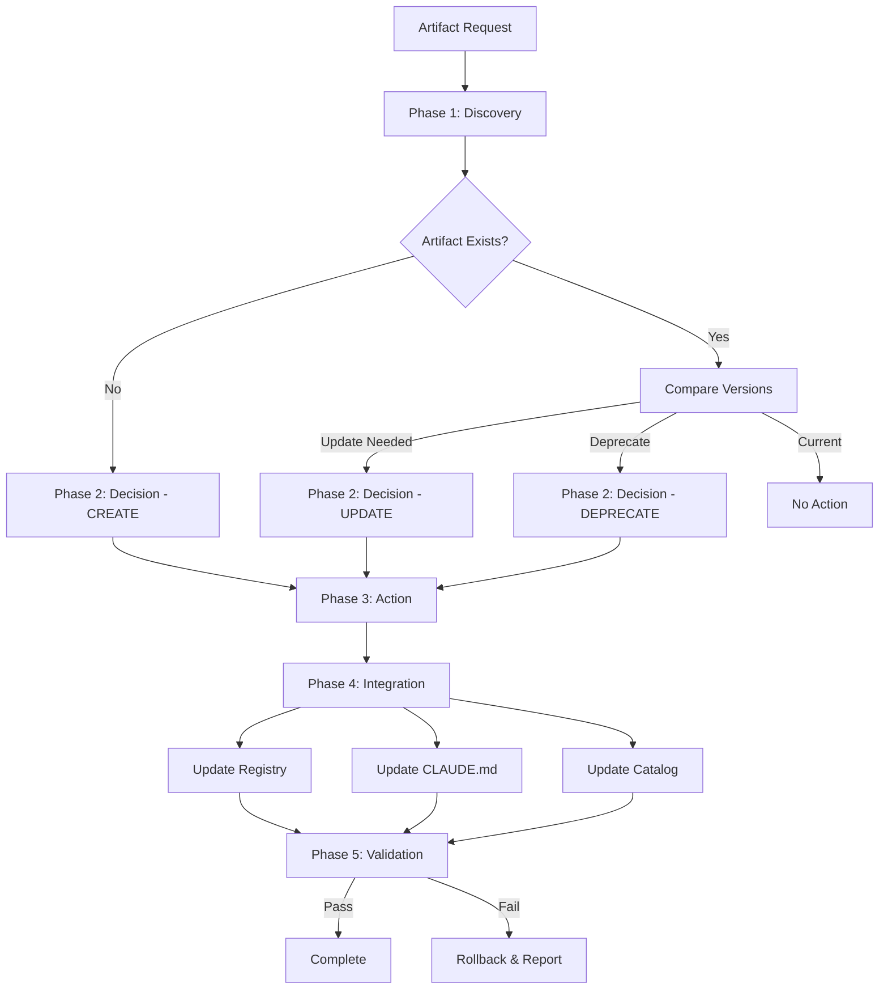

# Artifact Lifecycle Management Workflow

Universal lifecycle workflow for managing framework artifacts: skills, agents, hooks, workflows, templates, and schemas.



**Extended Thinking**: This workflow provides a standardized process for discovering, creating, updating, deprecating, and integrating all framework artifacts. It replaces scattered instructions across CLAUDE.md and creator skill files with a centralized, systematic approach that ensures consistency, prevents duplication, and maintains framework integrity. The workflow applies version control principles to framework artifacts, treating them as first-class citizens with proper lifecycle management. By unifying the lifecycle across all artifact types, we reduce cognitive load on creators and ensure systematic evolution of the framework ecosystem.

## ROUTER UPDATE REQUIRED (CRITICAL - DO NOT SKIP)

**After creating this workflow, you MUST update CLAUDE.md Section 8.6:**

```markdown
### Artifact Lifecycle Management

**Path:** `.claude/workflows/core/skill-lifecycle.md`

**When to use:** Any operation involving framework artifacts (skills, agents, hooks, workflows, templates, schemas) - creation, update, deprecation, or integration.

**Phases:**

1. **Discovery** - Check if artifact exists, compare versions
2. **Decision** - Create new, update existing, or deprecate
3. **Action** - Execute creation/update/deprecation
4. **Integration** - Update catalogs, CLAUDE.md, assign to agents
5. **Validation** - Test integration and verify references
```

**Verification:**

```bash
grep "skill-lifecycle" .claude/CLAUDE.md || echo "ERROR: CLAUDE.md NOT UPDATED!"
```

---

## Configuration Options

### Artifact Type

- **skill**: Capability/workflow in `.claude/skills/`
- **agent**: Specialized persona in `.claude/agents/`
- **hook**: Pre/post execution validator in `.claude/hooks/`
- **workflow**: Multi-agent orchestration in `.claude/workflows/`
- **template**: Artifact template in `.claude/templates/`
- **schema**: JSON Schema validator in `.claude/schemas/`

### Operation Mode

- **create**: New artifact (no existing version)
- **update**: Modify existing artifact (version increment)
- **deprecate**: Mark artifact as deprecated (replacement guidance)
- **integrate**: Add external artifact to framework

### Versioning Strategy

- **major**: Breaking changes (1.0.0 → 2.0.0)
- **minor**: New features, backward compatible (1.0.0 → 1.1.0)
- **patch**: Bug fixes, no new features (1.0.0 → 1.0.1)

## Prerequisites

Before starting this workflow:

1. **Required context**: Artifact purpose, target domain, expected inputs/outputs
2. **Required files**: Creator registry (`.claude/context/artifacts/creator-registry.json`)
3. **Required permissions**: Write access to `.claude/` directories

## Phase 1: Discovery

### Step 1: Check Artifact Existence

**Agent**: architect (for codebase exploration)

**Task Spawn**:

```javascript
Task({
  subagent_type: 'general-purpose',
  description: 'Checking if artifact exists in framework',
  prompt: `You are the ARCHITECT agent.

## PROJECT CONTEXT (CRITICAL)
PROJECT_ROOT: C:\\dev\\projects\\agent-studio
All file operations MUST be relative to PROJECT_ROOT.
- Agents: PROJECT_ROOT/.claude/agents/
- Skills: PROJECT_ROOT/.claude/skills/
- Context: PROJECT_ROOT/.claude/context/
DO NOT create files outside PROJECT_ROOT.

## Your Assigned Task
Task ID: $TASK_ID
Subject: Discover artifact: $ARTIFACT_NAME

## Instructions
1. Read your agent definition: .claude/agents/core/architect.md
2. **Claim task**: TaskUpdate({ taskId: "$TASK_ID", status: "in_progress" })
3. **Invoke skills**: Skill({ skill: "architecture-review" })
4. Search for artifact in framework:
   - Skills: Glob pattern ".claude/skills/$ARTIFACT_NAME/SKILL.md"
   - Agents: Glob pattern ".claude/agents/**/$ARTIFACT_NAME.md"
   - Hooks: Glob pattern ".claude/hooks/**/$ARTIFACT_NAME.cjs"
   - Workflows: Glob pattern ".claude/workflows/**/$ARTIFACT_NAME.md"
   - Templates: Glob pattern ".claude/templates/**/$ARTIFACT_NAME.md"
   - Schemas: Glob pattern ".claude/schemas/$ARTIFACT_NAME.schema.json"
3. Check creator registry: .claude/context/artifacts/creator-registry.json
4. Search skill catalog: .claude/context/artifacts/skill-catalog.md
5. Check learnings.md for similar artifacts: .claude/context/memory/learnings.md
6. Save findings to: .claude/context/reports/artifact-discovery-$ARTIFACT_NAME.md

## Output Format
- **Exists**: [Yes/No]
- **Location**: [Path if exists]
- **Version**: [Current version if exists]
- **Similar Artifacts**: [List of similar artifacts found]
- **Recommendation**: [Create new / Update existing / Use similar]

## Task Synchronization (MANDATORY)
- Update task metadata with discoveries: TaskUpdate({ taskId: "$TASK_ID", metadata: { discoveries: [...], keyFiles: [...] } })
- On completion: TaskUpdate({ taskId: "$TASK_ID", status: "completed", metadata: { summary: "...", filesModified: [...] } })
- Check for next work: TaskList()

## Critical: Use These Tools
- Skill() - invoke skills (don't just read them)
- TaskUpdate() - track progress
- TaskList() - find next work

## Memory Protocol
1. Read .claude/context/memory/learnings.md first
2. Record findings to .claude/context/reports/artifact-discovery-$ARTIFACT_NAME.md
`,
});
```

**Expected Output**: Discovery report with existence status, version info, and recommendations

### Step 2: Version Comparison (if artifact exists)

**Agent**: architect

**Task Spawn** (conditional - only if artifact exists):

```javascript
Task({
  subagent_type: 'general-purpose',
  description: 'Comparing artifact versions and analyzing changes needed',
  prompt: `You are the ARCHITECT agent.

## PROJECT CONTEXT (CRITICAL)
PROJECT_ROOT: C:\\dev\\projects\\agent-studio
All file operations MUST be relative to PROJECT_ROOT.
- Agents: PROJECT_ROOT/.claude/agents/
- Skills: PROJECT_ROOT/.claude/skills/
- Context: PROJECT_ROOT/.claude/context/
DO NOT create files outside PROJECT_ROOT.

## Your Assigned Task
Task ID: $TASK_ID
Subject: Compare versions for: $ARTIFACT_NAME

## Instructions
1. Read your agent definition: .claude/agents/core/architect.md
2. **Claim task**: TaskUpdate({ taskId: "$TASK_ID", status: "in_progress" })
3. **Invoke skills**: Skill({ skill: "architecture-review" })
4. Read current artifact: [path from discovery report]
5. Analyze desired changes: $DESIRED_CHANGES
6. Determine version increment:
   - **Major**: Breaking changes (API changes, removed features)
   - **Minor**: New features (backward compatible additions)
   - **Patch**: Bug fixes (no behavioral changes)
7. Check backward compatibility requirements
8. Identify migration needs for dependent artifacts
9. Save analysis to: .claude/context/reports/version-analysis-$ARTIFACT_NAME.md

## Output Format
- **Current Version**: [X.Y.Z]
- **Proposed Version**: [X.Y.Z]
- **Change Type**: [major/minor/patch]
- **Breaking Changes**: [List if any]
- **Migration Required**: [Yes/No]
- **Affected Dependents**: [List of agents/skills/workflows affected]

## Task Synchronization (MANDATORY)
- Update task metadata with discoveries: TaskUpdate({ taskId: "$TASK_ID", metadata: { discoveries: [...], keyFiles: [...] } })
- On completion: TaskUpdate({ taskId: "$TASK_ID", status: "completed", metadata: { summary: "...", filesModified: [...] } })
- Check for next work: TaskList()

## Critical: Use These Tools
- Skill() - invoke skills (don't just read them)
- TaskUpdate() - track progress
- TaskList() - find next work

## Memory Protocol
Record version decisions to .claude/context/memory/decisions.md
`,
});
```

**Expected Output**: Version comparison analysis with increment recommendation

## Phase 2: Decision & Planning

### Step 3: Decision Matrix

**Agent**: planner

**Task Spawn**:

```javascript
Task({
  subagent_type: 'general-purpose',
  description: 'Planning artifact lifecycle action',
  prompt: `You are the PLANNER agent.

## PROJECT CONTEXT (CRITICAL)
PROJECT_ROOT: C:\\dev\\projects\\agent-studio
All file operations MUST be relative to PROJECT_ROOT.
- Agents: PROJECT_ROOT/.claude/agents/
- Skills: PROJECT_ROOT/.claude/skills/
- Context: PROJECT_ROOT/.claude/context/
DO NOT create files outside PROJECT_ROOT.

## Your Assigned Task
Task ID: $TASK_ID
Subject: Plan lifecycle action for: $ARTIFACT_NAME

## Instructions
1. Read your agent definition: .claude/agents/core/planner.md
2. **Claim task**: TaskUpdate({ taskId: "$TASK_ID", status: "in_progress" })
3. **Invoke planning skill**: Skill({ skill: "plan-generator" })
4. Review discovery report: .claude/context/reports/artifact-discovery-$ARTIFACT_NAME.md
5. Review version analysis (if exists): .claude/context/reports/version-analysis-$ARTIFACT_NAME.md
6. Apply decision matrix:

   **If artifact does NOT exist:**
   - Action: CREATE
   - Next: Invoke appropriate creator skill

   **If artifact exists AND changes are minor/patch:**
   - Action: UPDATE
   - Next: Version increment + changelog

   **If artifact exists AND changes are breaking:**
   - Action: UPDATE (major version) OR DEPRECATE (if replaced)
   - Next: Migration guide + deprecation notice

   **If similar artifact exists:**
   - Action: INTEGRATE (reuse similar) OR CREATE (if different enough)
   - Next: Document rationale for duplication

7. Create action plan and use TaskCreate() for each task:
   TaskCreate({ subject: "Phase 3: Create/Update artifact", description: "Execute artifact creation or update", activeForm: "Creating artifact $ARTIFACT_NAME" })
   TaskCreate({ subject: "Phase 4: Integrate artifact", description: "Update registry and CLAUDE.md", activeForm: "Integrating $ARTIFACT_NAME" })
   TaskCreate({ subject: "Phase 5: Validate artifact", description: "Test integration and references", activeForm: "Validating $ARTIFACT_NAME" })
8. Set task dependencies: TaskUpdate({ taskId: "PHASE_4_ID", addBlockedBy: ["PHASE_3_ID"] })
9. Save plan to: .claude/context/plans/artifact-lifecycle-$ARTIFACT_NAME.md

## Decision Criteria
- **Duplication**: Never create duplicate artifacts (check registry)
- **Scope**: Framework-wide (generic) vs project-specific
- **Maintenance**: Clear ownership and documentation
- **Dependencies**: All required artifacts exist

## Task Synchronization (MANDATORY)
- Update task metadata with discoveries: TaskUpdate({ taskId: "$TASK_ID", metadata: { discoveries: [...], keyFiles: [...] } })
- On completion: TaskUpdate({ taskId: "$TASK_ID", status: "completed", metadata: { summary: "...", filesModified: [...] } })
- Check for next work: TaskList()

## Critical: Use These Tools
- Skill() - invoke skills (don't just read them)
- TaskCreate() - create tasks from plan
- TaskUpdate() - track progress
- TaskList() - find next work

## Memory Protocol
1. Read .claude/context/memory/learnings.md first
2. Record decision to .claude/context/memory/decisions.md
`,
});
```

**Expected Output**: Action plan with CREATE/UPDATE/DEPRECATE decision and task breakdown

## Phase 3: Action Execution

### Step 4a: CREATE Path

**Agent**: Invoke appropriate creator based on artifact type

**Task Spawn**:

```javascript
Task({
  subagent_type: 'general-purpose',
  description: 'Creating new artifact: $ARTIFACT_NAME',
  prompt: `You are the ${CREATOR_AGENT} agent.

## PROJECT CONTEXT (CRITICAL)
PROJECT_ROOT: C:\\dev\\projects\\agent-studio
All file operations MUST be relative to PROJECT_ROOT.
- Agents: PROJECT_ROOT/.claude/agents/
- Skills: PROJECT_ROOT/.claude/skills/
- Context: PROJECT_ROOT/.claude/context/
DO NOT create files outside PROJECT_ROOT.

## Your Assigned Task
Task ID: $TASK_ID
Subject: Create artifact: $ARTIFACT_NAME

## Instructions
1. **Claim task**: TaskUpdate({ taskId: "$TASK_ID", status: "in_progress" })
2. **Invoke creator skill**: Skill({ skill: "$CREATOR_SKILL" })
   - skill-creator for skills
   - agent-creator for agents
   - hook-creator for hooks
   - workflow-creator for workflows
   - template-creator for templates
   - schema-creator for schemas
2. Follow creator workflow from skill instructions
3. Perform BLOCKING validation:
   - Check all referenced artifacts exist
   - Validate required files/sections present
   - Run schema validation if applicable
4. Create artifact at correct location
5. Initialize version as 1.0.0
6. Create CHANGELOG.md with creation entry
7. Save creation summary to: .claude/context/reports/created-$ARTIFACT_NAME.md

## System Impact Analysis (MANDATORY)
Before creating, verify:
- [ ] No duplicate artifact in registry
- [ ] All dependencies exist (agents, skills, hooks referenced)
- [ ] No conflicts with existing functionality
- [ ] Proper scope (general vs project-specific)
- [ ] Clear documentation and ownership

## Task Synchronization (MANDATORY)
- Update task metadata with discoveries: TaskUpdate({ taskId: "$TASK_ID", metadata: { discoveries: [...], keyFiles: [...] } })
- On completion: TaskUpdate({ taskId: "$TASK_ID", status: "completed", metadata: { summary: "...", filesModified: [...] } })
- Check for next work: TaskList()

## Critical: Use These Tools
- Skill() - invoke skills (don't just read them)
- TaskUpdate() - track progress
- TaskList() - find next work

## Memory Protocol
Record creation to .claude/context/memory/learnings.md
`,
});
```

**Expected Output**: New artifact created with version 1.0.0

### Step 4b: UPDATE Path

**Agent**: developer (for code/config modifications)

**Task Spawn**:

```javascript
Task({
  subagent_type: 'general-purpose',
  description: 'Updating existing artifact: $ARTIFACT_NAME',
  prompt: `You are the DEVELOPER agent.

## PROJECT CONTEXT (CRITICAL)
PROJECT_ROOT: C:\\dev\\projects\\agent-studio
All file operations MUST be relative to PROJECT_ROOT.
- Agents: PROJECT_ROOT/.claude/agents/
- Skills: PROJECT_ROOT/.claude/skills/
- Context: PROJECT_ROOT/.claude/context/
DO NOT create files outside PROJECT_ROOT.

## Your Assigned Task
Task ID: $TASK_ID
Subject: Update artifact: $ARTIFACT_NAME

## Instructions
1. Read your agent definition: .claude/agents/core/developer.md
2. **Claim task**: TaskUpdate({ taskId: "$TASK_ID", status: "in_progress" })
3. **Invoke skills**: Skill({ skill: "tdd" })
4. Read current artifact: [path from discovery]
5. Read version analysis: .claude/context/reports/version-analysis-$ARTIFACT_NAME.md
6. Apply changes: $DESIRED_CHANGES
7. Update version number based on change type:
   - Major: X+1.0.0 (breaking changes)
   - Minor: X.Y+1.0 (new features)
   - Patch: X.Y.Z+1 (bug fixes)
8. Update CHANGELOG.md with version entry
9. Check backward compatibility:
   - If breaking: Create MIGRATION.md guide
   - If breaking: Update dependent artifacts
10. Run validation tests if available
11. Save update summary to: .claude/context/reports/updated-$ARTIFACT_NAME.md

## Backward Compatibility Check
- [ ] Existing API signatures unchanged (or documented)
- [ ] No removed features (or documented with alternatives)
- [ ] All tests pass (or updated for new behavior)
- [ ] Dependent artifacts notified of changes

## Task Synchronization (MANDATORY)
- Update task metadata with discoveries: TaskUpdate({ taskId: "$TASK_ID", metadata: { discoveries: [...], keyFiles: [...] } })
- On completion: TaskUpdate({ taskId: "$TASK_ID", status: "completed", metadata: { summary: "...", filesModified: [...] } })
- Check for next work: TaskList()

## Critical: Use These Tools
- Skill() - invoke skills (don't just read them)
- TaskUpdate() - track progress
- TaskList() - find next work

## Memory Protocol
Record update to .claude/context/memory/learnings.md
`,
});
```

**Expected Output**: Updated artifact with incremented version

### Step 4c: DEPRECATE Path

**Agent**: developer

**Task Spawn**:

```javascript
Task({
  subagent_type: 'general-purpose',
  description: 'Deprecating artifact: $ARTIFACT_NAME',
  prompt: `You are the DEVELOPER agent.

## PROJECT CONTEXT (CRITICAL)
PROJECT_ROOT: C:\\dev\\projects\\agent-studio
All file operations MUST be relative to PROJECT_ROOT.
- Agents: PROJECT_ROOT/.claude/agents/
- Skills: PROJECT_ROOT/.claude/skills/
- Context: PROJECT_ROOT/.claude/context/
DO NOT create files outside PROJECT_ROOT.

## Your Assigned Task
Task ID: $TASK_ID
Subject: Deprecate artifact: $ARTIFACT_NAME

## Instructions
1. Read your agent definition: .claude/agents/core/developer.md
2. **Claim task**: TaskUpdate({ taskId: "$TASK_ID", status: "in_progress" })
3. **Invoke skills**: Skill({ skill: "tdd" })
4. Read current artifact: [path from discovery]
5. Add DEPRECATION NOTICE to artifact:

   > **DEPRECATED**: This artifact is deprecated as of [DATE].
   > **Replacement**: Use [$REPLACEMENT_ARTIFACT] instead.
   > **Reason**: [DEPRECATION_REASON]
   > **Migration Guide**: See MIGRATION.md

6. Create MIGRATION.md with step-by-step replacement instructions
7. Update creator registry: Mark as deprecated
8. Update CLAUDE.md: Add deprecation note (do NOT remove entry)
9. Notify dependent artifacts (add deprecation warnings)
10. Set removal timeline (e.g., 3 months, 6 months)
11. Save deprecation summary to: .claude/context/reports/deprecated-$ARTIFACT_NAME.md

## Deprecation Checklist
- [ ] Deprecation notice added to artifact
- [ ] Replacement artifact documented
- [ ] Migration guide created
- [ ] Registry updated
- [ ] CLAUDE.md updated
- [ ] Dependent artifacts notified
- [ ] Removal timeline set

## Task Synchronization (MANDATORY)
- Update task metadata with discoveries: TaskUpdate({ taskId: "$TASK_ID", metadata: { discoveries: [...], keyFiles: [...] } })
- On completion: TaskUpdate({ taskId: "$TASK_ID", status: "completed", metadata: { summary: "...", filesModified: [...] } })
- Check for next work: TaskList()

## Critical: Use These Tools
- Skill() - invoke skills (don't just read them)
- TaskUpdate() - track progress
- TaskList() - find next work

## Memory Protocol
Record deprecation to .claude/context/memory/decisions.md
`,
});
```

**Expected Output**: Deprecated artifact with migration guide

## Phase 4: Integration

### Step 5: Catalog & Registry Updates

**Agent**: developer

**Task Spawn**:

```javascript
Task({
  subagent_type: 'general-purpose',
  description: 'Updating framework catalogs and registries',
  prompt: `You are the DEVELOPER agent.

## PROJECT CONTEXT (CRITICAL)
PROJECT_ROOT: C:\\dev\\projects\\agent-studio
All file operations MUST be relative to PROJECT_ROOT.
- Agents: PROJECT_ROOT/.claude/agents/
- Skills: PROJECT_ROOT/.claude/skills/
- Context: PROJECT_ROOT/.claude/context/
DO NOT create files outside PROJECT_ROOT.

## Your Assigned Task
Task ID: $TASK_ID
Subject: Update catalogs/registries for: $ARTIFACT_NAME

## Instructions
1. **Claim task**: TaskUpdate({ taskId: "$TASK_ID", status: "in_progress" })
2. **Invoke skills**: Skill({ skill: "tdd" })
3. Update creator registry: .claude/context/artifacts/creator-registry.json
   - Add artifact to appropriate array (agents/skills/hooks/workflows)
   - Update summary counts
   - Add relationships (agentToSkills, skillToAgents, etc.)
4. Update skill catalog (if skill): .claude/context/artifacts/skill-catalog.md
   - Add skill to category section
   - Include description and key features
5. Update CLAUDE.md (BLOCKING - MANDATORY):
   - Section 3 (if agent): Add to routing table
   - Section 8.5 (if skill/hook/template/schema): Add to enhancement skills
   - Section 8.6 (if workflow): Add to enterprise workflows
   - Include: Name, path, when to use, key features
6. Verify integration:

   grep "$ARTIFACT_NAME" .claude/CLAUDE.md || echo "ERROR: NOT IN CLAUDE.md"
   grep "$ARTIFACT_NAME" .claude/context/artifacts/creator-registry.json || echo "ERROR: NOT IN REGISTRY"

7. Save integration summary to: .claude/context/reports/integrated-$ARTIFACT_NAME.md

## BLOCKING Verification (CRITICAL)
This step BLOCKS completion until:
- [ ] creator-registry.json contains artifact
- [ ] CLAUDE.md references artifact
- [ ] All grep commands succeed
- [ ] No broken references in artifact

## Task Synchronization (MANDATORY)
- Update task metadata with discoveries: TaskUpdate({ taskId: "$TASK_ID", metadata: { discoveries: [...], keyFiles: [...] } })
- On completion: TaskUpdate({ taskId: "$TASK_ID", status: "completed", metadata: { summary: "...", filesModified: [...] } })
- Check for next work: TaskList()

## Critical: Use These Tools
- Skill() - invoke skills (don't just read them)
- TaskUpdate() - track progress
- TaskList() - find next work

## Memory Protocol
Record integration to .claude/context/memory/learnings.md
`,
});
```

**Expected Output**: Updated catalogs, registry, and CLAUDE.md

### Step 6: Agent Assignment (for skills)

**Agent**: planner

**Task Spawn** (conditional - only for skills):

```javascript
Task({
  subagent_type: 'general-purpose',
  description: 'Assigning skill to appropriate agents',
  prompt: `You are the PLANNER agent.

## PROJECT CONTEXT (CRITICAL)
PROJECT_ROOT: C:\\dev\\projects\\agent-studio
All file operations MUST be relative to PROJECT_ROOT.
- Agents: PROJECT_ROOT/.claude/agents/
- Skills: PROJECT_ROOT/.claude/skills/
- Context: PROJECT_ROOT/.claude/context/
DO NOT create files outside PROJECT_ROOT.

## Your Assigned Task
Task ID: $TASK_ID
Subject: Assign skill $SKILL_NAME to agents

## Instructions
1. Read your agent definition: .claude/agents/core/planner.md
2. **Claim task**: TaskUpdate({ taskId: "$TASK_ID", status: "in_progress" })
3. **Invoke planning skill**: Skill({ skill: "plan-generator" })
4. Analyze skill capabilities: .claude/skills/$SKILL_NAME/SKILL.md
5. Review existing agents: .claude/agents/
6. Determine which agents should use this skill:
   - Core agents (developer, planner, architect, qa, etc.)
   - Domain agents (python-pro, rust-pro, etc.)
   - Specialized agents (security-architect, devops, etc.)
7. Update agent definitions to reference skill:
   - Add to agent's skills list
   - Include skill invocation examples
8. Update relationships in creator registry:
   - agentToSkills mapping
   - skillToAgents mapping
9. Save assignment plan to: .claude/context/reports/skill-assignment-$SKILL_NAME.md

## Assignment Criteria
- **Relevance**: Skill aligns with agent's domain
- **Necessity**: Agent needs this capability for its role
- **Consistency**: Similar agents have similar skills

## Task Synchronization (MANDATORY)
- Update task metadata with discoveries: TaskUpdate({ taskId: "$TASK_ID", metadata: { discoveries: [...], keyFiles: [...] } })
- On completion: TaskUpdate({ taskId: "$TASK_ID", status: "completed", metadata: { summary: "...", filesModified: [...] } })
- Check for next work: TaskList()

## Critical: Use These Tools
- Skill() - invoke skills (don't just read them)
- TaskUpdate() - track progress
- TaskList() - find next work

## Memory Protocol
Record assignments to .claude/context/memory/decisions.md
`,
});
```

**Expected Output**: Skill assigned to relevant agents

## Phase 5: Validation & Testing

### Step 7: Integration Testing

**Agent**: qa

**Task Spawn**:

```javascript
Task({
  subagent_type: 'general-purpose',
  description: 'Testing artifact integration',
  prompt: `You are the QA agent.

## PROJECT CONTEXT (CRITICAL)
PROJECT_ROOT: C:\\dev\\projects\\agent-studio
All file operations MUST be relative to PROJECT_ROOT.
- Agents: PROJECT_ROOT/.claude/agents/
- Skills: PROJECT_ROOT/.claude/skills/
- Context: PROJECT_ROOT/.claude/context/
DO NOT create files outside PROJECT_ROOT.

## Your Assigned Task
Task ID: $TASK_ID
Subject: Test artifact integration: $ARTIFACT_NAME

## Instructions
1. Read your agent definition: .claude/agents/core/qa.md
2. **Claim task**: TaskUpdate({ taskId: "$TASK_ID", status: "in_progress" })
3. **Invoke qa-workflow skill**: Skill({ skill: "qa-workflow" })
4. Test artifact invocation:
   - For skills: Skill({ skill: "$ARTIFACT_NAME" }) - verify it loads
   - For agents: Verify agent file is readable and well-formed
   - For hooks: Test hook registration and execution
   - For workflows: Verify all referenced agents/skills exist
5. Validate all references:
   - Check all agent references point to existing agents
   - Check all skill references point to existing skills
   - Check all file paths are correct
   - Check all schemas validate
6. Test with assigned agents (if skill):
   - Spawn agent that should use skill
   - Verify skill invocation works
7. Run validation scripts (if available):

   # Validate workflow references
   node .claude/tools/validate-workflow.mjs --workflow $ARTIFACT_NAME

   # Validate skill schema
   node .claude/skills/schema-creator/scripts/main.cjs --validate .claude/skills/$ARTIFACT_NAME/schemas/

8. Save test report to: .claude/context/reports/test-$ARTIFACT_NAME.md

## Test Checklist
- [ ] Artifact file is readable and well-formed
- [ ] All references to agents/skills/hooks exist
- [ ] All file paths resolve correctly
- [ ] Schemas validate successfully
- [ ] Integration with CLAUDE.md verified
- [ ] Registry entries verified
- [ ] No broken links or references

## Task Synchronization (MANDATORY)
- Update task metadata with discoveries: TaskUpdate({ taskId: "$TASK_ID", metadata: { discoveries: [...], keyFiles: [...] } })
- On completion: TaskUpdate({ taskId: "$TASK_ID", status: "completed", metadata: { summary: "...", filesModified: [...] } })
- Check for next work: TaskList()

## Critical: Use These Tools
- Skill() - invoke skills (don't just read them)
- TaskUpdate() - track progress
- TaskList() - find next work

## Memory Protocol
Record test results to .claude/context/memory/learnings.md
`,
});
```

**Expected Output**: Test report with pass/fail status

### Step 8: Final Verification

**Agent**: architect

**Task Spawn**:

```javascript
Task({
  subagent_type: 'general-purpose',
  description: 'Final verification of artifact lifecycle completion',
  prompt: `You are the ARCHITECT agent.

## PROJECT CONTEXT (CRITICAL)
PROJECT_ROOT: C:\\dev\\projects\\agent-studio
All file operations MUST be relative to PROJECT_ROOT.
- Agents: PROJECT_ROOT/.claude/agents/
- Skills: PROJECT_ROOT/.claude/skills/
- Context: PROJECT_ROOT/.claude/context/
DO NOT create files outside PROJECT_ROOT.

## Your Assigned Task
Task ID: $TASK_ID
Subject: Final verification: $ARTIFACT_NAME

## Instructions
1. Read your agent definition: .claude/agents/core/architect.md
2. **Claim task**: TaskUpdate({ taskId: "$TASK_ID", status: "in_progress" })
3. **Invoke skills**: Skill({ skill: "architecture-review" })
4. Check all lifecycle gates:

   **Creation/Update Gate:**
   - [ ] Artifact file exists at correct location
   - [ ] Version number is correct
   - [ ] CHANGELOG.md is updated
   - [ ] MIGRATION.md exists (if breaking changes)

   **Integration Gate:**
   - [ ] creator-registry.json contains artifact
   - [ ] CLAUDE.md references artifact (Section 3, 8.5, or 8.6)
   - [ ] Skill catalog updated (if skill)
   - [ ] Relationships documented

   **Assignment Gate (skills only):**
   - [ ] Assigned to appropriate agents
   - [ ] Agent definitions updated
   - [ ] agentToSkills mapping updated

   **Validation Gate:**
   - [ ] Integration tests passed
   - [ ] All references verified
   - [ ] No broken links

   **Documentation Gate:**
   - [ ] README/docs created
   - [ ] Examples provided
   - [ ] Memory files updated

5. If ANY gate fails: Report blockers and required fixes
6. If all gates pass: Mark lifecycle as COMPLETE
7. Save final verification to: .claude/context/reports/verified-$ARTIFACT_NAME.md

## Final Checklist (ALL must pass)
- [ ] Artifact exists and is well-formed
- [ ] Version is correct (1.0.0 for new, incremented for updates)
- [ ] Registry contains artifact
- [ ] CLAUDE.md references artifact
- [ ] All dependencies exist
- [ ] Integration tests passed
- [ ] Documentation complete
- [ ] Memory files updated

## Task Synchronization (MANDATORY)
- Update task metadata with discoveries: TaskUpdate({ taskId: "$TASK_ID", metadata: { discoveries: [...], keyFiles: [...] } })
- On completion: TaskUpdate({ taskId: "$TASK_ID", status: "completed", metadata: { summary: "...", filesModified: [...] } })
- Check for next work: TaskList()

## Critical: Use These Tools
- Skill() - invoke skills (don't just read them)
- TaskUpdate() - track progress
- TaskList() - find next work

## Memory Protocol
Record lifecycle completion to .claude/context/memory/learnings.md
`,
});
```

**Expected Output**: Final verification report with COMPLETE/BLOCKED status

## Workflow Verification

### Phase Gate Checks

**Phase 1 Complete (Discovery):**

- [ ] Discovery report exists
- [ ] Artifact existence determined
- [ ] Version comparison done (if existing)
- [ ] Recommendation provided

**Phase 2 Complete (Decision):**

- [ ] Action plan created
- [ ] CREATE/UPDATE/DEPRECATE decision made
- [ ] Tasks defined
- [ ] Dependencies identified

**Phase 3 Complete (Action):**

- [ ] Artifact created/updated/deprecated
- [ ] Version number set/incremented
- [ ] CHANGELOG updated
- [ ] MIGRATION guide created (if needed)

**Phase 4 Complete (Integration):**

- [ ] creator-registry.json updated
- [ ] CLAUDE.md updated (BLOCKING)
- [ ] Skill catalog updated (if skill)
- [ ] Agents assigned (if skill)

**Phase 5 Complete (Validation):**

- [ ] Integration tests passed
- [ ] All references validated
- [ ] Final verification complete
- [ ] Lifecycle marked COMPLETE

### Final Deliverables

- [ ] Artifact file at `.claude/{type}/{name}/` or `.claude/{type}/{category}/{name}.md`
- [ ] Creator registry updated: `.claude/context/artifacts/creator-registry.json`
- [ ] CLAUDE.md updated with artifact reference
- [ ] Test report: `.claude/context/reports/test-{name}.md`
- [ ] Verification report: `.claude/context/reports/verified-{name}.md`
- [ ] Memory files updated: `.claude/context/memory/learnings.md`

## Error Recovery

### If Phase 1 fails (Discovery):

1. Check file system permissions
2. Verify creator registry is readable
3. Retry with corrected paths
4. Escalate to user if registry is corrupted

### If Phase 2 fails (Decision):

1. Review discovery findings for clarity
2. Ask user to clarify intent (create vs update)
3. Re-run decision matrix with additional context
4. Document decision blockers in issues.md

### If Phase 3 fails (Action):

1. Check if creator skill exists and is functional
2. Verify all dependencies are available
3. Validate artifact structure and required fields
4. Retry with fixed dependencies
5. If blocking validation fails: STOP and report errors

### If Phase 4 fails (Integration):

1. **CRITICAL**: If CLAUDE.md update fails, artifact is INVISIBLE
2. Manually verify CLAUDE.md is writable
3. Retry integration with corrected paths
4. Validate grep commands succeed
5. DO NOT proceed to Phase 5 if integration fails

### If Phase 5 fails (Validation):

1. Review test failures in detail
2. Fix broken references
3. Re-run integration tests
4. Update documentation gaps
5. Repeat validation until all checks pass

## Related Workflows

- **Feature Development Workflow**: Uses skills/agents created by this workflow
- **C4 Architecture Workflow**: Documents systems using agents from this workflow
- **Conductor Setup Workflow**: Creates project-specific artifacts managed by this lifecycle

## Customization Points

This workflow can be adapted for:

1. **Project-Specific Artifacts**: Modify scope check to allow project artifacts
2. **Batch Operations**: Process multiple artifacts in parallel
3. **Automated Migration**: Add scripts to auto-migrate breaking changes
4. **Continuous Integration**: Integrate with CI/CD for artifact testing
5. **Versioning Policy**: Customize version increment rules per project

## Usage Example

**Router spawning artifact lifecycle workflow:**

```javascript
// User: "Create a new skill for Kubernetes deployment"
Task({
  subagent_type: 'general-purpose',
  description: 'Managing lifecycle for k8s-deploy skill',
  prompt: `Execute artifact-lifecycle workflow for new skill.

## Parameters
- Artifact Name: k8s-deploy
- Artifact Type: skill
- Operation Mode: create
- Desired Changes: Kubernetes deployment automation with Helm support

## Instructions
Follow the phased workflow in: .claude/workflows/core/skill-lifecycle.md

Phase 1: Discovery - Check if k8s-deploy or similar skill exists
Phase 2: Decision - CREATE or integrate existing
Phase 3: Action - Invoke skill-creator
Phase 4: Integration - Update registry, CLAUDE.md, assign to devops agent
Phase 5: Validation - Test skill invocation and references

## Success Criteria
- Skill created at .claude/skills/k8s-deploy/
- CLAUDE.md Section 8.5 updated
- creator-registry.json updated
- Assigned to devops agent
- All tests pass
`,
});
```

## Advanced: Batch Artifact Management

For managing multiple artifacts at once:

```javascript
Task({
  subagent_type: 'general-purpose',
  description: 'Batch lifecycle management for multiple artifacts',
  prompt: `Execute artifact-lifecycle workflow for multiple artifacts.

## Batch Parameters
Artifacts:
1. skill: prometheus-integration (create)
2. skill: grafana-dashboard (create)
3. agent: sre-specialist (create)
4. workflow: observability-setup (create)

## Instructions
For each artifact:
1. Run Phase 1 (Discovery) in parallel
2. Run Phase 2 (Decision) sequentially (check for duplicates)
3. Run Phase 3 (Action) in parallel (independent creations)
4. Run Phase 4 (Integration) sequentially (avoid registry conflicts)
5. Run Phase 5 (Validation) in parallel

Track dependencies:
- sre-specialist agent should be assigned prometheus-integration skill
- observability-setup workflow should reference sre-specialist agent

## Success Criteria
- All 4 artifacts created
- Dependencies properly linked
- Single registry update (atomic)
- CLAUDE.md has all 4 references
`,
});
```

---

## Iron Laws of Artifact Lifecycle

These rules are INVIOLABLE:

1. **NO CREATION WITHOUT DISCOVERY**
   - Always check if artifact exists first
   - Never create duplicates

2. **NO UPDATE WITHOUT VERSION INCREMENT**
   - Major/minor/patch must be incremented
   - CHANGELOG must be updated

3. **NO INTEGRATION WITHOUT CLAUDE.MD UPDATE**
   - Artifact not in CLAUDE.md = invisible to Router
   - This is BLOCKING, not optional

4. **NO COMPLETION WITHOUT VALIDATION**
   - All references must be verified
   - Integration tests must pass

5. **NO DEPRECATION WITHOUT MIGRATION GUIDE**
   - Users need replacement instructions
   - Set removal timeline

6. **NO BREAKING CHANGES WITHOUT MAJOR VERSION**
   - API changes = major version bump
   - Backward compatibility check required

7. **ALWAYS UPDATE MEMORY**
   - learnings.md for patterns
   - decisions.md for rationale
   - If not in memory, it didn't happen
